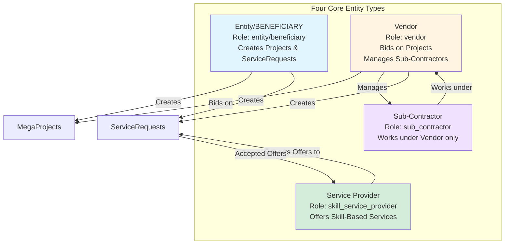
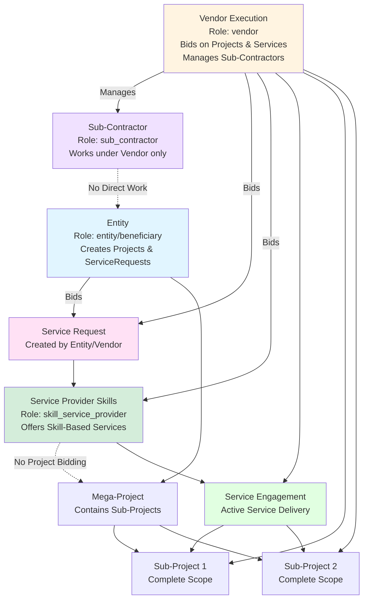
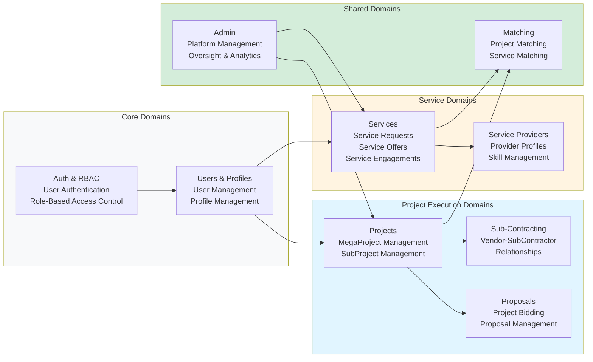

# PMTwin Platform Architecture & Service Providers Implementation

## Overview

This plan implements a **clean, scalable platform architecture** that separates project execution from skill-based services. The system supports four core actor types operating in two parallel collaboration tracks with strict boundaries and clear accountability.

### Entity Types Summary

The platform defines four distinct entity types:

1. **Entity (BENEFICIARY)** - Role: `entity` or `beneficiary` - Creates MegaProjects and ServiceRequests, can bid on ServiceRequests
2. **Vendor** - Role: `vendor` - Bids on projects, manages Sub-Contractors, creates ServiceRequests, bids on ServiceRequests, searches Service Provider Skills
3. **Sub-Contractor** - Role: `sub_contractor` - Works under Vendor only, never directly with Entity (No Direct Work restriction)
4. **Service Provider** - Role: `skill_service_provider` - Offers skill-based services, never bids on projects (No Project Bidding restriction)

**Important Note on Role Naming**:

- The new Service Provider entity type uses role ID `skill_service_provider` to distinguish it from the legacy `service_provider` role (which is mapped to `vendor` and retains project bidding capabilities).
- `beneficiary` is a separate role ID that provides the same permissions as `entity` and can be used interchangeably.

## Platform Architecture

### Key Relationships from Workflow Diagram

The workflow diagram shows the following critical relationships that are implemented in this plan:

1. **Vendor Execution Relationships**:

   - Manages Sub-Contractors (direct management relationship)
   - Bids on Service Requests (Vendors can request services)
   - Bids on Service Provider Skills (direct skill search/matching)
   - Engages with Service Engagements (can link services to projects)
   - Works on Sub-Projects (project execution)

2. **Sub-Contractor Restrictions**:

   - No Direct Work with Entity (dotted line - enforced restriction)
   - Works only under Vendor management

3. **Entity Capabilities**:

   - Creates Mega-Projects
   - Bids on Service Requests (Entities can request services)
   - Receives project delivery from Vendors

4. **Service Provider Restrictions**:

   - No Project Bidding (dotted line to Mega-Project - enforced restriction)
   - Can engage with Service Requests and Service Engagements
   - Services can support Sub-Projects (via Service Engagement links)

5. **Service Engagement Integration**:

   - Can be linked to Sub-Projects (services support project execution)
   - This is a reference link, not a project contract
   - Service Provider remains accountable only for service delivery

### Core Actor Types

The platform supports four distinct entity types with clear roles and boundaries:

1. **Entity (BENEFICIARY)** - Client/organization that creates MegaProjects and ServiceRequests

   - **Role ID**: `entity` (primary) or `beneficiary` (alias)
   - **Capabilities**: Creates MegaProjects, creates ServiceRequests, bids on ServiceRequests, reviews proposals, accepts service offers
   - **Restrictions**: Cannot submit proposals or project bids

2. **Vendor** - Execution contractor that bids on projects and manages Sub-Contractors

   - **Role ID**: `vendor`
   - **Capabilities**: Bids on MegaProjects/SubProjects, manages Sub-Contractors, creates ServiceRequests, bids on ServiceRequests, searches Service Provider Skills
   - **Restrictions**: Can only bid on complete scopes (full projects or complete subprojects), cannot create MegaProjects

3. **Sub-Contractor** - Executes delegated scope strictly under Vendor, never directly with Entity

- **Role ID**: `sub_contractor`
- **Capabilities**: Submits proposals to Vendors only, works on minor scope under Vendor management
- **Restrictions**: Cannot work directly with Entities, cannot bid on projects, cannot access service endpoints

4. **Service Provider** - Offers skill-based services (advisory, review, support), never participates in project bidding

- **Role ID**: `skill_service_provider` (new, distinct from legacy `service_provider` role)
- **Capabilities**: Creates service provider profile, submits service offers, manages service engagements
- **Restrictions**: Cannot bid on projects, cannot submit project proposals, cannot access project bidding APIs

### Entity Type Relationships



### Complete Workflow Diagram

This diagram shows the complete relationship flow between all entities, projects, and services:



### Two Parallel Collaboration Tracks

```mermaid
graph TB
    subgraph ProjectTrack["Project Track - Execution & Delivery"]
        Entity1[Entity/BENEFICIARY] -->|Creates| MegaProject[MegaProject]
        MegaProject -->|Contains| SubProject1[SubProject - Complete Scope]
        MegaProject -->|Contains| SubProject2[SubProject - Complete Scope]
        Vendor1[Vendor] -->|Bids on| MegaProject
        Vendor1 -->|Bids on| SubProject1
        Vendor1 -->|Manages| SubContractor[Sub-Contractor]
        SubContractor -.->|No Direct Work| Entity1
        SubContractor -->|Works under| Vendor1
        Vendor1 -->|Delivers| Entity1
    end
    
    subgraph ServiceTrack["Service Track - Skill-Based Services"]
        Entity2[Entity/BENEFICIARY] -->|Creates| ServiceRequest[ServiceRequest]
        Entity2 -->|Bids on| ServiceRequest
        Vendor2[Vendor] -->|Creates| ServiceRequest
        Vendor2 -->|Bids on| ServiceRequest
        Vendor2 -->|Searches| ServiceProviderSkills[Service Provider Skills]
        ServiceRequest -->|Matches| ServiceProvider[Service Provider]
        ServiceProvider -->|Submits| ServiceOffer[ServiceOffer]
        ServiceOffer -->|Accepted| ServiceEngagement[ServiceEngagement]
        ServiceEngagement -->|Supports| SubProject1_Service[Sub-Projects]
        ServiceEngagement -->|Delivered| Entity2
    end
    
    style ProjectTrack fill:#e1f5ff
    style ServiceTrack fill:#fff4e1
    style SubContractor fill:#f0e1ff
    style ServiceProvider fill:#d4edda
```



### Domain-Driven Architecture

The platform is organized into **modular domains** with clear boundaries:



### Track Separation & Boundaries

**Project Track** (`src/domains/projects/`):

- MegaProject creation and management
- SubProject definition (complete scope only)
- Vendor bidding and proposal management
- Sub-Contractor delegation under Vendors
- Project execution and delivery
- **Ownership**: Vendor is fully accountable for delivery

**Service Track** (`src/domains/services/`):

- ServiceRequest creation (Entity/Vendor only)
- ServiceRequest bidding (Entity/Vendor can bid on service requests they need)
- Service Provider matching and offers
- Service Provider Skills search (Vendors can search/bid on specific skills)
- Service Engagement management
- Service Engagement linking to Sub-Projects (services can support project execution)
- Skill-based service delivery
- **Ownership**: Service Provider delivers services, no project contracts
- **Integration**: Service Engagements can be linked to Sub-Projects to support project execution without creating project contracts

**Strict Boundaries**:

- Service Providers **CANNOT** access project bidding APIs (enforced by "No Project Bidding" restriction)
- Sub-Contractors **CANNOT** access service endpoints or work directly with Entities (enforced by "No Direct Work" restriction)
- Projects and Services have **independent data models** and **separate matching engines**
- No cross-track data dependencies (except shared user profiles)
- Service Engagements can be **linked** to Sub-Projects for support purposes, but this is a reference link only, not a project contract

### Directory Structure by Domain

```javascript
POC/src/
├── domains/
│   ├── auth/                      # Auth & RBAC Domain
│   │   ├── authentication/        # Login, registration, sessions
│   │   ├── rbac/                  # Role-based access control
│   │   └── guards/                # Route guards and middleware
│   │
│   ├── users/                     # Users & Profiles Domain
│   │   ├── user-management/       # User CRUD, onboarding
│   │   └── profiles/              # Profile management
│   │
│   ├── projects/                  # Project Execution Domain
│   │   ├── megaprojects/          # MegaProject management
│   │   ├── subprojects/           # SubProject management
│   │   ├── proposals/             # Project proposal management
│   │   └── execution/             # Project execution tracking
│   │
│   ├── subcontracting/            # Sub-Contracting Domain
│   │   ├── vendor-relationships/  # Vendor-SubContractor links
│   │   └── delegation/            # Scope delegation management
│   │
│   ├── services/                   # Service Track Domain
│   │   ├── service-requests/     # ServiceRequest management
│   │   ├── service-providers/     # ServiceProvider profiles
│   │   ├── service-offers/        # ServiceOffer management
│   │   └── service-engagements/  # ServiceEngagement lifecycle
│   │
│   ├── matching/                  # Matching Domain (Shared)
│   │   ├── project-matching/     # Project-to-Vendor matching
│   │   └── service-matching/     # ServiceRequest-to-Provider matching
│   │
│   └── admin/                      # Admin Domain (Shared)
│       ├── platform-management/   # Platform oversight
│       └── analytics/             # Analytics and reporting
│
├── core/                           # Core Infrastructure
│   ├── data/                       # Data layer (localStorage/API)
│   ├── api/                        # API client abstraction
│   └── utils/                      # Shared utilities
│
└── components/                     # Reusable UI components
```

### Independent Matching Engines

**Project Matching** (`src/domains/matching/project-matching/`):

- Matches Vendors to MegaProjects/SubProjects
- Based on: project scope, vendor capabilities, location, budget
- **Independent** from service matching
- Used by: Project Track only

**Service Matching** (`src/domains/matching/service-matching/`):

- Matches Service Providers to ServiceRequests
- Based on: required skills, provider skills, availability, pricing
- **Independent** from project matching
- Used by: Service Track only

### Data Ownership & Accountability

**Project Track Accountability**:

- Entity owns MegaProject and SubProjects
- Vendor is **fully accountable** for project/subproject delivery
- Sub-Contractor works under Vendor's accountability
- Vendor delivers complete work to Entity

**Service Track Accountability**:

- Entity/Vendor owns ServiceRequest
- Service Provider is accountable for service delivery
- No project execution ownership
- Services are delivered and closed without project contracts

### RBAC Enforcement by Track

**Project Track Access**:

- Entity/Beneficiary: Create projects, review proposals, approve awards
- Vendor: Bid on projects, manage Sub-Contractors
- Sub-Contractor: Submit proposals to Vendors only
- Service Provider (`skill_service_provider`): **BLOCKED** from all project endpoints
- Legacy `service_provider` role: Has vendor permissions (can bid on projects)

**Service Track Access**:

- Entity/Beneficiary/Vendor: Create ServiceRequests, bid on ServiceRequests, search Service Provider Skills, accept offers
- Service Provider (`skill_service_provider`): Submit offers, manage engagements
- Sub-Contractor: **BLOCKED** from all service endpoints (enforced by "No Direct Work" with Entity)

## Architecture Overview

## Implementation Components

### Domain Organization Strategy

The implementation follows a **domain-driven approach** where each domain is self-contained with its own:

- Data models and CRUD operations
- Service layer (business logic)
- Validation and business rules
- UI components and pages
- Domain-specific matching (if applicable)

**Key Principle**: Domains communicate through well-defined interfaces, never directly accessing each other's internal data structures.

### 1. Data Model Extensions

**Location**: `POC/src/core/data/data.js` (centralized data layer)**Strategy**: While the architecture is domain-driven, the data layer remains centralized for POC simplicity. In production, this would be split into domain-specific data modules.

#### 1.1 UserType Enum Extension

- Add `SERVICE_PROVIDER` user type to the mapping
- Add `BENEFICIARY` user type (maps to same permissions as `entity`)
- Update `mapRoleToUserType()` to handle:
- `skill_service_provider` role → `SERVICE_PROVIDER` user type
- `beneficiary` role → `BENEFICIARY` user type (same as `entity`)
- **Note**: Legacy `service_provider` role remains mapped to `vendor` and should not be confused with the new `skill_service_provider` role

#### 1.2 New Storage Keys

Add to `STORAGE_KEYS`:

- `SERVICE_PROVIDER_PROFILES: 'pmtwin_service_provider_profiles'`
- `SERVICE_REQUESTS: 'pmtwin_service_requests'`
- `SERVICE_OFFERS: 'pmtwin_service_offers'`
- `SERVICE_ENGAGEMENTS: 'pmtwin_service_engagements'`

#### 1.3 Data Models

**ServiceProviderProfile** (CRUD in data.js):

```javascript
{
  id: "sp_profile_001",
  userId: "user_123", // FK, unique
  providerType: "INDIVIDUAL" | "CONSULTANT" | "FIRM",
  skills: ["Project Management", "Legal Review", "Quality Assurance"],
  certifications: ["PMP", "ISO 9001"],
  availabilityStatus: "AVAILABLE" | "BUSY" | "UNAVAILABLE",
  pricingModel: "HOURLY" | "FIXED" | "RETAINER",
  hourlyRate: 500, // nullable, SAR
  createdAt: "2024-01-01T00:00:00Z",
  updatedAt: "2024-01-01T00:00:00Z"
}
```

**ServiceRequest** (CRUD in data.js):

```javascript
{
  id: "sr_001",
  requesterType: "ENTITY" | "VENDOR",
  requesterId: "user_456",
  title: "Legal Review Services",
  description: "Need legal review for construction contracts...",
  requiredSkills: ["Legal Review", "Contract Analysis"],
  status: "OPEN" | "OFFERED" | "APPROVED" | "IN_PROGRESS" | "COMPLETED" | "CANCELLED",
  budget: { min: 10000, max: 50000, currency: "SAR" },
  timeline: { startDate: "2024-02-01", duration: 30 }, // days
  createdAt: "2024-01-01T00:00:00Z",
  updatedAt: "2024-01-01T00:00:00Z"
}
```

**ServiceOffer** (CRUD in data.js):

```javascript
{
  id: "so_001",
  serviceRequestId: "sr_001",
  serviceProviderUserId: "user_123",
  proposedPricing: {
    model: "HOURLY" | "FIXED" | "RETAINER",
    amount: 45000,
    currency: "SAR",
    breakdown: "..." // optional
  },
  message: "I can provide comprehensive legal review...",
  status: "SUBMITTED" | "ACCEPTED" | "REJECTED" | "WITHDRAWN",
  submittedAt: "2024-01-02T00:00:00Z",
  respondedAt: null,
  respondedBy: null
}
```

**ServiceEngagement** (CRUD in data.js):

```javascript
{
  id: "se_001",
  serviceRequestId: "sr_001",
  serviceProviderUserId: "user_123",
  serviceOfferId: "so_001",
  status: "ACTIVE" | "COMPLETED" | "TERMINATED",
  startedAt: "2024-02-01T00:00:00Z",
  completedAt: null,
  terminatedAt: null,
  terminationReason: null,
  linkedSubProjectIds: ["subproject_001", "subproject_002"], // Optional: Link to Sub-Projects that this service supports
  linkedMegaProjectId: "megaproject_001" // Optional: Link to Mega-Project if service supports project execution
}
```

### 2. Migration Functions

**Location**: `POC/src/core/data/data.js`

- Add migration function `migrateServiceProviderModel()` to:
- Initialize new storage keys
- **Important**: Do NOT migrate legacy `service_provider` role users (they remain as vendors)
- Only create ServiceProviderProfile for users with new `skill_service_provider` role
- Handle `beneficiary` role as alias for `entity` (same permissions)
- Update `initStorage()` to call migration
- Increment `DATA_VERSION` to `'2.3.0'`

**Legacy Role Handling**:

- Legacy `service_provider` role (mapped to `vendor`) remains unchanged
- Users with legacy `service_provider` role continue to function as vendors
- New `skill_service_provider` role is for the new Service Provider entity type

### 3. Service Domain Implementation

**Location**: `POC/src/domains/services/` (new domain structure)**Domain Structure**:

```javascript
src/domains/services/
├── service-requests/
│   ├── service-request-service.js      # ServiceRequest CRUD and business logic
│   ├── service-request-validator.js    # ServiceRequest validation
│   └── service-request-model.js        # ServiceRequest data model
├── service-providers/
│   ├── service-provider-service.js     # ServiceProvider profile management
│   ├── service-provider-validator.js   # Profile validation
│   └── service-provider-model.js       # ServiceProviderProfile model
├── service-offers/
│   ├── service-offer-service.js        # ServiceOffer management
│   ├── service-offer-validator.js      # Offer validation
│   └── service-offer-model.js          # ServiceOffer model
└── service-engagements/
    ├── service-engagement-service.js   # Engagement lifecycle
    ├── service-engagement-validator.js # Engagement validation
    └── service-engagement-model.js      # ServiceEngagement model
```

**Legacy Location** (for backward compatibility during migration): `POC/src/services/service-providers/`

#### 3.1 Service Provider Service

**File**: `service-provider-service.js`

- `createProfile(profileData)` - Create/update service provider profile
- `getProfile(userId)` - Get profile by userId
- `getMyProfile()` - Get current user's profile
- `searchProviders(filters)` - Search providers by skills, location, etc. (used by Vendors/Entities to find providers)
- `searchProviderSkills(skillFilters)` - Search provider skills directly (Vendor can bid on specific skills)
- `updateProfile(userId, updates)` - Update profile

#### 3.2 Service Request Service

**File**: `service-request-service.js`

- `createServiceRequest(requestData)` - Create service request (Entity/Beneficiary/Vendor only)
- `getServiceRequest(id)` - Get request by ID
- `getMyServiceRequests()` - Get requester's requests
- `updateServiceRequestStatus(id, status)` - Update status
- `getAvailableServiceRequests()` - Get open requests for providers
- `bidOnServiceRequest(serviceRequestId, bidData)` - Allow Entity/Vendor to bid on service requests (if they need services themselves)

#### 3.3 Service Offer Service

**File**: `service-offer-service.js`

- `submitOffer(serviceRequestId, offerData)` - Submit offer (Service Provider with `skill_service_provider` role only)
- `getOffer(id)` - Get offer by ID
- `getOffersForRequest(serviceRequestId)` - Get all offers for a request
- `getMyOffers()` - Get current provider's offers
- `acceptOffer(offerId)` - Accept offer (Entity/Beneficiary/Vendor only)
- `rejectOffer(offerId, reason)` - Reject offer
- `withdrawOffer(offerId)` - Withdraw offer (Service Provider only)

#### 3.4 Service Engagement Service

**File**: `service-engagement-service.js`

- `createEngagement(serviceRequestId, serviceOfferId)` - Create engagement from accepted offer
- `getEngagement(id)` - Get engagement by ID
- `getMyEngagements()` - Get current user's engagements
- `updateEngagementStatus(id, status)` - Update engagement status
- `completeEngagement(id)` - Mark engagement as completed
- `linkEngagementToSubProject(engagementId, subProjectId)` - Link service engagement to Sub-Project (services can support project execution)
- `linkEngagementToMegaProject(engagementId, megaProjectId)` - Link service engagement to Mega-Project
- `getEngagementsForSubProject(subProjectId)` - Get all service engagements supporting a Sub-Project

#### 3.5 API Client Integration

**Location**: `POC/src/core/api/api-service.js`

- Add service provider endpoints to API client
- Support localStorage fallback
- Endpoints:
- `POST /api/v1/service-providers/profile`
- `GET /api/v1/service-providers/me`
- `GET /api/v1/service-providers/search`
- `POST /api/v1/service-requests`
- `GET /api/v1/service-requests/:id`
- `POST /api/v1/service-requests/:id/offers`
- `POST /api/v1/service-requests/:id/bid` - Allow Entity/Vendor to bid on service requests
- `GET /api/v1/service-providers/skills/search` - Search Service Provider Skills (Vendor access)
- `POST /api/v1/service-offers/:id/accept`
- `POST /api/v1/service-offers/:id/reject`
- `GET /api/v1/service-engagements/my`
- `POST /api/v1/service-engagements/:id/link-subproject` - Link engagement to Sub-Project
- `GET /api/v1/service-engagements/subproject/:subProjectId` - Get engagements for Sub-Project

### 4. RBAC Updates

**Location**: `POC/data/roles.json` and `POC/src/services/rbac/`

#### 4.1 Role Definition Updates

- Add `skill_service_provider` role to `roles.json` (new role ID to avoid confusion with legacy `service_provider`):
- Permissions: `create_service_provider_profile`, `submit_service_offers`, `view_service_requests`, `manage_service_engagements`
- Restrictions: `Cannot bid on projects`, `Cannot submit project proposals`, `Cannot access project bidding APIs`
- Features: `service_provider_profile`, `service_requests_browse`, `service_offers_manage`, `service_engagements_view`
- Add `beneficiary` role to `roles.json` (alias for `entity`):
- Same permissions and features as `entity` role
- Maps to same user type and capabilities
- Can be used interchangeably with `entity` role

#### 4.2 Entity/Beneficiary/Vendor Permissions

- Add to `entity` role: `create_service_requests`, `accept_service_offers`, `manage_service_engagements`
- Add to `beneficiary` role: Same permissions as `entity` (alias role)
- Add to `vendor` role: `create_service_requests`, `accept_service_offers`

#### 4.3 Sub-Contractor Restrictions

- Ensure `sub_contractor` role has NO access to service endpoints
- Add restriction: `Cannot access service provider features`

#### 4.4 RBAC Guards

**Location**: `POC/src/core/auth/auth.js` and new middleware

- Create `requireServiceProvider()` guard - checks for `skill_service_provider` role
- Create `requireEntityOrVendor()` guard - checks for `entity`, `beneficiary`, or `vendor` roles
- Create `blockSubContractor()` guard for service endpoints - blocks `sub_contractor` role
- Create `blockServiceProviderFromProjects()` guard for project bidding endpoints - blocks `skill_service_provider` role
- **Note**: Legacy `service_provider` role (mapped to vendor) should still have access to project bidding

### 5. Matching Logic

**Location**: `POC/src/services/matching/service-matching-service.js` (new file)

#### 5.1 Service Provider Matching

- `matchServiceProvidersToRequest(serviceRequestId)` - Match providers to request
- `calculateSkillMatch(providerSkills, requiredSkills)` - Calculate skill overlap score
- `rankMatches(matches)` - Rank by score (skill overlap, availability, ratings)
- Returns: Array of matched providers with scores

#### 5.2 Integration

- Do NOT modify existing project matching logic
- Keep service matching completely separate
- Can be triggered when ServiceRequest is created

### 6. UI Components

#### 6.1 Service Provider Profile

**Location**: `POC/pages/service-providers/profile/index.html` and `POC/features/service-providers/profile.js`

- Create/edit service provider profile form
- Display profile information
- Manage skills, certifications, pricing

#### 6.2 Service Requests

**Location**: `POC/pages/service-requests/` and `POC/features/service-requests/`

- `index.html` - List of service requests
- `create.html` - Create service request (Entity/Vendor)
- `view.html` - View request details and offers

#### 6.3 Service Offers

**Location**: `POC/features/service-requests/offers.js`

- Submit offer form
- View offers for a request
- Accept/reject offers (Entity/Vendor)

#### 6.4 Service Engagements

**Location**: `POC/pages/service-engagements/index.html` and `POC/features/service-engagements/engagements.js`

- List active/completed engagements
- Engagement details and status updates

### 7. Admin Views

**Location**: `POC/pages/admin/` and `POC/features/admin/`

#### 7.1 Service Providers Admin

**File**: `admin-service-providers/index.html` and `admin-service-providers.js`

- List all service providers
- View provider profiles
- Manage provider status
- Statistics: total providers, active providers, etc.

#### 7.2 Service Requests Admin

**File**: `admin-service-requests/index.html` and `admin-service-requests.js`

- List all service requests
- View request details
- Monitor request status
- Statistics: open requests, completed requests, etc.

### 8. Navigation Updates

**Location**: `POC/src/services/dashboard/dashboard-service.js`

- Add service provider menu items for SERVICE_PROVIDER role
- Add service requests menu items for ENTITY/VENDOR roles
- Update sidebar navigation based on user type

### 9. Validation & Business Logic

**Location**: `POC/src/business-logic/service-validator.js` (new file)

#### 9.1 Validation Rules

- `validateServiceProviderProfile(profile)` - Validate profile data
- `validateServiceRequest(request)` - Validate request (Entity/Vendor only)
- `validateServiceOffer(offer)` - Validate offer (Service Provider only)
- `validateEngagementCreation(engagement)` - Validate engagement creation

#### 9.2 Business Rules

- Service Providers cannot bid on projects (enforce in proposal creation)
- Sub-Contractors cannot access service endpoints (enforce in guards)
- Only one active engagement per ServiceRequest
- ServiceRequest must be OPEN to accept offers

### 10. Tests

#### 10.1 Test Files

**Location**: `POC/tests/service-providers/`

- `service-provider-profile.test.js` - Profile CRUD tests
- `service-requests.test.js` - Request creation and management
- `service-offers.test.js` - Offer submission and acceptance
- `service-engagements.test.js` - Engagement lifecycle
- `rbac-service-providers.test.js` - RBAC enforcement tests
- `matching-service-providers.test.js` - Matching algorithm tests

#### 10.2 Test Cases Documentation

**Location**: `POC/docs/TEST_CASES_SERVICE_PROVIDERS.md`

- Manual testing checklist
- Test scenarios for each user type
- Edge cases and error handling
- Integration test scenarios

## Key Files to Modify/Create

### New Domain Structure

**Service Domain** (`src/domains/services/`):

- `service-requests/service-request-service.js`
- `service-requests/service-request-validator.js`
- `service-requests/service-request-model.js`
- `service-providers/service-provider-service.js`
- `service-providers/service-provider-validator.js`
- `service-providers/service-provider-model.js`
- `service-offers/service-offer-service.js`
- `service-offers/service-offer-validator.js`
- `service-offers/service-offer-model.js`
- `service-engagements/service-engagement-service.js`
- `service-engagements/service-engagement-validator.js`
- `service-engagements/service-engagement-model.js`

**Service Matching Domain** (`src/domains/matching/service-matching/`):

- `service-matching-service.js` - Main matching service
- `skill-matcher.js` - Skill-based matching algorithm
- `match-scorer.js` - Scoring and ranking logic

**Auth Domain Updates** (`src/domains/auth/guards/`):

- `track-guards.js` - Track-specific access guards
- `service-track-guards.js` - Service track guards
- `project-track-guards.js` - Project track guards (update existing)

**UI Components**:

- `POC/pages/service-providers/profile/index.html`
- `POC/features/service-providers/profile.js`
- `POC/pages/service-requests/index.html`
- `POC/pages/service-requests/create.html`
- `POC/pages/service-requests/view.html`
- `POC/features/service-requests/requests.js`
- `POC/features/service-requests/offers.js`
- `POC/pages/service-engagements/index.html`
- `POC/features/service-engagements/engagements.js`

**Admin Views**:

- `POC/pages/admin/admin-service-providers/index.html`
- `POC/features/admin/admin-service-providers.js`
- `POC/pages/admin/admin-service-requests/index.html`
- `POC/features/admin/admin-service-requests.js`

**Tests**:

- `POC/tests/service-providers/service-provider-profile.test.js`
- `POC/tests/service-providers/service-requests.test.js`
- `POC/tests/service-providers/service-offers.test.js`
- `POC/tests/service-providers/service-engagements.test.js`
- `POC/tests/service-providers/rbac-service-providers.test.js`
- `POC/tests/service-providers/matching-service-providers.test.js`
- `POC/tests/service-providers/track-separation.test.js` - Test track boundaries

**Documentation**:

- `POC/docs/TEST_CASES_SERVICE_PROVIDERS.md`
- `POC/docs/ARCHITECTURE_DOMAINS.md` - Domain architecture documentation
- `POC/docs/TRACK_SEPARATION.md` - Track separation and boundaries

### Modified Files

**Core Data Layer**:

- `POC/src/core/data/data.js` - Add storage keys, migration, CRUD modules for Service domain

**RBAC**:

- `POC/data/roles.json` - Add service_provider role, update entity/vendor permissions
- `POC/src/domains/auth/rbac/role-service.js` - Update role service if needed

**Auth & Guards**:

- `POC/src/domains/auth/guards/` - Add track-specific guards
- `POC/src/core/auth/auth.js` - Add new guard functions (if centralized)

**Project Domain** (maintain existing, add restrictions):

- `POC/src/domains/projects/proposals/proposal-validator.js` - Add check to block Service Providers from project bidding

**Dashboard & Navigation**:

- `POC/src/services/dashboard/dashboard-service.js` - Add navigation items for Service Track

**API Layer**:

- `POC/src/core/api/api-service.js` - Add service provider endpoints with localStorage fallback

## Implementation Order

1. Data models and CRUD operations
2. Migration functions
3. RBAC updates and guards
4. API service layer
5. Business logic and validation
6. Matching logic
7. UI components
8. Admin views
9. Navigation updates
10. Tests

## Constraints & Validations

### Track Separation Constraints

1. **Service Providers (`skill_service_provider`) cannot bid on projects**: 

- Enforce in `proposal-validator.js` (Project Domain) - check for `skill_service_provider` role
- Enforce in RBAC guards (`blockServiceProviderFromProjects()`) - block `skill_service_provider` role
- Block access to `/projects/*`, `/proposals/*`, `/create-proposal/*`
- **Note**: Legacy `service_provider` role (mapped to vendor) retains project bidding access

2. **Sub-Contractors cannot access services**: 

- Enforce in RBAC guards (`blockSubContractor()`)
- Block access to `/service-requests/*`, `/service-providers/*`
- No direct Entity access (enforced in proposal flow)

3. **Sub-Contractors cannot work directly with Entities**:

- Enforce in proposal submission flow
- Sub-Contractors can only submit proposals to Vendors

### Service Track Constraints

4. **Only Entity/Beneficiary/Vendor can create ServiceRequests**: 

- Validate in `service-request-validator.js` - check for `entity`, `beneficiary`, or `vendor` roles
- Enforce in RBAC guard (`requireEntityOrVendor()`) - allow `entity`, `beneficiary`, or `vendor` roles

5. **Entity/Beneficiary/Vendor can bid on ServiceRequests**: 

- Allow Entities/Vendors to bid on service requests when they need services themselves
- Validate in `service-request-validator.js` - check for `entity`, `beneficiary`, or `vendor` roles
- This enables Entities/Vendors to request services from Service Providers

6. **Vendors can search and bid on Service Provider Skills directly**: 

- Allow Vendors to search Service Provider Skills without going through ServiceRequests
- Implement `searchProviderSkills()` in service-provider-service.js
- This enables direct skill-based matching for Vendors

7. **Only Service Providers (`skill_service_provider`) can submit offers**: 

- Validate in `service-offer-validator.js` - check for `skill_service_provider` role
- Enforce in RBAC guard (`requireServiceProvider()`) - require `skill_service_provider` role

8. **Only one active engagement per ServiceRequest**: 

- Validate in `service-engagement-validator.js`
- Check before creating new engagement

9. **ServiceRequest must be OPEN to accept offers**: 

- Validate in offer acceptance logic
- Update request status when engagement created

10. **Service Engagements can be linked to Sub-Projects**: 

- Allow Service Engagements to reference Sub-Projects for support purposes
- This is a reference link only, not a project contract
- Service Provider is not accountable for project delivery, only service delivery
- Implement `linkEngagementToSubProject()` in service-engagement-service.js

### Project Track Constraints (Maintain Existing)

8. **Vendors can only bid on complete scopes**: 

- Maintain existing validation in `proposal-validator.js`
- Full projects or complete subprojects only

9. **Sub-Projects must be complete scope only**: 

- Maintain existing validation in `sub-project-manager.js`

### Data Ownership & Accountability

10. **Project Track**: Vendor is fully accountable for delivery
11. **Service Track**: Service Provider is accountable for service delivery
12. **No cross-track ownership**: Services do not create project contracts
13. **Clear boundaries**: Projects and Services have independent data models
14. **Service-Project Linking**: Service Engagements can reference Sub-Projects for support, but this is informational only - Service Provider is not accountable for project delivery
15. **Sub-Contractor Restriction**: Sub-Contractors cannot work directly with Entities (enforced by "No Direct Work" relationship)
16. **Service Provider Restriction**: Service Providers cannot bid on projects (enforced by "No Project Bidding" relationship)

## Architectural Principles & Scalability

### Domain-Driven Design

The platform follows **Domain-Driven Design (DDD)** principles:

1. **Bounded Contexts**: Each domain (Projects, Services, Sub-Contracting, Matching, Admin) is a bounded context with its own models and business logic
2. **Domain Models**: Each domain defines its own data models, validators, and business rules
3. **Domain Services**: Business logic is encapsulated in domain services, not in UI or infrastructure layers
4. **Clear Boundaries**: Domains communicate through well-defined interfaces, never directly accessing each other's internals

### Track Separation Strategy

**Two Independent Collaboration Tracks**:

1. **Project Track** (`domains/projects/`):

- Execution-focused: MegaProjects → SubProjects → Vendor bidding → Delivery
- Full accountability: Vendor owns project delivery
- Complete scope only: No partial work bidding
- Sub-Contractor delegation: Under Vendor management only

2. **Service Track** (`domains/services/`):

- Skill-focused: ServiceRequests → Provider matching → Offers → Engagements
- Service delivery: No project execution ownership
- Independent lifecycle: Services close without project contracts
- Skill-based matching: Separate from project matching

**Separation Benefits**:

- Clear accountability boundaries
- Independent scaling of each track
- No cross-track dependencies
- Easier maintenance and evolution
- Clear data ownership

### Scalability Considerations

**Horizontal Scalability**:

- Domains can be split into microservices in production
- Independent matching engines can scale separately
- Service Track and Project Track can have separate databases

**Data Model Scalability**:

- Independent data models prevent cross-track coupling
- Clear ownership boundaries enable distributed systems
- Domain-specific indexes and queries

**Matching Engine Scalability**:

- Project matching and Service matching are independent
- Can use different algorithms and optimization strategies
- Can scale matching services separately based on load

**RBAC Scalability**:

- Track-specific guards enable fine-grained access control
- Role definitions are extensible without affecting other tracks
- Permission checks are domain-aware

### Implementation Strategy

**Phase 1: Domain Structure** (Foundation):

- Create domain directory structure
- Implement domain models and validators
- Set up domain services

**Phase 2: Track Separation** (Boundaries):

- Implement RBAC guards for track separation
- Add validation to prevent cross-track access
- Create independent matching engines

**Phase 3: Service Track Implementation** (New Features):

- Implement Service Provider profiles
- Implement Service Requests, Offers, Engagements
- Implement Service matching engine

**Phase 4: Integration & Testing** (Quality):

- Integration tests for track boundaries
- RBAC enforcement tests
- Matching algorithm tests
- End-to-end workflow tests

### Migration Path

**From POC to Production**:

1. **Data Layer**: Split centralized data.js into domain-specific data modules
2. **API Layer**: Convert to RESTful APIs with domain-specific endpoints
3. **Matching**: Scale matching engines independently (separate services)
4. **Database**: Split into domain-specific databases if needed
5. **Microservices**: Each domain can become a microservice

**Backward Compatibility**:

- Maintain existing project/proposal flow (no breaking changes)
- Service Track is additive (new features, no modifications to existing)
- RBAC updates are additive (new roles, new guards)

### Key Design Decisions

1. **Domain-Driven Architecture**: Enables clean separation, scalability, and maintainability
2. **Track Separation**: Prevents coupling, ensures clear accountability, enables independent evolution
3. **Independent Matching**: Allows different algorithms, separate scaling, independent optimization
4. **Strict RBAC**: Enforces boundaries at the guard level, prevents unauthorized access
5. **Data Ownership**: Clear ownership boundaries enable distributed systems and accountability