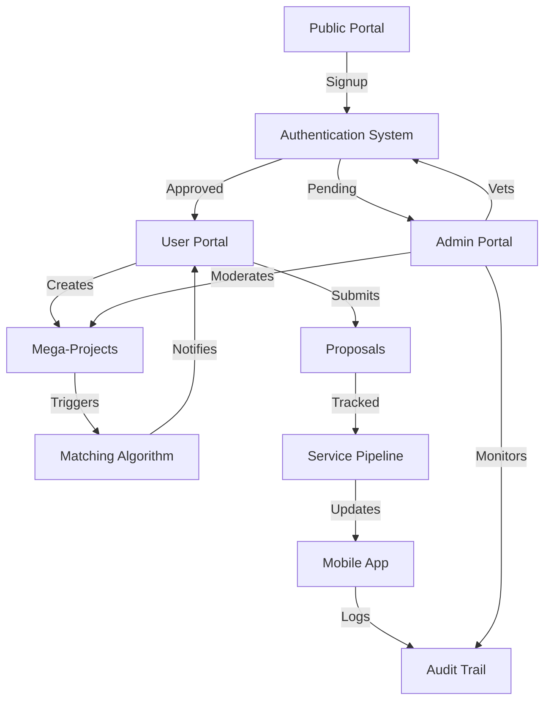

# PMTwin Ecosystem Overview

## Architecture: Four Touchpoints

PMTwin operates as a multi-tenant platform with four distinct touchpoints, each serving a specific layer of the construction and service ecosystem.

```
┌─────────────────────────────────────────────────────────────┐
│                    PMTwin Platform Core                      │
│  (Matching Engine | Data Layer | Authentication | Analytics) │
└─────────────────────────────────────────────────────────────┘
         │              │              │              │
         ▼              ▼              ▼              ▼
┌──────────────┐ ┌──────────────┐ ┌──────────────┐ ┌──────────────┐
│ Public Portal│ │ User Portal  │ │ Admin Portal │ │ Mobile App   │
│ (Marketing)  │ │ (Execution)  │ │ (Governance) │ │ (Field Ops)  │
└──────────────┘ └──────────────┘ └──────────────┘ └──────────────┘
```

## Touchpoint Details

### 1. Public Portal (The Window)
**Purpose:** Marketing, Transparency, & Discovery  
**Target Audience:** Unregistered visitors, Potential Leads  
**Key Functions:**
- Showcase active mega-projects (limited visibility)
- Interactive PMTwin Wizard for collaboration model selection
- Knowledge Hub with educational resources
- Entry point for registration (Individual/Entity)

### 2. User Portal (The Workplace)
**Purpose:** Execution, Collaboration, & Bidding  
**Target Audience:** Registered Entities & Professionals  
**Key Functions:**
- Role-adaptive dashboards (Entity vs Individual)
- Mega-project creation and management
- Matching algorithm integration
- Proposal suite (Cash & Barter)
- Service pipeline tracking

### 3. Admin Portal (The Command Center)
**Purpose:** Governance, Vetting, & Analytics  
**Target Audience:** Internal PMTwin Operators  
**Key Functions:**
- User credential vetting and verification
- Marketplace moderation
- Financial reporting and analytics
- Audit trail management

### 4. Mobile App (The On-Site Companion)
**Purpose:** Real-time Updates & Site Verification  
**Target Audience:** Field Engineers, Logistics, On-site Teams  
**Key Functions:**
- Biometric approval for milestones
- Site log and media uploads
- Push notifications
- Offline mode with sync

## User Personas

### Persona 1: Entity (Company/Contractor/Supplier)
**Characteristics:**
- Represents a registered business entity
- Has Commercial Registration (CR) and VAT
- Engages in large-scale projects
- Seeks partners for JVs, consortia, or service providers
- Manages multiple tenders and proposals

**Needs:**
- Financial health visibility
- Multi-service tender management
- Access to incentivized deals
- Quality partner matching

**Portal Access:** User Portal (Entity Dashboard)

### Persona 2: Individual (Professional/Consultant)
**Characteristics:**
- Independent professional or consultant
- Has professional certifications/licenses
- Focuses on task-based opportunities
- Builds reputation through endorsements
- Seeks flexible engagement models

**Needs:**
- Skill-matched opportunities
- Profile visibility and endorsements
- Task-based project access
- Real-time matching notifications

**Portal Access:** User Portal (Individual Dashboard)

### Persona 3: Admin (PMTwin Operator)
**Characteristics:**
- Internal PMTwin staff
- Responsible for platform governance
- Verifies credentials against standards
- Monitors marketplace quality
- Generates reports and analytics

**Needs:**
- Efficient vetting workflows
- Moderation tools
- Comprehensive reporting
- Audit trail access

**Portal Access:** Admin Portal

### Persona 4: Field User (On-Site Professional)
**Characteristics:**
- Works on construction sites
- Needs mobile access
- Requires offline capabilities
- Verifies site conditions
- Approves milestones

**Needs:**
- Mobile-optimized interface
- Offline functionality
- Media capture and upload
- Real-time notifications

**Portal Access:** Mobile App

## Platform Relationships



## Data Flow

### Registration Flow
```
Public Portal → Signup Form → Credential Upload → 
Admin Queue → Vetting → Approval → User Portal Access
```

### Project Execution Flow
```
Entity Creates Project → Matching Algorithm → 
Auto-Inquiry to Matched Providers → Proposal Submission → 
Evaluation → Approval → Site Execution (Mobile App)
```

### Barter Transaction Flow
```
Provider Submits Barter Proposal → Client Reviews Services → 
Value Equivalence Calculation → Agreement → 
Service Exchange Tracking → Completion
```

## Technology Stack (POC)

### Frontend
- **HTML5:** Semantic markup, accessibility
- **CSS3:** Centralized stylesheet, responsive design, CSS Grid/Flexbox
- **JavaScript (ES6+):** Modular architecture, localStorage API

### Data Persistence
- **localStorage:** Client-side data storage
- **JSON:** Data serialization format
- **Versioning:** Data migration support

### Architecture Patterns
- **Modular JavaScript:** Separate files per portal/feature
- **Hash-based Routing:** Client-side navigation
- **Component-based CSS:** Reusable UI components
- **Role-based Access Control:** Authentication and authorization

## Integration Points (Future)

### Planned Integrations
- Government procurement systems
- Payment gateways
- Document management systems
- Email/SMS notification services
- Cloud storage for media files
- Analytics platforms

## Security Considerations

### Authentication
- Role-based access control (RBAC)
- Session management
- Password security (simulated hashing in POC)

### Data Protection
- Credential verification
- Audit trail for all actions
- Secure data storage (localStorage in POC, cloud in production)

### Compliance
- Saudi CR/VAT verification standards
- Professional license validation
- Legal contract tracking

## Scalability Considerations

### Current (POC)
- Client-side only
- localStorage limitations (~5-10MB)
- Single-user experience simulation

### Production (Future)
- Backend API integration
- Database (PostgreSQL/MongoDB)
- Cloud storage
- Real-time notifications (WebSockets)
- Multi-user concurrent access
- CDN for static assets

---

*This ecosystem overview provides the architectural foundation for PMTwin's multi-tenant platform.*

