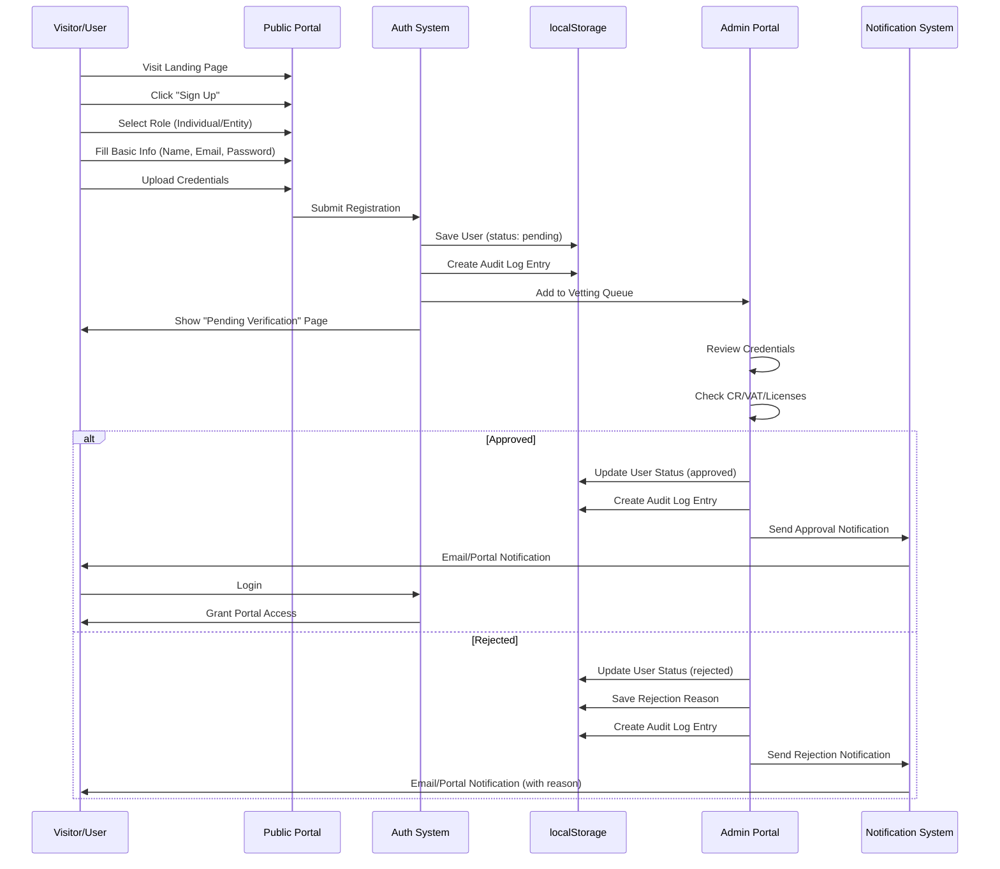
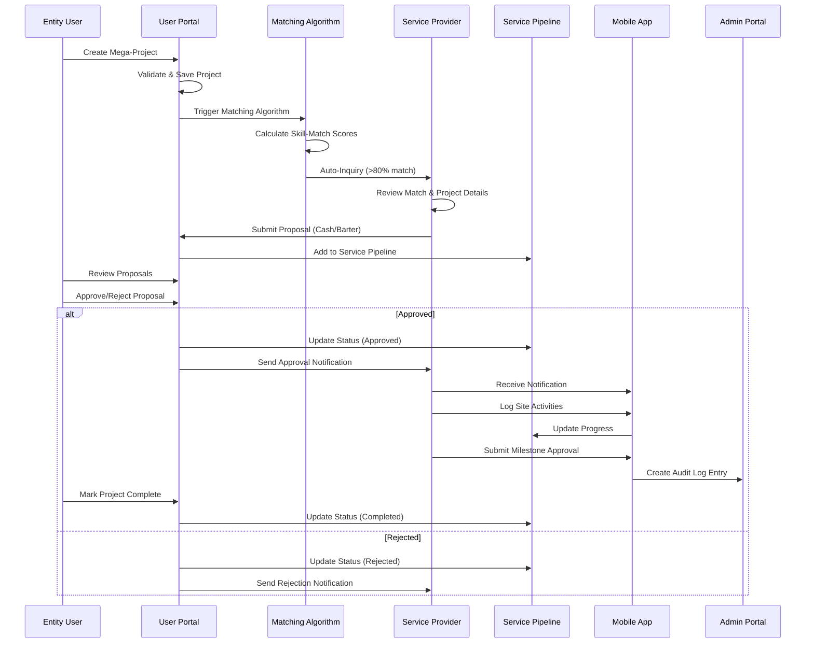

# User Flows Documentation

## 1. Onboarding & Vetting Workflow

### 1.1 Flow Diagram



### 1.2 Step-by-Step Flow

#### Step 1: Initial Visit & Discovery
1. User visits Public Portal landing page
2. User browses Discovery Engine (limited project visibility)
3. User may use PMTwin Wizard to understand collaboration models
4. User decides to register

#### Step 2: Registration Initiation
1. User clicks "Sign Up" or "Join as Individual/Entity"
2. System displays role selection screen
3. User selects: **Individual** (Professional/Consultant) or **Entity** (Company)

#### Step 3: Basic Information Collection
1. **For Individuals:**
   - Name (required)
   - Email (required, validated)
   - Password (required, min 8 chars, strength indicator)
   - Confirm Password (required, must match)
   - Phone (optional)
   - Professional Title (optional)

2. **For Entities:**
   - Company Name (required)
   - Email (required, validated)
   - Password (required, min 8 chars, strength indicator)
   - Confirm Password (required, must match)
   - Phone (required)
   - Website (optional)

3. User accepts Terms & Conditions (required checkbox)
4. User clicks "Continue"

#### Step 4: Credential Upload
1. **For Individuals:**
   - Upload Professional License/Certification (required)
   - Upload CV/Resume (required)
   - Portfolio Link (optional)
   - Additional Certifications (optional, multiple)

2. **For Entities:**
   - Upload Commercial Registration (CR) (required)
   - Upload VAT Certificate (required)
   - Upload Company Profile Document (required)
   - Additional Licenses (optional, multiple)

3. File upload interface:
   - Drag-and-drop or click to browse
   - File preview with name and size
   - Remove option for each file
   - File size limits displayed (e.g., max 5MB per file)

4. User clicks "Submit Registration"

#### Step 5: System Processing
1. System validates all inputs
2. System creates user record in localStorage:
   ```javascript
   {
     id: "user_123",
     email: "user@example.com",
     password: "hashed_password",
     role: "individual" | "entity",
     profile: {
       name: "User Name",
       status: "pending",
       credentials: [...],
       createdAt: "2024-01-01T00:00:00Z"
     }
   }
   ```
3. System creates audit log entry
4. System adds user to admin vetting queue
5. System displays "Pending Verification" confirmation page

#### Step 6: Admin Vetting Process
1. Admin logs into Admin Portal
2. Admin navigates to Vetting Module
3. Admin sees pending users queue
4. Admin clicks on user to review:
   - Views user information
   - Downloads/reviews uploaded credentials
   - Checks against verification criteria:
     - CR valid (entities)
     - VAT valid (entities)
     - Professional license valid (individuals)
     - Documents complete
     - Information matches documents
     - No red flags

5. Admin makes decision:
   - **Approve:** User status → "approved", gains portal access
   - **Reject:** User status → "rejected", reason saved, no access
   - **Request More Info:** Status remains "pending", notification sent

6. System creates audit log entry for admin action

#### Step 7: User Notification & Activation
1. **If Approved:**
   - System sends notification (simulated email/portal alert)
   - User receives "Account Approved" message
   - User can now log in
   - User gains access to User Portal with role-appropriate dashboard

2. **If Rejected:**
   - System sends notification with rejection reason
   - User sees "Account Rejected" message
   - User can view reason and may reapply (new registration)

### 1.3 Data Flow

```
Registration Form → Validation → localStorage (users) → 
Admin Queue (localStorage) → Admin Review → 
Status Update → Notification → User Portal Access
```

### 1.4 Error Handling

- **Email Already Exists:** Show error, suggest login
- **Weak Password:** Show strength indicator, prevent submission
- **Missing Required Files:** Highlight missing uploads
- **File Size Exceeded:** Show error, allow retry
- **Network Error (future):** Save draft locally, retry on reconnect

## 2. Opportunity & Execution Workflow

### 2.1 Flow Diagram



### 2.2 Step-by-Step Flow

#### Step 1: Project Creation
1. Entity user logs into User Portal
2. Entity navigates to "Create Mega-Project" (or clicks CTA on dashboard)
3. Entity fills project creation form:
   - Basic Information (Title, Description, Category, Location)
   - Scope & Requirements (Services needed, Skills required)
   - Requested Facilities (Offices, SUVs, Equipment)
   - Financial Details (Budget range, Payment terms)
   - Timeline (Start date, Duration, Milestones)
   - Additional Information (Special requirements, Documents)

4. Entity clicks "Publish Project"
5. System validates form data
6. System saves project to localStorage:
   ```javascript
   {
     id: "project_456",
     creatorId: "entity_123",
     title: "Mega Infrastructure Project",
     category: "Infrastructure",
     status: "active",
     budget: { min: 1000000, max: 5000000 },
     requirements: [...],
     facilities: [...],
     createdAt: "2024-01-01T00:00:00Z"
   }
   ```
7. System creates audit log entry
8. System triggers matching algorithm

#### Step 2: Matching Algorithm Execution
1. System retrieves all active service providers (individuals/entities)
2. For each provider, system calculates Skill-Match Score:
   - Service category alignment (weight: 30%)
   - Skill requirements match (weight: 40%)
   - Experience level compatibility (weight: 20%)
   - Location proximity (weight: 10%)

3. Score calculation example:
   ```
   Match Score = (Category Match × 0.3) + 
                 (Skills Match × 0.4) + 
                 (Experience Match × 0.2) + 
                 (Location Match × 0.1)
   ```

4. System filters providers with score >80%
5. System creates match records in localStorage:
   ```javascript
   {
     id: "match_789",
     projectId: "project_456",
     providerId: "provider_321",
     score: 85,
     criteria: {...},
     notified: false,
     createdAt: "2024-01-01T00:00:00Z"
   }
   ```

6. System sends auto-inquiry notifications to matched providers

#### Step 3: Provider Receives Match
1. Provider (Individual or Entity) receives notification:
   - "New Match Found!" alert
   - Match score displayed (e.g., "85% Match")
   - Project title and category
   - "View Details" button

2. Provider clicks notification or navigates to "Matches" section
3. Provider views full project details:
   - Complete project description
   - Budget range
   - Required services and skills
   - Requested facilities
   - Timeline and milestones
   - Matching criteria breakdown

4. Provider decides:
   - **Interested:** Proceed to proposal creation
   - **Not Interested:** Dismiss match

#### Step 4: Proposal Submission
1. Provider clicks "Submit Proposal" on project
2. Provider selects proposal type:
   - **Cash Proposal:** Standard payment
   - **Barter Proposal:** Service exchange

3. **For Cash Proposal:**
   - Service description
   - Pricing breakdown (itemized)
   - Timeline (start date, completion, milestones)
   - Terms & conditions
   - Attachments (optional)

4. **For Barter Proposal:**
   - Services offered (description, value, timeline)
   - Services requested in exchange (description, value, timeline)
   - Value equivalence calculation
   - Barter terms
   - Attachments (optional)

5. Provider clicks "Submit Proposal"
6. System validates proposal data
7. System saves proposal to localStorage:
   ```javascript
   {
     id: "proposal_101",
     projectId: "project_456",
     providerId: "provider_321",
     type: "cash" | "barter",
     status: "in_review",
     details: {...},
     submittedAt: "2024-01-01T00:00:00Z"
   }
   ```
8. System creates audit log entry
9. System updates Service Pipeline (status: "In Review")
10. System sends notification to project creator (Entity)

#### Step 5: Proposal Evaluation
1. Entity receives notification: "New Proposal Received"
2. Entity navigates to "Proposals" section or Service Pipeline
3. Entity views proposal details:
   - Provider profile and credentials
   - Proposal type and details
   - Pricing/Value breakdown
   - Timeline and terms
   - Attachments

4. Entity may:
   - **Request Clarification:** Send message (future feature)
   - **Compare with Other Proposals:** View all proposals side-by-side
   - **Approve:** Accept proposal
   - **Reject:** Decline proposal (with optional reason)

#### Step 6: Proposal Decision
1. **If Approved:**
   - Entity clicks "Approve Proposal"
   - System updates proposal status: "approved"
   - System updates Service Pipeline: "Approved" column
   - System creates "Click-to-Accept" contract record
   - System sends approval notification to provider
   - System creates audit log entry
   - Project status may update to "In Progress"

2. **If Rejected:**
   - Entity clicks "Reject Proposal"
   - Entity may enter rejection reason (optional)
   - System updates proposal status: "rejected"
   - System updates Service Pipeline: "Rejected" column
   - System sends rejection notification to provider
   - System creates audit log entry

#### Step 7: Site Execution (Mobile App)
1. Provider receives approval notification
2. Provider opens Mobile App
3. Provider navigates to approved project
4. Provider uses Site Log & Media:
   - Logs daily activities
   - Uploads photos/videos of progress
   - Verifies preliminaries (site office, utilities, etc.)
   - Updates progress status

5. Provider uses Biometric Approval:
   - Signs off on milestones
   - Approves work orders
   - Captures location and timestamp
   - Creates audit trail entry

6. System syncs mobile data to main platform
7. Entity can view progress updates in User Portal

#### Step 8: Project Completion
1. Provider marks final milestone complete in Mobile App
2. Entity reviews completed work in User Portal
3. Entity confirms completion
4. System updates proposal status: "completed"
5. System updates Service Pipeline: "Completed" column
6. System creates final audit log entry
7. Project may be archived or marked complete

### 2.3 Data Flow

```
Project Creation → Matching Algorithm → Auto-Inquiry → 
Proposal Submission → Evaluation → Approval → 
Site Execution (Mobile) → Completion → Audit Trail
```

### 2.4 Status Transitions

```
Proposal: In Review → Evaluation → Approved/Rejected → Completed
Project: Draft → Active → In Progress → Completed
Match: Created → Notified → Viewed → Proposal Submitted
```

## 3. Authentication Flows

### 3.1 Login Flow
1. User visits any portal
2. User clicks "Login" or is redirected to login
3. User enters email and password
4. System validates credentials against localStorage
5. System creates session:
   ```javascript
   {
     userId: "user_123",
     token: "session_token_abc",
     role: "individual" | "entity" | "admin",
     expiresAt: "2024-01-02T00:00:00Z"
   }
   ```
6. System stores session in localStorage
7. System redirects user to appropriate portal based on role

### 3.2 Logout Flow
1. User clicks "Logout"
2. System removes session from localStorage
3. System creates audit log entry
4. System redirects to Public Portal

### 3.3 Session Management
- Sessions expire after 24 hours (configurable)
- System checks session validity on page load
- Expired sessions trigger automatic logout
- Multiple sessions allowed (same user, different devices)

## 4. Role-Based Access Flows

### 4.1 Individual User Access
- **Allowed:** User Portal (Individual Dashboard), Public Portal
- **Restricted:** Admin Portal, Entity-specific features
- **Features:** Task-based opportunities, proposals, profile management

### 4.2 Entity User Access
- **Allowed:** User Portal (Entity Dashboard), Public Portal
- **Restricted:** Admin Portal, Individual-specific features
- **Features:** Project creation, proposal management, financial overview

### 4.3 Admin User Access
- **Allowed:** Admin Portal, Public Portal, User Portal (view-only)
- **Restricted:** Cannot create projects or submit proposals
- **Features:** Vetting, moderation, reporting, audit trail

### 4.4 Guest Access
- **Allowed:** Public Portal only
- **Restricted:** All authenticated features
- **Features:** Discovery Engine (limited), Knowledge Hub, Signup

---

*These user flows define the complete journey from registration to project execution on the PMTwin platform.*

