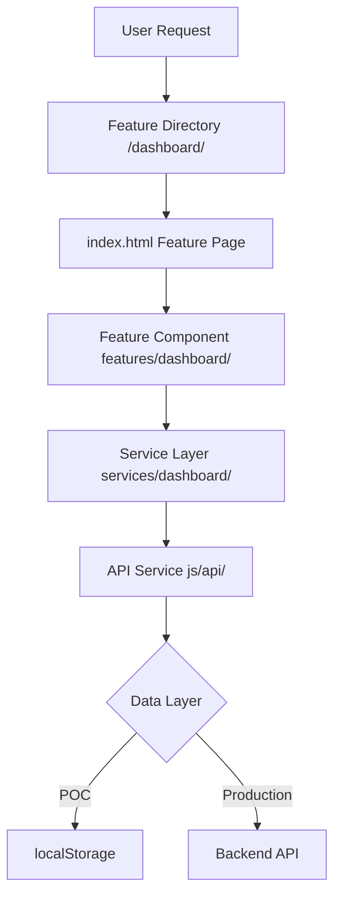
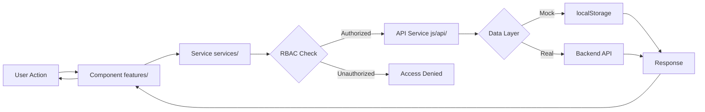
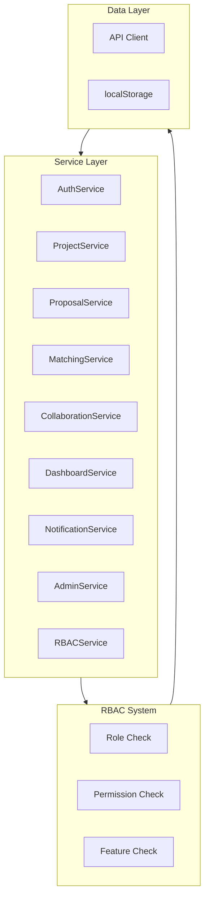
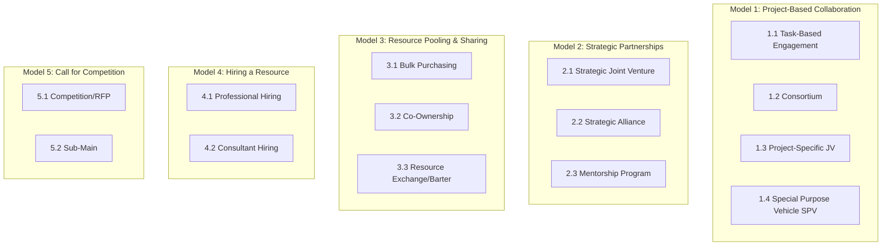
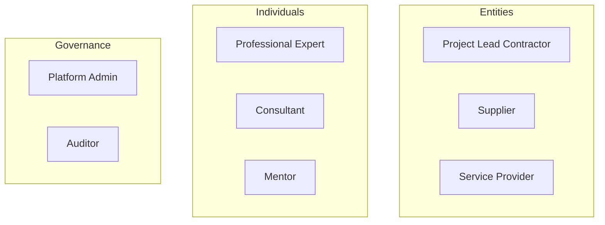
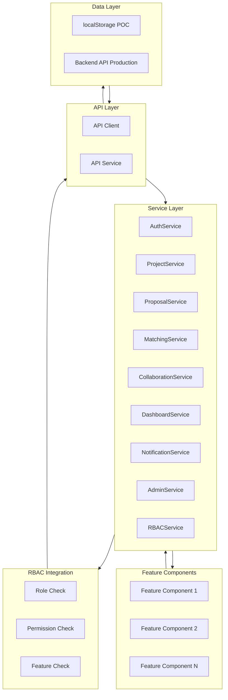
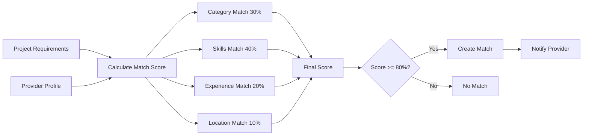
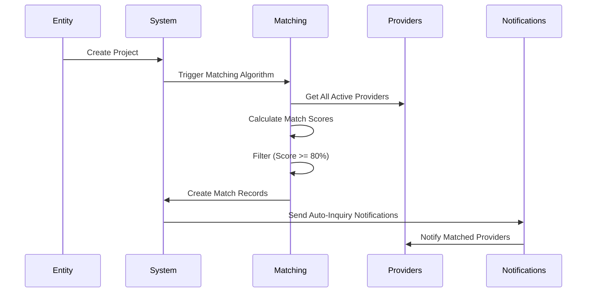

# PMTwin - Complete Project Documentation

**Version:** 2.1.0  
**Last Updated:** 2024  
**Status:** POC Complete, Ready for Backend Integration  
**Production Readiness:** 60%

---

## Table of Contents

1. [Executive Summary](#executive-summary)
2. [Architecture Overview](#architecture-overview)
3. [Feature Catalog](#feature-catalog)
4. [Collaboration Models](#collaboration-models)
5. [RBAC System](#rbac-system)
6. [Data Flow & Service Layer](#data-flow--service-layer)
7. [Matching Algorithm](#matching-algorithm)
8. [Project Structure](#project-structure)
9. [Technology Stack](#technology-stack)
10. [Key Metrics & Statistics](#key-metrics--statistics)

---

## Executive Summary

### Vision Statement

To digitize the lifecycle of construction collaboration in the MENA region through data-driven matching and flexible resource exchange.

### Mission

PMTwin revolutionizes how construction entities, professionals, and service providers connect, collaborate, and execute mega-projects. By combining intelligent matching algorithms with innovative barter systems and transparent project management, we create a sustainable ecosystem that reduces costs, accelerates timelines, and fosters strategic partnerships.

### Target Market

**Primary Focus:** MENA (Middle East and North Africa) Region
- Saudi Arabia (Primary market)
- UAE, Qatar, Kuwait, Egypt, Jordan (Secondary markets)

**Market Characteristics:**
- Rapid infrastructure development
- Large-scale mega-projects (Vision 2030, NEOM, etc.)
- Growing need for specialized expertise
- High demand for resource optimization
- Strong emphasis on local content and partnerships

### Current Status

- ✅ **Architecture Refactoring**: Complete migration to feature-based structure
- ✅ **Feature Implementation**: 24 features fully implemented
- ✅ **Service Layer**: Complete service abstraction with RBAC
- ✅ **API Abstraction**: Ready for backend integration
- ✅ **Documentation**: Comprehensive documentation in place
- ⚠️ **Backend Integration**: Pending (currently using localStorage)

### Key Metrics

| Metric | Value |
|--------|-------|
| **Features** | 24 features |
| **Services** | 9 service modules |
| **Collaboration Models** | 5 categories, 14 sub-models |
| **User Roles** | 8 roles (Project Lead, Supplier, Service Provider, Professional, Consultant, Mentor, Platform Admin, Auditor) |
| **Portals** | 4 (Public, User, Admin, Mobile) |
| **Documentation Files** | 10+ |
| **Code Quality** | Good (well-organized, documented) |
| **Production Readiness** | 60% |

---

## Architecture Overview

### Architecture Pattern

**Feature-Based Multi-Page Application (MPA)**



### Data Flow Architecture



### Service Layer Architecture



### Key Architectural Decisions

#### ✅ Strengths
1. **Separation of Concerns**: Clear separation between presentation, business logic, and data
2. **Scalability**: Feature-based structure allows easy addition of new features
3. **API Abstraction**: Seamless transition from localStorage to real API
4. **RBAC Integration**: Role-based access control built into service layer
5. **Backward Compatibility**: Router maintains compatibility with hash-based URLs

#### ⚠️ Areas for Improvement
1. **No Build Process**: No bundling, minification, or transpilation
2. **No Module System**: Uses global variables instead of ES6 modules
3. **No Type Safety**: No TypeScript or type checking
4. **Limited Error Handling**: Basic error handling, could be more comprehensive
5. **No Testing Framework**: No unit tests or integration tests

---

## Feature Catalog

### Complete Feature Matrix

| # | Feature Name | Public Portal | User Portal (Entity) | User Portal (Individual) | Admin Portal | Mobile App |
|---|--------------|---------------|---------------------|-------------------------|--------------|------------|
| 1 | Home/Landing Page | ✅ | ❌ | ❌ | ❌ | ❌ |
| 2 | Project Discovery | ✅ (Limited) | ✅ (Full) | ✅ (Full) | ✅ (View All) | ✅ (Assigned) |
| 3 | PMTwin Wizard | ✅ | ✅ | ✅ | ✅ (View Only) | ❌ |
| 4 | Knowledge Hub | ✅ | ✅ | ✅ | ✅ | ❌ |
| 5 | Login | ✅ | ✅ | ✅ | ✅ | ✅ |
| 6 | Signup/Registration | ✅ | ❌ | ❌ | ❌ | ❌ |
| 7 | Dashboard | ❌ | ✅ (Entity) | ✅ (Individual) | ✅ (Admin) | ✅ (Mobile) |
| 8 | Project Creation | ❌ | ✅ | ❌ | ❌ | ❌ |
| 9 | Project List/View | ❌ | ✅ | ✅ | ✅ (All) | ✅ (Assigned) |
| 10 | Project Edit/Delete | ❌ | ✅ (Own) | ❌ | ✅ (All) | ❌ |
| 11 | Proposal Creation | ❌ | ✅ | ✅ | ❌ | ❌ |
| 12 | Proposal List/View | ❌ | ✅ (Received) | ✅ (Own) | ✅ (All) | ❌ |
| 13 | Proposal Review/Approve | ❌ | ✅ (Own Projects) | ❌ | ✅ (All) | ❌ |
| 14 | Opportunities View | ❌ | ✅ | ✅ | ✅ (All) | ❌ |
| 15 | Matches View | ❌ | ✅ | ✅ | ✅ (All) | ❌ |
| 16 | Collaboration Models | ✅ (Wizard) | ✅ (Full) | ✅ (Limited) | ✅ (View Only) | ❌ |
| 17 | Collaboration Opportunities | ❌ | ✅ (Create) | ✅ (Apply) | ✅ (View All) | ❌ |
| 18 | Pipeline Management | ❌ | ✅ | ❌ | ✅ (View All) | ❌ |
| 19 | Profile Management | ✅ (Reg Only) | ✅ (Full) | ✅ (Full) | ✅ (View All) | ✅ (Limited) |
| 20 | Onboarding | ❌ | ✅ | ✅ | ❌ | ❌ |
| 21 | Notifications | ❌ | ✅ | ✅ | ✅ | ✅ |
| 22 | User Vetting | ❌ | ❌ | ❌ | ✅ | ❌ |
| 23 | Project Moderation | ❌ | ❌ | ❌ | ✅ | ❌ |
| 24 | Audit Trail | ❌ | ✅ (Own) | ✅ (Own) | ✅ (Full) | ✅ (Own) |
| 25 | Reports & Analytics | ❌ | ✅ (Own Data) | ✅ (Own Data) | ✅ (Full Platform) | ❌ |

### Public Features (6)

1. **Home** - Landing page with hero, services, portfolio
2. **Discovery** - Browse and filter projects (limited visibility)
3. **Wizard** - Interactive wizard for collaboration model selection
4. **Knowledge** - Knowledge hub (SPVs, barter systems, FAQs)
5. **Login** - Authentication with role detection
6. **Signup** - Multi-step registration with OTP verification

### User Features (13)

1. **Dashboard** - Role-based dashboard (Entity/Individual)
2. **Projects** - Project list, create, view, update, delete
3. **Opportunities** - Matched opportunities for providers
4. **Matches** - Match viewing and management
5. **Proposals** - Proposal creation and management
6. **Pipeline** - Kanban-style service pipeline
7. **Collaboration** - Collaboration models and opportunities
8. **Profile** - User profile management
9. **Onboarding** - Progressive profile completion
10. **Notifications** - Notification center
11. **Create Project** - Dynamic project creation with model selection
12. **Create Proposal** - Cash and barter proposal creation
13. **Project View** - Detailed project view with proposals

### Admin Features (5)

1. **Admin Dashboard** - Platform statistics and KPIs
2. **User Vetting** - Review and approve/reject users
3. **Project Moderation** - Moderate marketplace projects
4. **Audit Trail** - System activity logs
5. **Reports** - Financial and activity reports

### Feature-to-Role Mapping

| Feature | Project Lead | Supplier | Service Provider | Professional | Consultant | Mentor | Platform Admin | Auditor |
|---------|-------------|----------|------------------|--------------|------------|--------|----------------|---------|
| Create Projects | ✅ | ❌ | ❌ | ❌ | ❌ | ❌ | ✅ | ❌ |
| Post Tenders | ✅ | ❌ | ❌ | ❌ | ❌ | ❌ | ✅ | ❌ |
| Form Consortia | ✅ | ❌ | ❌ | ✅ | ❌ | ❌ | ✅ | ❌ |
| Create SPVs | ✅ | ❌ | ❌ | ❌ | ❌ | ❌ | ✅ | ❌ |
| Bulk Purchasing | ✅ | ✅ | ❌ | ❌ | ❌ | ❌ | ✅ | 👁️ |
| Task-Based Engagement | ✅ | ❌ | ✅ | ✅ | ✅ | ❌ | ✅ | 👁️ |
| Strategic Alliances | ✅ | ✅ | ✅ | ❌ | ✅ | ❌ | ✅ | 👁️ |
| Mentorship Program | ❌ | ❌ | ❌ | ✅ | ❌ | ✅ | ✅ | 👁️ |
| Professional Hiring | ✅ | ❌ | ❌ | ✅ | ❌ | ❌ | ✅ | 👁️ |
| Consultant Hiring | ✅ | ❌ | ❌ | ❌ | ✅ | ❌ | ✅ | 👁️ |
| Review Proposals | ✅ | ❌ | ❌ | ❌ | ❌ | ❌ | ✅ | 👁️ |
| User Vetting | ❌ | ❌ | ❌ | ❌ | ❌ | ❌ | ✅ | 👁️ |

Legend: ✅ = Full Access, 👁️ = Read-Only, ❌ = No Access

---

## Collaboration Models

### Overview

PMTwin supports **5 main categories** with **14 sub-models** for different collaboration scenarios:



### Model 1: Project-Based Collaboration

**Purpose:** Deliver defined projects with clear start and end points

#### 1.1 Task-Based Engagement
- **Description:** Short-term collaboration for specific tasks, deliverables, or expert consultation
- **Applicability:** B2B, B2P, P2B, P2P
- **Key Attributes:**
  - Task title, type, detailed scope
  - Duration, budget range, budget type
  - Required skills, experience level
  - Location requirement, start date
  - Deliverable format, payment terms
  - Exchange type (Cash/Barter/Mixed)
- **Matching Metrics:**
  - Skill/Scope Match: 50%
  - Financial Capacity: 30%
  - Past Performance: 20%
- **Threshold:** 80%
- **Use Cases:** Design review, engineering consultation, quality control

#### 1.2 Consortium
- **Description:** Temporary contractual alliance among independent entities formed to pursue a specific opportunity
- **Applicability:** B2B, B2P, P2B, P2P
- **Key Attributes:**
  - Project title, type, value, duration
  - Project location, lead member status
  - Required members, required expertise
  - Financial contribution, risk sharing
- **Use Cases:** Large infrastructure projects requiring multiple specialties

#### 1.3 Project-Specific Joint Venture (JV)
- **Description:** Shared management partnership for a single project
- **Applicability:** B2B
- **Key Attributes:**
  - Project details, equity split
  - Management structure, decision-making
  - Profit/loss sharing, exit strategy
- **Use Cases:** Complex projects needing shared expertise and resources

#### 1.4 Special Purpose Vehicle (SPV)
- **Description:** Risk-isolated entity for mega-projects (50M+ SAR)
- **Applicability:** B2B
- **Key Attributes:**
  - Project value (minimum 50M SAR)
  - Legal structure, equity distribution
  - Risk isolation, financial structure
- **Use Cases:** Mega-projects requiring legal and financial isolation

### Model 2: Strategic Partnerships

**Purpose:** Form long-term alliances for ongoing collaboration and mutual growth (10+ years)

#### 2.1 Strategic Joint Venture
- **Description:** New permanent business entity for long-term market presence
- **Applicability:** B2B
- **Key Attributes:**
  - Strategic objectives, market focus
  - Equity structure, governance model
  - Long-term commitment (10+ years)
- **Use Cases:** Entering new markets, technology transfer, capacity building

#### 2.2 Strategic Alliance
- **Description:** Ongoing contractual relationship without new entity formation
- **Applicability:** B2B, B2P, P2B, P2P
- **Key Attributes:**
  - Alliance scope, duration
  - Resource sharing, technology transfer
  - Performance metrics
- **Use Cases:** Ongoing supply chain partnerships, technology sharing

#### 2.3 Mentorship Program
- **Description:** Knowledge transfer relationship between experienced and emerging entities/professionals
- **Applicability:** B2B, B2P, P2B, P2P
- **Key Attributes:**
  - Mentor/mentee matching
  - Program duration, learning objectives
  - Progress tracking, evaluation
- **Use Cases:** Knowledge transfer, skill development, market entry support

### Model 3: Resource Pooling & Sharing

**Purpose:** Optimize costs through sharing, co-ownership, or barter of resources

#### 3.1 Bulk Purchasing
- **Description:** Group buying for volume discounts on materials and equipment
- **Applicability:** B2B
- **Key Attributes:**
  - Material/equipment type, quantity
  - Target discount, participation requirements
  - Delivery timeline, payment terms
- **Use Cases:** Materials procurement, equipment rental, service contracts

#### 3.2 Co-Ownership
- **Description:** Joint ownership of high-value assets (machinery, equipment, facilities)
- **Applicability:** B2B
- **Key Attributes:**
  - Asset type, value, ownership percentage
  - Usage rights, maintenance responsibilities
  - Exit strategy
- **Use Cases:** Heavy machinery, specialized equipment, shared facilities

#### 3.3 Resource Exchange/Barter
- **Description:** Marketplace for trading services, materials, or equipment
- **Applicability:** B2B, B2P, P2B, P2P
- **Key Attributes:**
  - Resource type, quantity, value
  - Exchange terms, barter offer
  - Quality standards, delivery terms
- **Use Cases:** Surplus materials, excess capacity, service-for-service trades

### Model 4: Hiring a Resource

**Purpose:** Recruit professionals or consultants for employment or service engagements

#### 4.1 Professional Hiring
- **Description:** Full-time or part-time employment contracts
- **Applicability:** B2B, B2P
- **Key Attributes:**
  - Position title, job description
  - Employment type, salary range
  - Required qualifications, experience
- **Use Cases:** Project managers, engineers, site supervisors

#### 4.2 Consultant Hiring
- **Description:** Expert advisory services and consulting engagements
- **Applicability:** B2B, P2B
- **Key Attributes:**
  - Consulting scope, engagement type
  - Fee structure, deliverables
  - Required expertise, duration
- **Use Cases:** Feasibility studies, expert reviews, advisory services

### Model 5: Call for Competition

**Purpose:** Competitive sourcing of solutions, designs, or talent through open or invited competitions

#### 5.1 Competition/RFP
- **Description:** Open or invited competitions for designs, solutions, or proposals
- **Applicability:** B2B, B2P, P2B, P2P
- **Key Attributes:**
  - Competition type, scope
  - Evaluation criteria, prizes
  - Submission deadline, requirements
- **Use Cases:** Design competitions, innovation challenges, RFQ for materials

#### 5.2 Sub-Main
- **Description:** [Description to be defined]
- **Applicability:** [Applicability to be defined]
- **Key Attributes:**
  - [Key attributes to be defined]
- **Use Cases:** [Use cases to be defined]

### Collaboration Model Access by Role

| Model | Project Lead | Supplier | Service Provider | Professional | Consultant | Mentor |
|-------|-------------|----------|------------------|--------------|------------|--------|
| 1.1 Task-Based | ✅ | ❌ | ✅ | ✅ | ✅ | ❌ |
| 1.2 Consortium | ✅ | ❌ | ❌ | ✅ | ❌ | ❌ |
| 1.3 Project JV | ✅ | ❌ | ❌ | ❌ | ❌ | ❌ |
| 1.4 SPV | ✅ | ❌ | ❌ | ❌ | ❌ | ❌ |
| 2.1 Strategic JV | ✅ | ❌ | ❌ | ❌ | ❌ | ❌ |
| 2.2 Strategic Alliance | ✅ | ✅ | ✅ | ❌ | ✅ | ❌ |
| 2.3 Mentorship | ❌ | ❌ | ❌ | ✅ | ❌ | ✅ |
| 3.1 Bulk Purchasing | ✅ | ✅ | ❌ | ❌ | ❌ | ❌ |
| 3.2 Co-Ownership | ✅ | ✅ | ❌ | ❌ | ❌ | ❌ |
| 3.3 Resource Exchange | ✅ | ✅ | ❌ | ❌ | ❌ | ❌ |
| 4.1 Professional Hiring | ✅ | ❌ | ❌ | ✅ | ❌ | ❌ |
| 4.2 Consultant Hiring | ✅ | ❌ | ❌ | ❌ | ✅ | ❌ |
| 5.1 Competition | ✅ | ❌ | ❌ | ❌ | ❌ | ❌ |
| 5.2 Sub-Main | ✅ | ❌ | ❌ | ❌ | ❌ | ❌ |

---

## RBAC System

### User Types and Roles

PMTwin operates on a multi-role registration system with **8 distinct roles** organized into three categories:



### Role Definitions

#### 1. Project Lead (Contractor)
- **Role ID:** `project_lead`
- **Access Level:** Full Entity Admin
- **Primary Responsibilities:**
  - Posts tenders and project opportunities
  - Forms consortia for large projects
  - Hires resources (professionals and consultants)
  - Initiates Special Purpose Vehicles (SPVs)
  - Manages project lifecycle from initiation to completion
- **Available Models:** All 14 sub-models (1.1-1.4, 2.1-2.2, 3.1-3.3, 4.1-4.2, 5.1-5.2)

#### 2. Supplier
- **Role ID:** `supplier`
- **Access Level:** Inventory & Sales
- **Primary Responsibilities:**
  - Participates in bulk purchasing initiatives
  - Lists surplus materials and equipment
  - Joins strategic alliances
  - Manages inventory and resource sharing
- **Available Models:** 2.2, 3.1, 3.2, 3.3

#### 3. Service Provider
- **Role ID:** `service_provider`
- **Access Level:** Service Admin
- **Primary Responsibilities:**
  - Offers specialized B2B services (Legal, Logistics, Design)
  - Participates in Task-Based engagements
  - Joins Strategic Alliances
- **Available Models:** 1.1, 2.2

#### 4. Professional / Expert
- **Role ID:** `professional`
- **Access Level:** Personal Profile
- **Primary Responsibilities:**
  - Accepts task-based engagements
  - Joins consortia as a member
  - Seeks full-time hiring opportunities
  - Participates in mentorship programs
- **Available Models:** 1.1, 1.2, 2.3, 4.1

#### 5. Consultant
- **Role ID:** `consultant`
- **Access Level:** Consultant Profile
- **Primary Responsibilities:**
  - Provides advisory services
  - Conducts feasibility studies
  - Performs expert reviews
  - Offers high-level consultation
- **Available Models:** 1.1, 2.2, 4.2

#### 6. Mentor
- **Role ID:** `mentor`
- **Access Level:** Mentor Dashboard
- **Primary Responsibilities:**
  - Guides junior professionals through Mentorship Program
  - Provides knowledge transfer
  - Supports professional development
- **Available Models:** 2.3

#### 7. Platform Admin
- **Role ID:** `platform_admin`
- **Access Level:** System Wide
- **Primary Responsibilities:**
  - Manages user verification
  - Handles dispute resolution
  - Monitors platform analytics
  - Manages system-wide settings
- **Available Models:** All models (read-only access for monitoring)

#### 8. Auditor
- **Role ID:** `auditor`
- **Access Level:** Read-Only
- **Primary Responsibilities:**
  - Verifies compliance
  - Reviews contract integrity
  - Monitors audit trails
- **Available Models:** All models (read-only access)

### Permission Matrix

| Permission | Project Lead | Supplier | Service Provider | Professional | Consultant | Mentor | Platform Admin | Auditor |
|------------|-------------|----------|------------------|--------------|------------|--------|----------------|---------|
| Create Projects | ✅ | ❌ | ❌ | ❌ | ❌ | ❌ | ✅ | ❌ |
| Post Tenders | ✅ | ❌ | ❌ | ❌ | ❌ | ❌ | ✅ | ❌ |
| Form Consortia | ✅ | ❌ | ❌ | ✅ | ❌ | ❌ | ✅ | ❌ |
| Create SPVs | ✅ | ❌ | ❌ | ❌ | ❌ | ❌ | ✅ | ❌ |
| Bulk Purchasing | ✅ | ✅ | ❌ | ❌ | ❌ | ❌ | ✅ | 👁️ |
| List Surplus | ✅ | ✅ | ❌ | ❌ | ❌ | ❌ | ✅ | 👁️ |
| Task-Based Engagement | ✅ | ❌ | ✅ | ✅ | ✅ | ❌ | ✅ | 👁️ |
| Strategic Alliances | ✅ | ✅ | ✅ | ❌ | ✅ | ❌ | ✅ | 👁️ |
| Mentorship Program | ❌ | ❌ | ❌ | ✅ | ❌ | ✅ | ✅ | 👁️ |
| Professional Hiring | ✅ | ❌ | ❌ | ✅ | ❌ | ❌ | ✅ | 👁️ |
| Consultant Hiring | ✅ | ❌ | ❌ | ❌ | ✅ | ❌ | ✅ | 👁️ |
| Review Proposals | ✅ | ❌ | ❌ | ❌ | ❌ | ❌ | ✅ | 👁️ |
| User Vetting | ❌ | ❌ | ❌ | ❌ | ❌ | ❌ | ✅ | 👁️ |
| Dispute Resolution | ❌ | ❌ | ❌ | ❌ | ❌ | ❌ | ✅ | 👁️ |
| View Analytics | ❌ | ❌ | ❌ | ❌ | ❌ | ❌ | ✅ | 👁️ |

Legend: ✅ = Full Access, 👁️ = Read-Only, ❌ = No Access

### Portal Access by Role

| Role | Public Portal | User Portal | Admin Portal | Mobile App |
|------|--------------|-------------|---------------|------------|
| Project Lead | ✅ | ✅ | ❌ | ✅ |
| Supplier | ✅ | ✅ | ❌ | ✅ |
| Service Provider | ✅ | ✅ | ❌ | ✅ |
| Professional | ✅ | ✅ | ❌ | ✅ |
| Consultant | ✅ | ✅ | ❌ | ✅ |
| Mentor | ✅ | ✅ | ❌ | ✅ |
| Platform Admin | ✅ | ✅ | ✅ | ❌ |
| Auditor | ✅ | ❌ | ✅ | ❌ |
| Guest | ✅ | ❌ | ❌ | ❌ |

### Profile Score Calculation

The Profile Score is a dynamic progress indicator (0-100%) that incentivizes users to complete their profiles.

**Profile Score = (Completion Score × 0.6) + (Verification Score × 0.4)**

#### Completion Score (60% weight)
- Basic Information: 15%
- Professional Details: 20%
- Portfolio/Experience: 25%
- Certifications: 15%
- References: 10%
- Additional Information: 15%

#### Verification Score (40% weight)
- Identity Verification: 30% (National ID for individuals, CR for entities)
- Professional Certifications: 30%
- Portfolio Documents: 20%
- Safety Certifications: 20%

---

## Data Flow & Service Layer

### Service Layer Architecture



### Available Services

| Service | Functions | RBAC Integration | Status |
|---------|-----------|------------------|--------|
| **AuthService** | login, register, logout | ✅ Role assignment on login | ✅ Complete |
| **ProjectService** | CRUD operations | ✅ Permission checks | ✅ Complete |
| **ProposalService** | CRUD operations | ✅ Role-based filtering | ✅ Complete |
| **MatchingService** | getMatches, getMatchById | ✅ Access control | ✅ Complete |
| **CollaborationService** | Opportunities, Applications | ✅ Permission checks | ✅ Complete |
| **DashboardService** | getDashboardData, getMenuItems | ✅ Role-based data | ✅ Complete |
| **NotificationService** | getNotifications, markAsRead | ✅ User filtering | ✅ Complete |
| **AdminService** | Vetting, Moderation, Audit | ✅ Admin-only | ✅ Complete |
| **RBACService** | Role checks, permissions | ✅ Core system | ✅ Complete |

### Service Method Pattern

All services follow a consistent pattern:

```javascript
ServiceName.method(params)
  → Check RBAC permissions
  → Validate input
  → Call API service or localStorage
  → Return { success: boolean, data: ..., message: ... }
```

### Data Management

#### Current Implementation (POC - localStorage)

**Storage Structure:**
```javascript
localStorage.setItem('pmtwin_users', JSON.stringify([...]))
localStorage.setItem('pmtwin_projects', JSON.stringify([...]))
localStorage.setItem('pmtwin_proposals', JSON.stringify([...]))
localStorage.setItem('pmtwin_matches', JSON.stringify([...]))
localStorage.setItem('pmtwin_collaboration_opportunities', JSON.stringify([...]))
localStorage.setItem('pmtwin_notifications', JSON.stringify([...]))
localStorage.setItem('pmtwin_audit', JSON.stringify([...]))
localStorage.setItem('pmtwin_sessions', JSON.stringify([...]))
```

**Data Modules:**
- `Users` - User accounts and profiles
- `Sessions` - Active sessions
- `Projects` - Mega-projects
- `Proposals` - Service proposals
- `Matches` - Matching records
- `CollaborationOpportunities` - Collaboration opportunities
- `CollaborationApplications` - Applications
- `Notifications` - User notifications
- `Audit` - Audit trail

#### API Integration Ready

**API Abstraction Layer:**
- `js/api/api-client.js` - HTTP client with retry logic
- `js/api/api-service.js` - Service abstraction
- Automatic fallback to localStorage when API unavailable
- Configuration in `js/config.js`

**Expected API Endpoints:**
- `GET/POST/PUT/DELETE /api/v1/users`
- `GET/POST/PUT/DELETE /api/v1/projects`
- `GET/POST/PUT/DELETE /api/v1/proposals`
- `GET/POST/PUT/DELETE /api/v1/notifications`
- `POST /api/v1/sessions` (login)
- `DELETE /api/v1/sessions/{token}` (logout)

---

## Matching Algorithm

### Overview

PMTwin uses an intelligent matching algorithm to connect projects with service providers based on multiple criteria with a minimum threshold of 80%.

### Score Calculation



### Matching Weights

| Criteria | Weight | Description |
|----------|--------|-------------|
| **Category** | 30% | Service category alignment |
| **Skills** | 40% | Required skills match |
| **Experience** | 20% | Experience level compatibility |
| **Location** | 10% | Location proximity |

**Formula:**
```
Match Score = (Category Match × 0.3) + 
              (Skills Match × 0.4) + 
              (Experience Match × 0.2) + 
              (Location Match × 0.1)
```

### Matching Threshold

- **Minimum Score:** 80%
- **Auto-Inquiry:** Matches above threshold trigger automatic notifications
- **Match Record:** Created in system for tracking

### Model-Specific Matching

Each collaboration model has its own matching function with model-specific metrics:

#### Model 1.1 (Task-Based Engagement)
- Skill/Scope Match: 50%
- Financial Capacity: 30%
- Past Performance: 20%
- Threshold: 80%

#### Model 1.2 (Consortium)
- Expertise Match: 40%
- Financial Capacity: 30%
- Past Performance: 20%
- Location: 10%
- Threshold: 80%

#### Model 1.4 (SPV)
- Financial Capacity: 50%
- Expertise Match: 30%
- Past Performance: 20%
- Threshold: 85% (higher for mega-projects)

### Matching Flow



### Auto-Inquiry System

When a match is created:
1. Match record is stored in system
2. Notification is sent to matched provider
3. Provider can view match details
4. Provider can submit proposal
5. Entity reviews proposals and approves/rejects

---

## Project Structure

### Complete Directory Structure

```
POC/
├── index.html                    # Entry point (redirects to home/)
│
├── [feature]/                    # Feature directories (24 total)
│   └── index.html                # Feature page
│
├── css/
│   └── main.css                  # Centralized stylesheet
│
├── js/                           # Core JavaScript
│   ├── config.js                 # Configuration
│   ├── data.js                   # Data layer (localStorage)
│   ├── auth.js                   # Authentication
│   ├── router.js                 # Router (backward compatibility)
│   ├── auth-check.js             # Auth utilities
│   ├── demo-credentials.js       # Demo accounts
│   ├── matching.js               # Matching algorithm
│   ├── collaboration-models.js   # Collaboration models UI
│   ├── collaboration-model-definitions.js  # Model definitions
│   ├── collaboration-matching.js # Model-specific matching
│   ├── project-form-builder.js  # Dynamic form generation
│   └── api/                      # API layer
│       ├── api-client.js         # HTTP client
│       └── api-service.js        # API services
│
├── features/                     # Feature components
│   ├── auth/                     # Authentication components
│   │   ├── login.html
│   │   ├── login.js
│   │   ├── signup.html
│   │   └── signup.js
│   ├── dashboard/               # Dashboard components
│   ├── projects/                # Project management
│   ├── proposals/               # Proposal management
│   ├── matching/                # Matching engine
│   ├── collaboration/           # Collaboration models
│   ├── pipeline/               # Service pipeline
│   ├── profile/                # User profile
│   ├── onboarding/            # Onboarding flow
│   ├── notifications/          # Notifications
│   ├── admin/                  # Admin features
│   └── public/                 # Public features
│
├── services/                    # Service layer
│   ├── auth/
│   │   └── auth-service.js
│   ├── projects/
│   │   └── project-service.js
│   ├── proposals/
│   │   └── proposal-service.js
│   ├── matching/
│   │   └── matching-service.js
│   ├── notifications/
│   │   └── notification-service.js
│   ├── admin/
│   │   ├── admin-service.js
│   │   ├── analytics-service.js
│   │   ├── models-management-service.js
│   │   └── settings-service.js
│   ├── dashboard/
│   │   └── dashboard-service.js
│   ├── collaboration/
│   │   └── collaboration-service.js
│   ├── onboarding/
│   ├── rbac/
│   │   └── role-service.js
│   └── services-loader.js      # Service loader
│
├── data/                        # Data files
│   ├── *.json                   # JSON data files
│   ├── roles.json              # Role definitions
│   ├── user-roles.json         # User-role assignments
│   ├── demo-users.json         # Demo accounts
│   ├── sample-projects.json    # Sample projects
│   └── data-loader.js         # Data loader
│
├── templates/                   # HTML templates
│   └── app-layout.html         # Application layout
│
└── archive/                     # Archived obsolete files
    ├── obsolete-html/          # Old HTML files
    ├── obsolete-portals/       # Old portal files
    ├── obsolete-js/            # Old JS files
    └── test-files/             # Test/debug files
```

### Feature Directories (24 total)

#### Public Features (6)
- `home/` - Landing page
- `discovery/` - Project discovery
- `wizard/` - PMTwin wizard
- `knowledge/` - Knowledge hub
- `login/` - Login page
- `signup/` - Signup page

#### User Features (13)
- `dashboard/` - User dashboard
- `projects/` - Projects list
- `create-project/` - Create project
- `project/` - Project details
- `opportunities/` - Opportunities
- `matches/` - Matches
- `proposals/` - Proposals list
- `create-proposal/` - Create proposal
- `pipeline/` - Service pipeline
- `collaboration/` - Collaboration models
- `profile/` - User profile
- `onboarding/` - Onboarding flow
- `notifications/` - Notifications

#### Admin Features (5)
- `admin/` - Admin dashboard
- `admin-vetting/` - User vetting
- `admin-moderation/` - Project moderation
- `admin-audit/` - Audit trail
- `admin-reports/` - Reports

### Key Files

| File | Purpose |
|------|---------|
| `index.html` | Entry point, redirects to home/ |
| `js/config.js` | Configuration (API URLs, feature flags) |
| `js/data.js` | Data persistence layer (localStorage) |
| `js/auth.js` | Authentication system |
| `js/matching.js` | Matching algorithm |
| `js/collaboration-models.js` | Collaboration models UI |
| `js/collaboration-model-definitions.js` | Model definitions |
| `js/collaboration-matching.js` | Model-specific matching |
| `data/roles.json` | Role definitions |
| `data/user-roles.json` | User-role assignments |
| `css/main.css` | Centralized stylesheet |

---

## Technology Stack

### Frontend

- **HTML5** - Semantic markup
- **CSS3** - Styling (single `main.css` file)
- **Vanilla JavaScript** - No frameworks (ES5/ES6)
- **localStorage** - Client-side data persistence (POC)

### Data Management

- **JSON Files** - Static data and configuration
- **localStorage API** - Client-side storage
- **API Abstraction** - Ready for REST API integration

### Architecture Patterns

- **Service Layer Pattern** - Business logic abstraction
- **Repository Pattern** - Data access abstraction
- **RBAC Pattern** - Role-based access control
- **Component Pattern** - Feature-based components

### Backend Integration (Ready)

- **API Client** - HTTP client with retry logic
- **API Service** - Service abstraction layer
- **Configuration** - Easy switch between mock and real API
- **Expected Backend:** Java REST API

### Development Tools

- **No Build Process** - Direct file access (POC)
- **No Module System** - Global variables (POC)
- **No Type Safety** - Vanilla JavaScript (POC)
- **No Testing Framework** - Manual testing (POC)

### Future Enhancements

**Recommended:**
- Build tool: Webpack, Vite, or Parcel
- Testing: Jest, Mocha, or Vitest
- Linting: ESLint
- Formatting: Prettier
- Type checking: TypeScript
- HTTP client: Axios (if needed)

---

## Key Metrics & Statistics

### Code Metrics

| Metric | Value |
|--------|-------|
| **Features** | 24 features implemented |
| **Services** | 9 service modules |
| **Components** | 50+ component files |
| **Documentation** | 10+ documentation files |
| **Lines of Code** | ~15,000+ (estimated) |
| **Functions** | 200+ functions documented |

### File Structure

| Category | Count |
|----------|-------|
| **Feature Directories** | 24 |
| **Service Modules** | 9 |
| **Data Files** | 8 JSON files |
| **Core JavaScript Files** | 10+ |
| **Documentation Files** | 10+ |

### Feature Breakdown

| Category | Count | Features |
|----------|-------|----------|
| **Public** | 6 | Home, Discovery, Wizard, Knowledge, Login, Signup |
| **User** | 13 | Dashboard, Projects, Opportunities, Matches, Proposals, Pipeline, Collaboration, Profile, Onboarding, Notifications |
| **Admin** | 5 | Dashboard, Vetting, Moderation, Audit, Reports |

### Collaboration Models

| Category | Sub-Models | Total |
|----------|------------|-------|
| **Model 1: Project-Based** | 4 | 1.1, 1.2, 1.3, 1.4 |
| **Model 2: Strategic** | 3 | 2.1, 2.2, 2.3 |
| **Model 3: Resource Pooling** | 3 | 3.1, 3.2, 3.3 |
| **Model 4: Hiring** | 2 | 4.1, 4.2 |
| **Model 5: Competition** | 2 | 5.1, 5.2 |
| **Total** | **14** | **5 categories** |

### User Roles

| Category | Roles | Total |
|----------|-------|-------|
| **Entities** | Project Lead, Supplier, Service Provider | 3 |
| **Individuals** | Professional, Consultant, Mentor | 3 |
| **Governance** | Platform Admin, Auditor | 2 |
| **Total** | **8 roles** | **3 categories** |

### Portals

| Portal | Features | Access |
|--------|----------|--------|
| **Public** | 6 | Guest, All Users |
| **User** | 13 | Authenticated Users |
| **Admin** | 5 | Platform Admin, Auditor |
| **Mobile** | 10 | Authenticated Users (Mobile) |

### Production Readiness: 60%

**Ready:**
- ✅ Architecture
- ✅ Features
- ✅ Documentation
- ✅ Code organization
- ✅ API abstraction

**Needed:**
- ⚠️ Backend API
- ⚠️ Security hardening
- ⚠️ Testing framework
- ⚠️ Build process
- ⚠️ Performance optimization

### Security Status

**✅ Implemented:**
- RBAC (Role-Based Access Control)
- Session Management
- OTP Verification
- Input Validation
- Audit Trail

**⚠️ Needs Improvement (POC Only):**
- Password hashing (currently Base64)
- HTTPS enforcement
- CSRF protection
- Rate limiting
- Server-side validation

### Next Steps

**Priority 1: Backend Integration**
1. Implement Java backend API
2. Update `config.js` with API URL
3. Test API integration
4. Migrate from localStorage

**Priority 2: Security Hardening**
1. Implement password hashing (bcrypt)
2. Add HTTPS
3. CSRF protection
4. Rate limiting
5. Server-side validation

**Priority 3: Testing & Quality**
1. Set up testing framework
2. Write unit tests
3. Write integration tests
4. Set up CI/CD

---

## Summary

PMTwin is a comprehensive construction collaboration platform for the MENA region with:

- **24 Features** across 4 portals
- **5 Collaboration Model Categories** with 14 sub-models
- **8 User Roles** with granular permissions
- **9 Service Modules** with RBAC integration
- **Intelligent Matching Algorithm** with 80% threshold
- **Feature-Based Architecture** ready for backend integration

The platform is **POC Complete** and ready for backend integration, with comprehensive documentation and a well-organized codebase.

**Status:** Ready for Backend Integration  
**Production Readiness:** 60%  
**Next Phase:** Backend Development & Security Hardening

---

**Last Updated:** 2024  
**Document Version:** 2.1.0  
**Project Status:** POC Complete

