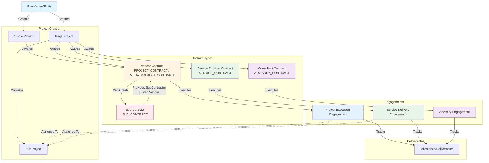
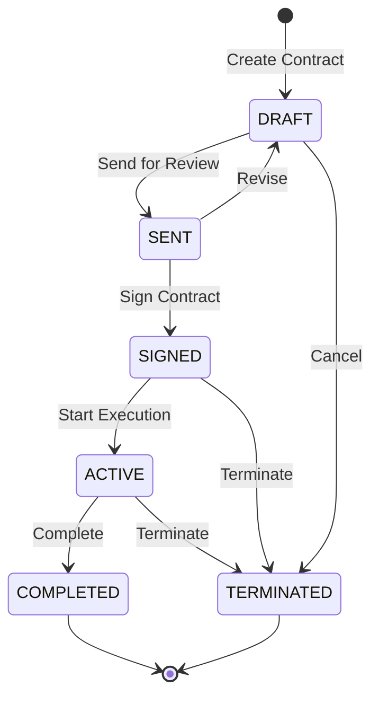
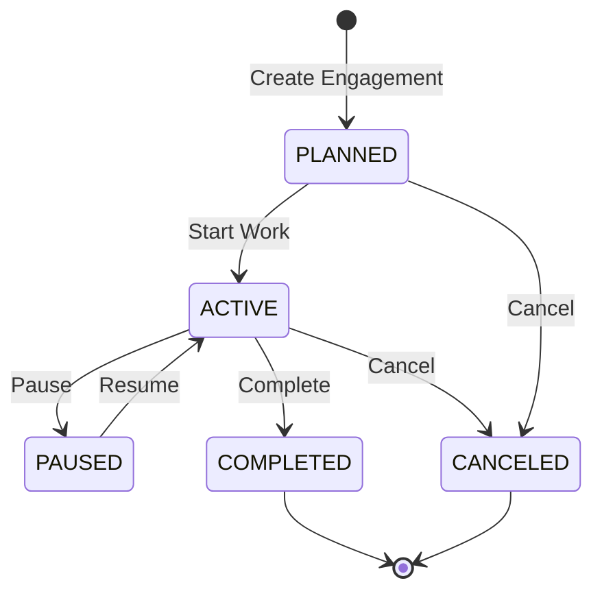
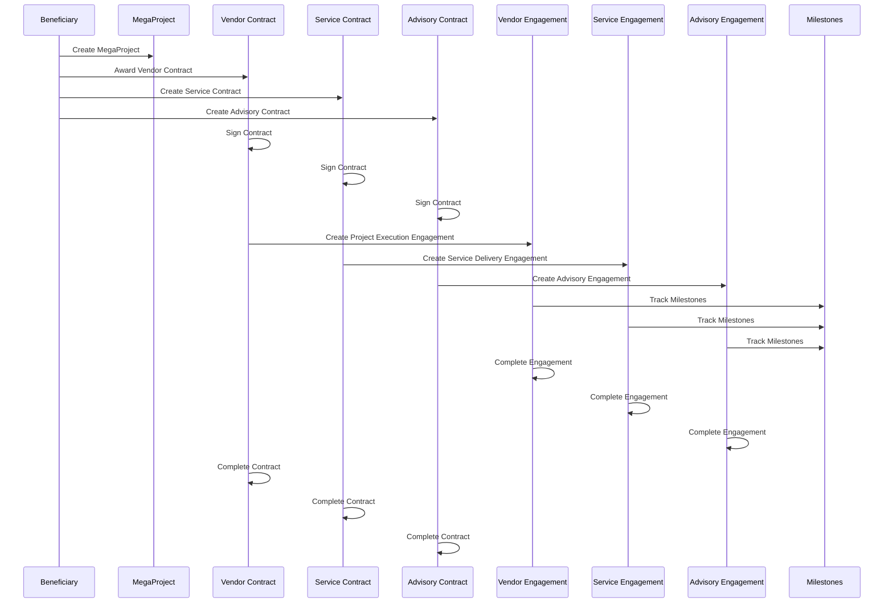
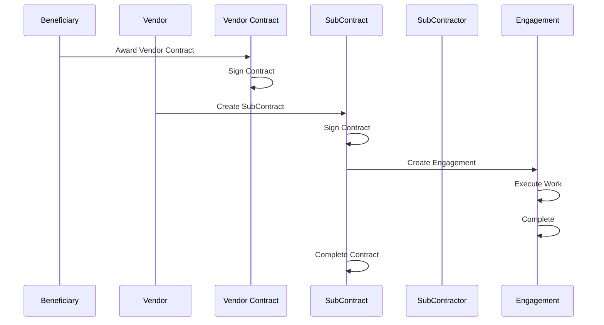

# Contract-Driven Workflow

## Overview

The PMTwin platform uses a contract-driven workflow where all collaboration and execution flows through Contracts and Engagements. This ensures proper governance, traceability, and enforcement of business rules.

## Workflow Diagram

## Contract Types

### 1. PROJECT_CONTRACT
- **Buyer**: Beneficiary
- **Provider**: Vendor (Corporate or Individual)
- **Scope**: Single Project
- **Engagement Type**: PROJECT_EXECUTION

### 2. MEGA_PROJECT_CONTRACT
- **Buyer**: Beneficiary
- **Provider**: Vendor (Corporate or Individual)
- **Scope**: Mega Project
- **Engagement Type**: PROJECT_EXECUTION
- **Note**: Mega Projects can have multiple parallel contracts

### 3. SERVICE_CONTRACT
- **Buyer**: Beneficiary or Vendor
- **Provider**: Service Provider
- **Scope**: Service Request
- **Engagement Type**: SERVICE_DELIVERY
- **Restriction**: Service Providers cannot bid on Projects/MegaProjects directly

### 4. ADVISORY_CONTRACT
- **Buyer**: Beneficiary or Vendor
- **Provider**: Consultant
- **Scope**: Project, Mega Project, or Service Request
- **Engagement Type**: ADVISORY

### 5. SUB_CONTRACT
- **Buyer**: Vendor (must be VENDOR_CORPORATE or VENDOR_INDIVIDUAL)
- **Provider**: SubContractor
- **Scope**: Same as parent contract (PROJECT, MEGA_PROJECT, or SUB_PROJECT)
- **Parent Contract**: Must reference a PROJECT_CONTRACT or MEGA_PROJECT_CONTRACT
- **Engagement Type**: PROJECT_EXECUTION
- **Restriction**: SubContractors cannot contract directly with Beneficiaries

## Business Rules

### SubContract Rules
1. ✅ Provider must be SUB_CONTRACTOR
2. ✅ Buyer must be VENDOR (Corporate or Individual)
3. ✅ Must have parentContractId pointing to Vendor contract
4. ✅ Parent contract must be PROJECT_CONTRACT or MEGA_PROJECT_CONTRACT
5. ✅ SubContractor cannot have direct contract with Beneficiary

### Service Provider Rules
1. ✅ Cannot bid on Projects/MegaProjects directly
2. ✅ Can only be engaged via ServiceRequest → Match → SERVICE_CONTRACT
3. ✅ Must use SERVICE_CONTRACT type
4. ✅ Scope must be SERVICE_REQUEST

### Engagement Rules
1. ✅ Must have contractId (required)
2. ✅ Contract must be SIGNED or ACTIVE
3. ✅ Engagement type must match contract type
4. ✅ Can be assigned to SubProjects, Phases, or Work Packages

### MegaProject Rules
1. ✅ Can have multiple parallel contracts simultaneously
2. ✅ Supports Vendor, Service Provider, and Consultant contracts
3. ✅ Sub-Contracts can be created under Vendor contracts

## Contract Lifecycle

## Engagement Lifecycle

## Data Flow Example: Mega Project with Multiple Contracts

## SubContract Flow

## Key Constraints

1. **SubContractor Isolation**: SubContractors can only contract with Vendors, never directly with Beneficiaries
2. **Service Provider Isolation**: Service Providers cannot bid on Projects/MegaProjects; only via ServiceRequests
3. **Contract Requirement**: All engagements require a signed contract
4. **Multi-Contract Support**: MegaProjects support multiple parallel contracts across provider types
5. **Parent Contract Validation**: SubContracts must have valid parent Vendor contracts

## Migration Path

The system includes migration functions to convert existing data:

1. **Approved Proposals** → PROJECT_CONTRACT/MEGA_PROJECT_CONTRACT + Engagements
2. **Service Engagements** → SERVICE_CONTRACT + Engagements
3. **Vendor-SubContractor Relationships** → SUB_CONTRACT entities

## API Endpoints

### Contracts
- `POST /api/v1/contracts` - Create contract
- `POST /api/v1/contracts/:id/sign` - Sign contract
- `GET /api/v1/contracts/:id` - Get contract
- `GET /api/v1/mega-projects/:id/contracts` - Get all contracts for mega-project
- `GET /api/v1/projects/:id/contracts` - Get all contracts for project
- `GET /api/v1/contracts/:id/sub-contracts` - Get sub-contracts

### Engagements
- `POST /api/v1/engagements` - Create engagement
- `GET /api/v1/engagements/:id` - Get engagement
- `GET /api/v1/contracts/:id/engagements` - Get engagements for contract
- `POST /api/v1/engagements/:id/assign-scope` - Assign to scope
- `POST /api/v1/engagements/:id/complete` - Complete engagement

