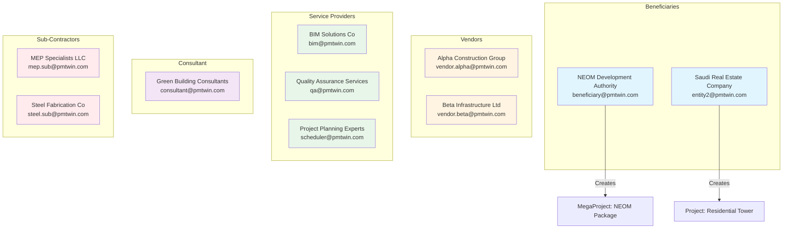
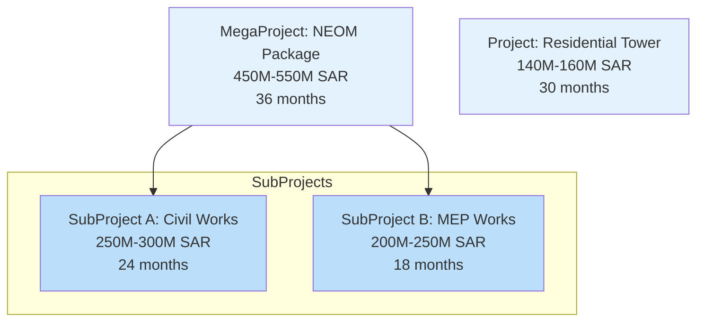
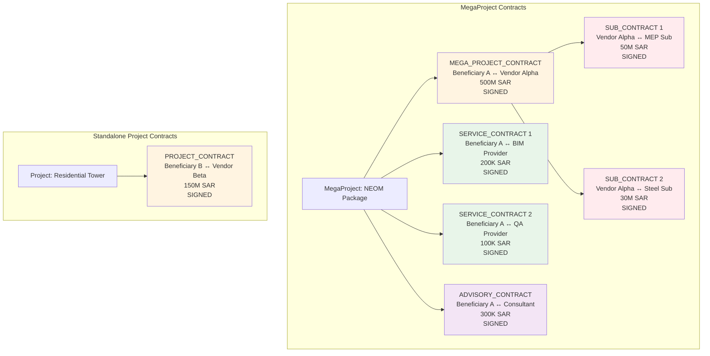
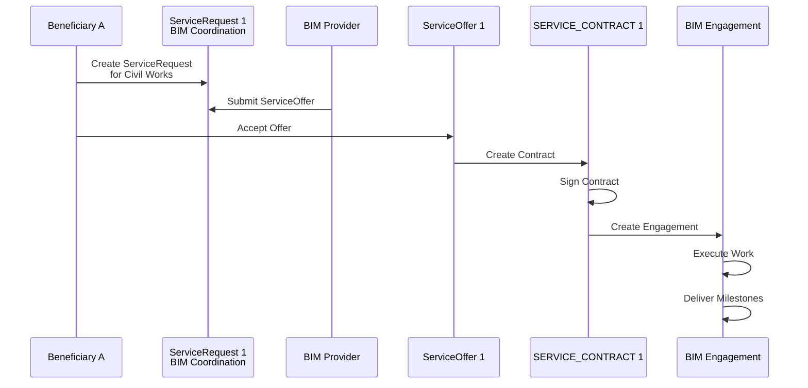
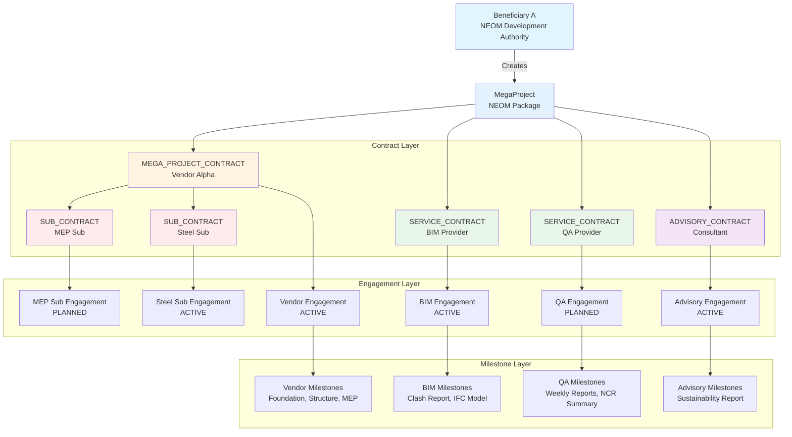
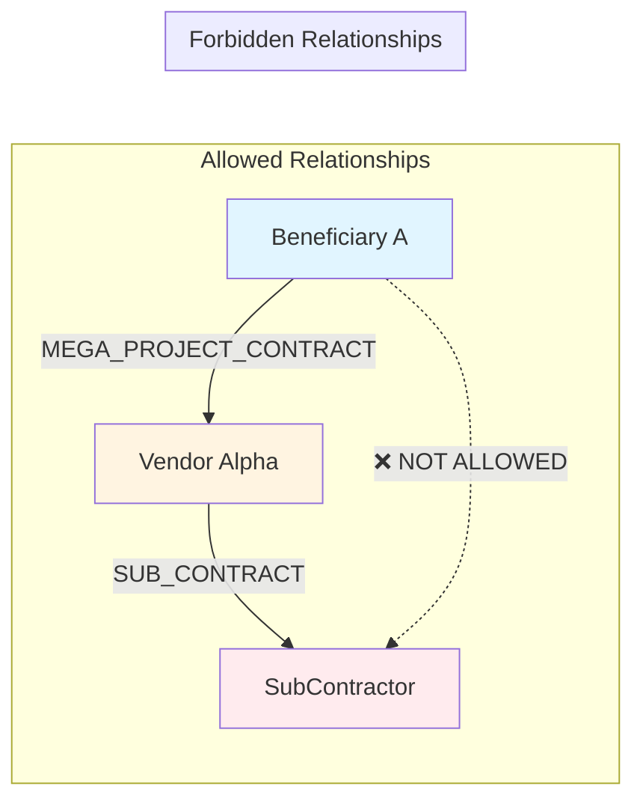
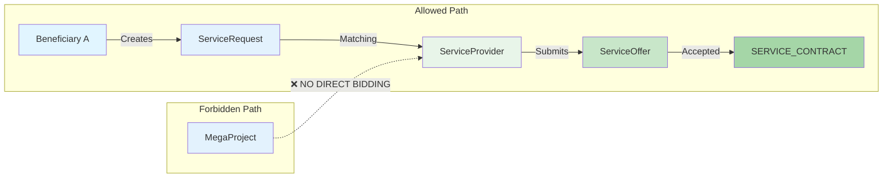
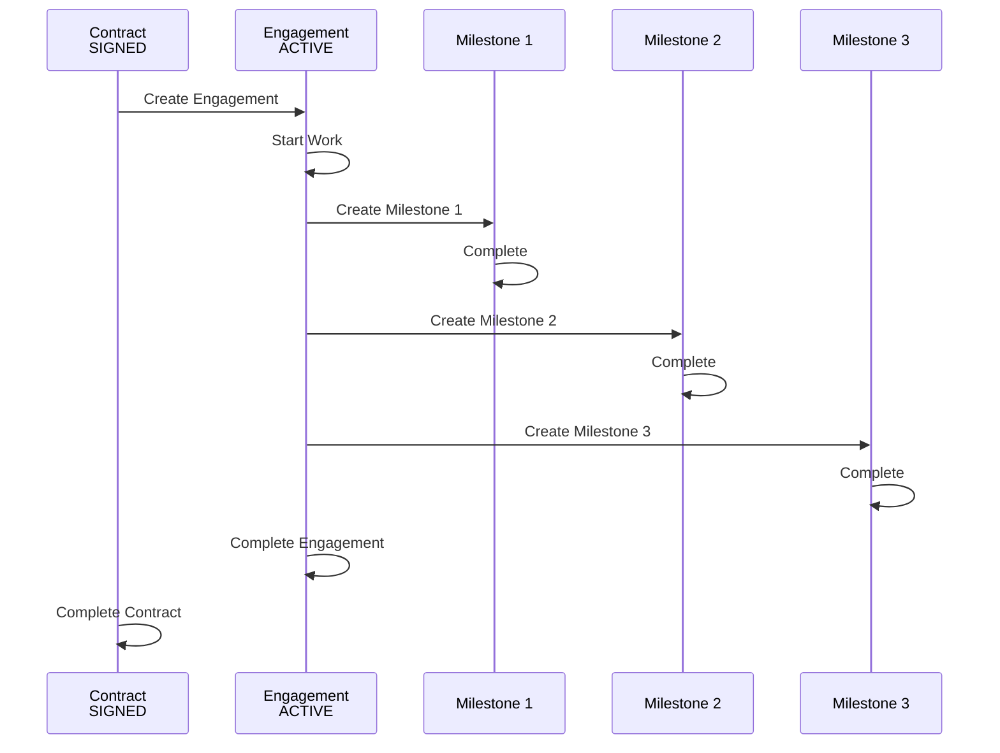
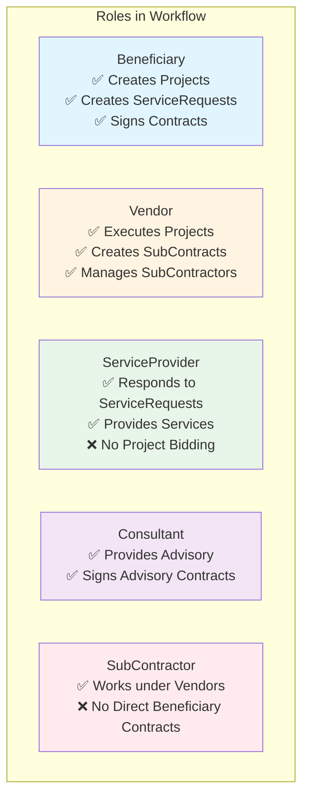

# Golden Seed Data - Visual Diagrams

## Overview

This document provides visual Mermaid diagrams showing the complete golden seed dataset structure, relationships, and workflow paths.

## User Roles and Relationships

## Project Structure

## Contract Relationships

## Service Request Flow

## Engagement and Milestone Tracking

```mermaid
graph TB
    subgraph "MegaProject Engagements"
        E1[Mega Engagement<br/>Vendor Alpha<br/>ACTIVE]
        E2[BIM Engagement<br/>BIM Provider<br/>ACTIVE]
        E3[QA Engagement<br/>QA Provider<br/>PLANNED]
        E4[Advisory Engagement<br/>Consultant<br/>ACTIVE]
        E5[MEP Sub Engagement<br/>MEP SubContractor<br/>PLANNED]
        E6[Steel Sub Engagement<br/>Steel SubContractor<br/>ACTIVE]
    end
    
    subgraph "BIM Milestones"
        M1[Clash Report v1<br/>IN_PROGRESS]
        M2[IFC Coordination Model<br/>PENDING]
        M3[Final BIM Deliverable<br/>PENDING]
    end
    
    subgraph "QA Milestones"
        M4[Weekly Report #1-12<br/>PENDING]
        M5[NCR Closure Summary<br/>PENDING]
    end
    
    subgraph "Advisory Milestones"
        M6[Sustainability Report<br/>IN_PROGRESS]
        M7[Compliance Checklist<br/>PENDING]
    end
    
    subgraph "Vendor Milestones"
        M8[Foundation Complete<br/>PENDING]
        M9[Structure Complete<br/>PENDING]
        M10[MEP Installation Complete<br/>PENDING]
    end
    
    E2 --> M1
    E2 --> M2
    E2 --> M3
    
    E3 --> M4
    E3 --> M5
    
    E4 --> M6
    E4 --> M7
    
    E1 --> M8
    E1 --> M9
    E1 --> M10
    
    style E1 fill:#e3f2fd
    style E2 fill:#e8f5e9
    style E3 fill:#e8f5e9
    style E4 fill:#f3e5f5
    style E5 fill:#ffebee
    style E6 fill:#ffebee
```

## Complete Workflow: MegaProject with All Contract Types

## SubContractor Isolation Constraint

## Service Provider Isolation Constraint

## Data Flow: Contract to Engagement to Milestone

## Role Usage Matrix

## Summary Statistics

The golden seed dataset demonstrates:

- **10 Users** across 5 role types
- **2 Projects** (1 MegaProject, 1 standalone)
- **2 SubProjects** within the MegaProject
- **3 ServiceRequests** with complete workflow
- **7 Contracts** covering all contract types
- **6 Engagements** for active execution
- **20+ Milestones** tracking deliverables

All constraints are enforced and validated through the validation scripts.

