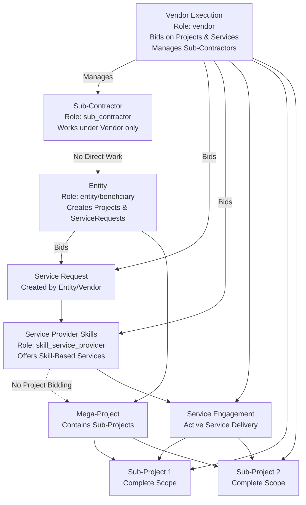

# Complete Service Workflow Documentation

## Overview

This document describes the complete service workflow implementation, including all relationships and interactions between entities, vendors, sub-contractors, and service providers as shown in the workflow diagram.

## Workflow Diagram Relationships

The platform implements the following key relationships:

### 1. Vendor Execution Relationships

**Vendor** (Role: `vendor`) can:
- **Manage Sub-Contractors**: Direct management relationship with sub-contractors
- **Bid on Mega-Projects**: Submit proposals for complete mega-projects
- **Bid on Service Requests**: Request services when vendors need them
- **Search Service Provider Skills**: Direct skill-based search without going through service requests
- **Link Service Engagements to Projects**: Connect service engagements to sub-projects or mega-projects
- **Work on Sub-Projects**: Execute project work on sub-projects

### 2. Sub-Contractor Restrictions

**Sub-Contractor** (Role: `sub_contractor`) can:
- **Work under Vendor only**: Submit proposals to vendors only
- **Cannot work directly with Entity**: Enforced restriction (No Direct Work)
- **Cannot access service endpoints**: Blocked from all service provider features

### 3. Entity Capabilities

**Entity/Beneficiary** (Roles: `entity`, `beneficiary`, `project_lead`) can:
- **Create Mega-Projects**: Define projects with sub-projects
- **Create Service Requests**: Request skill-based services
- **Bid on Service Requests**: Request services when entities need them
- **Review Proposals**: Accept/reject project proposals
- **Accept Service Offers**: Accept offers from service providers

### 4. Service Provider Restrictions

**Service Provider** (Role: `skill_service_provider`) can:
- **Create Service Provider Profile**: Manage skills and availability
- **Submit Service Offers**: Respond to service requests
- **Manage Service Engagements**: Track active service delivery
- **Cannot bid on projects**: Enforced restriction (No Project Bidding)
- **Cannot submit project proposals**: Blocked from project bidding APIs

### 5. Service Engagement Integration

**Service Engagements** can:
- **Link to Sub-Projects**: Reference sub-projects that services support
- **Link to Mega-Projects**: Reference mega-projects that services support
- **Support Project Execution**: Services can support projects without creating project contracts
- **Independent Delivery**: Service providers deliver services independently

## Complete Workflow Diagram



## Implementation Details

### Service Request Bidding

**Location**: `POC/features/service-requests/view.js`

Entities and Vendors can bid on service requests when they need services themselves. The bidding interface:
- Shows "Bid on This Request" section for authenticated entities/vendors (not requester)
- Allows submitting a bid with message and requirements
- Displays all bids on the request for the requester
- Stores bids in the service request's `bids` array

**Service**: `ServiceRequestService.bidOnServiceRequest(serviceRequestId, bidData)`

### Service Engagement Linking

**Location**: `POC/features/service-engagements/engagements.js`

Service engagements can be linked to sub-projects and mega-projects:
- "Link to Project" button in engagement details (for active engagements)
- Modal to search and select projects/sub-projects
- Display linked projects with ability to unlink
- Links are informational only - service provider is not accountable for project delivery

**Services**:
- `ServiceEngagementService.linkEngagementToSubProject(engagementId, subProjectId)`
- `ServiceEngagementService.linkEngagementToMegaProject(engagementId, megaProjectId)`

### Vendor Skill Search

**Location**: `POC/pages/service-providers/skills-search.html` and `POC/features/service-providers/skills-search.js`

Vendors can search service provider skills directly:
- Skill-based search interface with filters (availability, pricing model, hourly rate)
- Results display with skill match scores
- "Create Service Request" button for each provider
- Pre-populates service request form with skills from search

**Service**: `ServiceProviderService.searchProviderSkills(skillFilters)`

## User Flows

### Flow 1: Entity Creates Service Request

1. Entity navigates to Service Requests
2. Creates a new service request with required skills
3. Service providers see the request and submit offers
4. Entity reviews offers and accepts one
5. Service engagement is created
6. Engagement can be linked to sub-projects if needed

### Flow 2: Vendor Searches Provider Skills

1. Vendor navigates to "Search Provider Skills"
2. Enters required skills and applies filters
3. Views matching providers with skill match scores
4. Clicks "Create Service Request" for a provider
5. Service request form is pre-populated with skills
6. Vendor completes and submits the request
7. Provider receives notification and can submit offer

### Flow 3: Entity/Vendor Bids on Service Request

1. Entity/Vendor views a service request (not their own)
2. Sees "Bid on This Request" section
3. Submits bid with message and requirements
4. Requester sees the bid in the request details
5. Requester can contact bidder if interested

### Flow 4: Link Service Engagement to Project

1. User views service engagement details
2. Clicks "Link to Project" button
3. Selects project or sub-project from modal
4. Engagement is linked to the project
5. Linked projects are displayed in engagement view
6. Can unlink projects if needed

## RBAC Enforcement

### Track Separation

**Project Track** (blocked for `skill_service_provider`):
- Project bidding APIs
- Proposal submission
- Project creation (for vendors)

**Service Track** (blocked for `sub_contractor`):
- Service request creation
- Service provider features
- Service engagement management

### Role Permissions

**Vendor** (`vendor`):
- ✅ Search service provider skills
- ✅ Create service requests
- ✅ Bid on service requests
- ✅ Link engagements to projects
- ✅ Bid on projects
- ✅ Manage sub-contractors

**Entity/Beneficiary** (`entity`, `beneficiary`, `project_lead`):
- ✅ Search service provider skills
- ✅ Create service requests
- ✅ Bid on service requests
- ✅ Accept service offers
- ✅ Create mega-projects
- ❌ Submit project proposals

**Service Provider** (`skill_service_provider`):
- ✅ Create service provider profile
- ✅ Submit service offers
- ✅ Manage service engagements
- ❌ Bid on projects
- ❌ Submit project proposals

**Sub-Contractor** (`sub_contractor`):
- ✅ Submit proposals to vendors
- ❌ Work directly with entities
- ❌ Access service endpoints
- ❌ Bid on projects

## Data Models

### Service Request with Bids

```javascript
{
  id: "sr_001",
  requesterType: "ENTITY" | "VENDOR",
  requesterId: "user_456",
  title: "Legal Review Services",
  description: "...",
  requiredSkills: ["Legal Review", "Contract Analysis"],
  status: "OPEN" | "OFFERED" | "APPROVED" | "IN_PROGRESS" | "COMPLETED" | "CANCELLED",
  budget: { min: 10000, max: 50000, currency: "SAR" },
  timeline: { startDate: "2024-02-01", duration: 30 },
  bids: [  // Array of bids from entities/vendors
    {
      id: "bid_001",
      bidderId: "user_789",
      bidderType: "ENTITY" | "VENDOR",
      message: "We need this service for...",
      requirements: "...",
      submittedAt: "2024-01-15T00:00:00Z"
    }
  ],
  createdAt: "2024-01-01T00:00:00Z",
  updatedAt: "2024-01-01T00:00:00Z"
}
```

### Service Engagement with Links

```javascript
{
  id: "se_001",
  serviceRequestId: "sr_001",
  serviceProviderUserId: "user_123",
  serviceOfferId: "so_001",
  status: "ACTIVE" | "COMPLETED" | "TERMINATED",
  startedAt: "2024-02-01T00:00:00Z",
  completedAt: null,
  terminatedAt: null,
  terminationReason: null,
  linkedSubProjectIds: ["subproject_001", "subproject_002"],  // Optional
  linkedMegaProjectId: "megaproject_001"  // Optional
}
```

## Navigation

### Menu Items

**For Vendors/Entities/Beneficiaries**:
- Service Requests (`service-requests/`)
- Search Provider Skills (`service-providers/skills-search.html`)
- Service Engagements (`service-engagements/`)

**For Service Providers**:
- Service Provider Profile (`service-providers/profile/`)
- Service Requests (browse only)
- Service Engagements

## Testing Checklist

### Service Request Bidding
- [ ] Entity can bid on service request
- [ ] Vendor can bid on service request
- [ ] Bids are displayed on request view
- [ ] Only entities/vendors can bid (not service providers)
- [ ] Cannot bid on own request
- [ ] Cannot bid on closed requests

### Service Engagement Linking
- [ ] Can link engagement to sub-project
- [ ] Can link engagement to mega-project
- [ ] Linked projects displayed in engagement view
- [ ] Can unlink projects
- [ ] Only active engagements can be linked
- [ ] Linked engagements visible in project view (if implemented)

### Vendor Skill Search
- [ ] Vendor can search by skills
- [ ] Results show skill match scores
- [ ] Can create service request from search
- [ ] Navigation accessible from vendor dashboard
- [ ] Filters work correctly (availability, pricing, rate range)
- [ ] Pre-populates service request form

### Workflow Integration
- [ ] All relationships from diagram are functional
- [ ] Navigation flows work correctly
- [ ] RBAC restrictions enforced
- [ ] Track separation maintained

## Files Modified/Created

### New Files
- `POC/pages/service-providers/skills-search.html`
- `POC/features/service-providers/skills-search.js`
- `POC/docs/SERVICE_WORKFLOW_COMPLETE.md`

### Modified Files
- `POC/features/service-requests/view.js` - Added bidding UI
- `POC/features/service-requests/create.js` - Pre-populate from skill search
- `POC/features/service-engagements/engagements.js` - Added linking UI
- `POC/src/domains/services/service-requests/service-request-service.js` - Store bids
- `POC/src/core/data/data.js` - Initialize bids array
- `POC/src/services/dashboard/dashboard-service.js` - Added skill search menu item
- `POC/data/roles.json` - Added search_service_provider_skills feature

## Success Criteria

✅ All relationships from the workflow diagram are implemented in UI
✅ Vendors can search and bid on service provider skills directly
✅ Entities/Vendors can bid on service requests
✅ Service engagements can be linked to sub-projects and mega-projects
✅ All features are accessible through navigation
✅ RBAC restrictions are properly enforced
✅ Track separation is maintained

