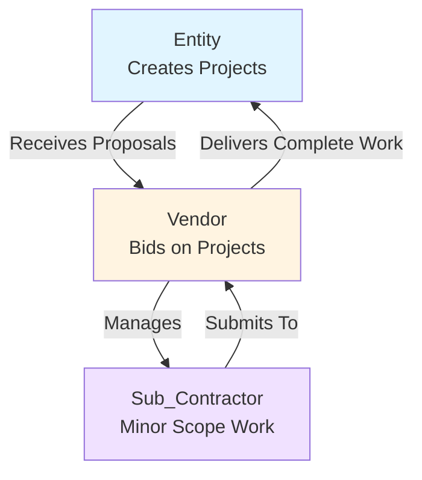

# User Types Documentation

## Overview

PMTwin POC supports 3 primary user types with distinct roles and capabilities:

1. **Entity** (Corporate/Organization) - Project requesters
2. **Vendor** (Service Provider/Contractor) - Full project/subproject providers
3. **Sub_Contractor** (Individual Service Provider) - Minor scope workers under vendors

## User Type Details

### 1. Entity (Corporate/Organization)

**Role ID:** `entity`

**Description:**
Entities are corporate organizations or companies that create and request projects or megaprojects. They define project requirements and review proposals from vendors.

**Key Capabilities:**
- Create projects and megaprojects
- Define subprojects within megaprojects
- Review and approve/reject proposals
- Manage project lifecycle
- Post tenders and form consortia
- Create collaboration opportunities

**Restrictions:**
- Cannot submit proposals (only receives them)
- Cannot view other entities' private projects
- Cannot access admin features

**Available Collaboration Models:**
- All Project-Based Collaboration models (1.1-1.4)
- Strategic Partnerships (2.1-2.2)
- Resource Pooling & Sharing (3.1-3.3)
- Resource Acquisition (4.1-4.2)
- Call for Competition (5.1)

**Dashboard Focus:**
- Project creation and management
- Proposal review and approval
- Megaproject management
- Collaboration opportunities

---

### 2. Vendor (Service Provider/Contractor)

**Role ID:** `vendor`

**Description:**
Vendors are service providers or contractors that can provide full megaprojects or complete subprojects. They cannot deliver partial work - only complete scopes. Vendors can manage sub_contractors for minor scope work.

**Key Capabilities:**
- Submit proposals for full megaprojects
- Submit proposals for complete subprojects
- Manage sub_contractors
- Receive and approve/reject sub_contractor proposals
- Create service offerings
- Participate in task-based engagements
- Join strategic alliances

**Restrictions:**
- **Cannot submit proposals for partial work** (only full projects or complete subprojects)
- Cannot create mega-projects
- Cannot post tenders
- Cannot access admin features

**Available Collaboration Models:**
- Task-Based Engagement (1.1)
- Strategic Alliances (2.2)

**Dashboard Focus:**
- Proposals sent to entities
- Sub_contractor management
- Active projects and engagements
- Service portfolio management

**Proposal Validation:**
- Vendors must bid on complete scopes only
- System validates that proposals are for full projects or complete subprojects
- Partial work proposals are rejected

---

### 3. Sub_Contractor (Individual Service Provider)

**Role ID:** `sub_contractor`

**Description:**
Sub_contractors are individual service providers who work ONLY under vendors for minor scope work. They cannot work directly with entities and must submit all proposals through vendors.

**Key Capabilities:**
- Submit proposals to vendors (not entities)
- View vendor opportunities
- Manage own proposals
- Participate in minor scope work

**Restrictions:**
- **Cannot submit proposals to entities** (only to vendors)
- Cannot bid on full projects or subprojects directly
- Cannot create projects
- Must be associated with a vendor
- Cannot access admin features

**Available Collaboration Models:**
- Task-Based Engagement (1.1) - Minor scope only

**Dashboard Focus:**
- Proposals to vendors
- Active assignments
- Vendor relationships

**Proposal Flow:**
1. Sub_contractor views vendor opportunities
2. Sub_contractor submits proposal to vendor
3. Vendor reviews and approves/rejects proposal
4. If approved, sub_contractor works on minor scope under vendor
5. Vendor delivers complete work to entity

---

## User Type Relationships



## Proposal Flow

### Entity → Vendor Flow
1. Entity creates megaproject with subprojects
2. System matches vendors to project
3. Vendor submits proposal for full project or complete subproject
4. Entity reviews and approves/rejects proposal
5. Vendor delivers complete work

### Sub_Contractor → Vendor Flow
1. Vendor needs minor scope work
2. Sub_contractor submits proposal to vendor
3. Vendor reviews and approves/rejects proposal
4. Sub_contractor works on minor scope under vendor
5. Vendor delivers complete work to entity

## Data Models

### Vendor-Sub_Contractor Relationship
```javascript
{
  id: "relationship_001",
  vendorId: "vendor_123",
  subContractorId: "sub_contractor_456",
  status: "active", // active | pending | inactive
  createdAt: "2024-01-01T00:00:00Z",
  approvedAt: "2024-01-02T00:00:00Z"
}
```

### Enhanced Proposal Model
```javascript
{
  // ... existing fields ...
  proposalType: "vendor_to_entity" | "sub_contractor_to_vendor",
  vendorId: null, // Set if sub_contractor proposal
  subprojectId: null, // Set if bidding on specific subproject
  scopeType: "full_project" | "subproject" | "minor_scope" // Validation based on role
}
```

## Key Constraints

1. **Vendors cannot bid on partial work**
   - Must validate proposal scope matches complete subproject or full project
   - Enforced in `ProposalValidator.validateVendorProposalScope()`

2. **Sub_Contractors can only work under vendors**
   - All proposals must go through vendors
   - Enforced in `ProposalValidator.validateSubContractorProposal()`

3. **Subprojects must be complete scopes**
   - Cannot create partial subprojects
   - Enforced in `ProposalValidator.validateSubprojectCompleteness()`

4. **Clear subproject boundaries**
   - Each subproject must be independently deliverable
   - Validated during project creation

## Migration from Legacy Roles

Legacy roles are mapped to new roles:
- `project_lead` → `entity`
- `service_provider` → `vendor`
- `professional` → `sub_contractor` (for this use case)
- `individual` → `sub_contractor` (for this use case)

## Demo Users

- **Entity**: `entity@pmtwin.com` / `Entity123`
- **Vendor**: `vendor@pmtwin.com` / `Vendor123`
- **Sub_Contractor**: `subcontractor@pmtwin.com` / `SubContractor123`

## API Services

### Proposal Service
- `createProposal()` - Creates proposal with role-based validation
- `createSubContractorProposal()` - Creates sub_contractor proposal to vendor
- `validateVendorProposalScope()` - Validates vendor proposal scope

### Vendor Management
- `getVendorSubContractors()` - Gets sub_contractors under a vendor
- `linkSubContractorToVendor()` - Establishes vendor-sub_contractor relationship

### Project Service
- `validateSubprojectStructure()` - Validates megaproject subproject structure

## Validation

All proposals are validated based on user role:
- **Entity**: Cannot submit proposals
- **Vendor**: Must bid on complete scopes only
- **Sub_Contractor**: Must submit to vendors only, minor scope only

Validation is handled by `ProposalValidator` service in `src/business-logic/proposal-validator.js`.

