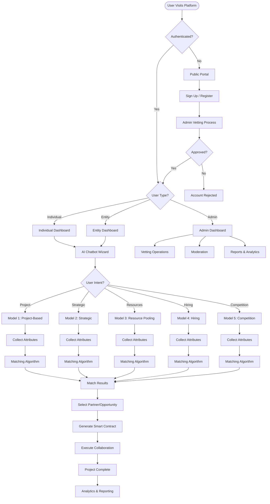

# PMTwin Complete Workflow Overview

## Executive Summary

This document provides a one-page comprehensive view of the PMTwin collaboration platform workflow, showing how users navigate from initial intent through to successful collaboration execution across all five collaboration models.

## Portal & Role Context

**Portals:** Public Portal → User Portal → Admin Portal → Mobile App  
**Roles:** Guest → Individual/Entity → Admin  
**User Types:** B2B (Entity), B2P (Entity-Professional), P2P (Professional-Professional)

**Portal Access Flow:**
- **Public Portal:** Guest access, registration entry point
- **User Portal:** Individual Dashboard (B2P/P2P) or Entity Dashboard (B2B)
- **Admin Portal:** Admin role only
- **Mobile App:** Field operations for Individual and Entity users

## The Universal PMTwin Journey

## Model-Specific Collaboration Paths

### Model 1: Project-Based Collaboration
**Purpose:** Deliver defined projects with clear end points

**Sub-Models:**
- **1.1 Task-Based:** Short-term discrete work
- **1.2 Consortium:** Temporary alliance for bidding
- **1.3 Joint Venture:** Shared management partnership
- **1.4 SPV:** Risk isolation for mega-projects (50M+ SAR)

**Key Attributes Collected:**
- Scope & Deliverables
- Project Value & Duration
- Liability Structure
- Equity/Debt Financing

**Primary Matching Metrics:**
- Skill/Scope Match Score
- Financial Capacity
- Past Performance Score

### Model 2: Strategic Partnerships
**Purpose:** Form long-term alliances for mutual growth (10+ years)

**Sub-Models:**
- **2.1 Strategic JV:** New permanent business entity
- **2.2 Strategic Alliance:** Ongoing contractual relationship
- **2.3 Mentorship:** Knowledge transfer relationship

**Key Attributes Collected:**
- Strategic Objectives
- Target Sectors & Markets
- Technology Transfer Needs
- Skills to Develop

**Primary Matching Metrics:**
- Strategic Alignment
- Complementary Strengths
- Cultural Compatibility

### Model 3: Resource Pooling & Sharing
**Purpose:** Optimize costs via sharing, co-ownership, or barter

**Sub-Models:**
- **3.1 Bulk Purchasing:** Group buying for volume discounts
- **3.2 Co-Ownership:** Joint asset ownership
- **3.3 Resource Exchange:** Marketplace for barter/trade

**Key Attributes Collected:**
- Quantity & Target Price
- Asset Description & Usage Schedule
- Barter Offer & Preferences

**Primary Matching Metrics:**
- Timeline Alignment
- Geographic Proximity
- Barter Compatibility Score

### Model 4: Hiring a Resource
**Purpose:** Recruit professionals or consultants for roles

**Sub-Models:**
- **4.1 Professional Hiring:** Employment contracts
- **4.2 Consultant Hiring:** Expert advisory services

**Key Attributes Collected:**
- Job Title & Description
- Required Skills & Experience
- Salary/Budget Range
- Deliverables

**Primary Matching Metrics:**
- Qualification & Skill Match
- Availability Match
- Budget Compatibility

### Model 5: Call for Competition
**Purpose:** Source solutions via transparent contests/RFPs

**Sub-Models:**
- **5.1 Competition/RFP:** Open or invited competitions

**Key Attributes Collected:**
- Scope & Submission Requirements
- Evaluation Criteria & Weights
- Participant Eligibility

**Primary Matching Metrics:**
- Transparent Evaluation against predefined criteria and weights

## Platform Deliverables

Upon successful matching and selection, the platform provides:

1. **Smart Contracts:** Automated generation of legal agreements
2. **Consortium Agreements:** Multi-party collaboration documents
3. **Analytics & Reporting:** Performance metrics and insights
4. **Transparent Match Scores:** Detailed breakdown of matching criteria

## Key Workflow Stages

### Stage 1: User Intent & AI Guidance
The AI chatbot identifies the user's high-level goal through conversational questions, determining whether they need:
- Short-term project execution
- Long-term strategic partnership
- Resource optimization
- Talent acquisition
- Competitive sourcing

### Stage 2: Model Selection & Data Gathering
Based on intent, users are guided through model-specific questions to collect quantifiable attributes such as:
- Budget ranges
- Timeline requirements
- Skill requirements
- Geographic preferences
- Risk tolerance

### Stage 3: Algorithmic Matching
Model-specific metrics are applied to rank potential partners or opportunities:
- Weighted scoring algorithms
- Multi-criteria evaluation
- Threshold filtering (>80% for auto-notification)
- Real-time ranking updates

### Stage 4: Execution & Outcomes
Successful matches lead to:
- Partner selection interface
- Smart contract generation
- Project initiation
- Progress tracking
- Completion and reporting

## Entity Interaction Matrix

| Model | B2B (Company to Company) | B2P (Company to Professional) | P2P (Professional to Professional) |
|-------|-------------------------|-------------------------------|-----------------------------------|
| **Model 1** | Primary (Consortia, JVs, SPVs) | Supported (Task-based, Consortium members) | Supported (Task-based support) |
| **Model 2** | Primary (Strategic JVs, Alliances) | Supported (Preferred consultant, Mentorship) | Supported (Strategic alliances, Mentorship) |
| **Model 3** | Primary (Bulk purchasing, Co-ownership) | Limited/Supported (Resource exchange) | Limited/Supported (Tool co-ownership, Skill barter) |
| **Model 4** | Not Applicable | Primary (Employment, Consulting) | Limited (Senior professionals hiring assistants) |
| **Model 5** | Supported (Major project contracts) | Supported (Professional evaluation) | Supported (Design competitions) |

## Success Metrics

The platform tracks and reports:
- **Platform Volume:** Total value of projects and transactions
- **User Engagement:** Active users, proposals submitted, matches made
- **Cost Savings:** Average savings through bulk purchasing and barter
- **Quality Score:** User satisfaction, completion rates, dispute resolution
- **Match Success Rate:** Percentage of matches leading to successful collaborations

---

*This overview provides the foundation for understanding how PMTwin guides users from initial intent through successful collaboration execution.*

