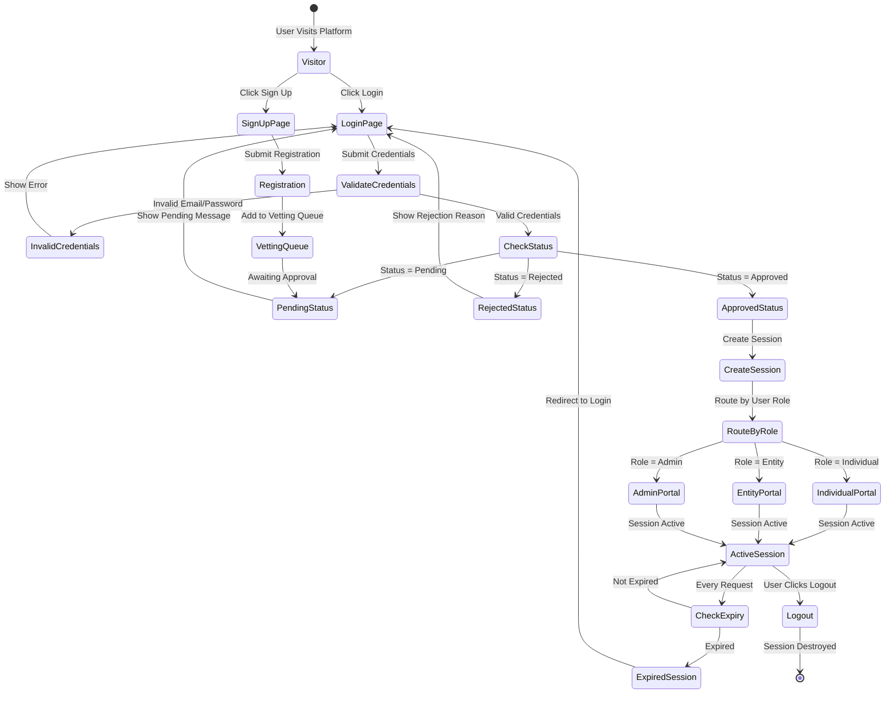
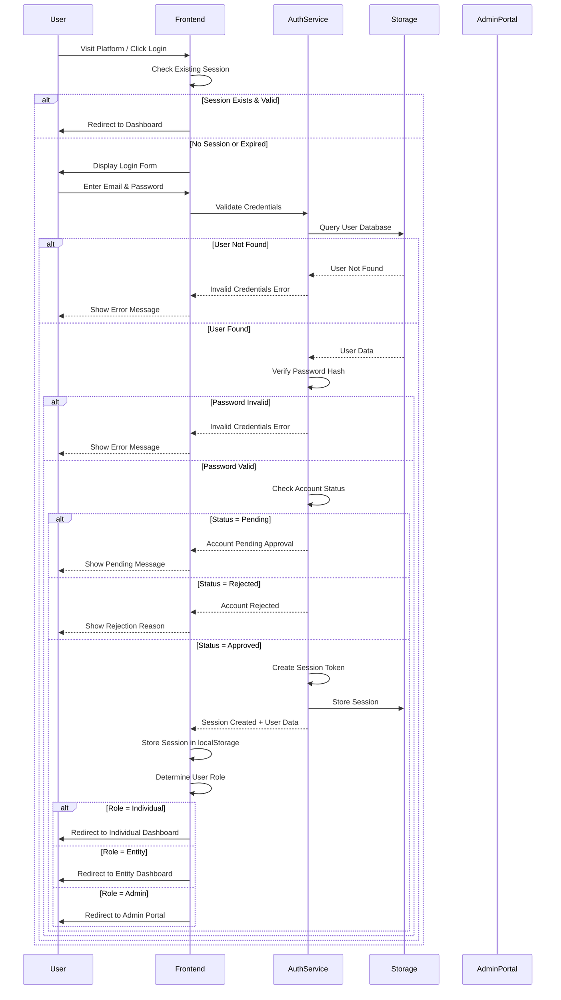
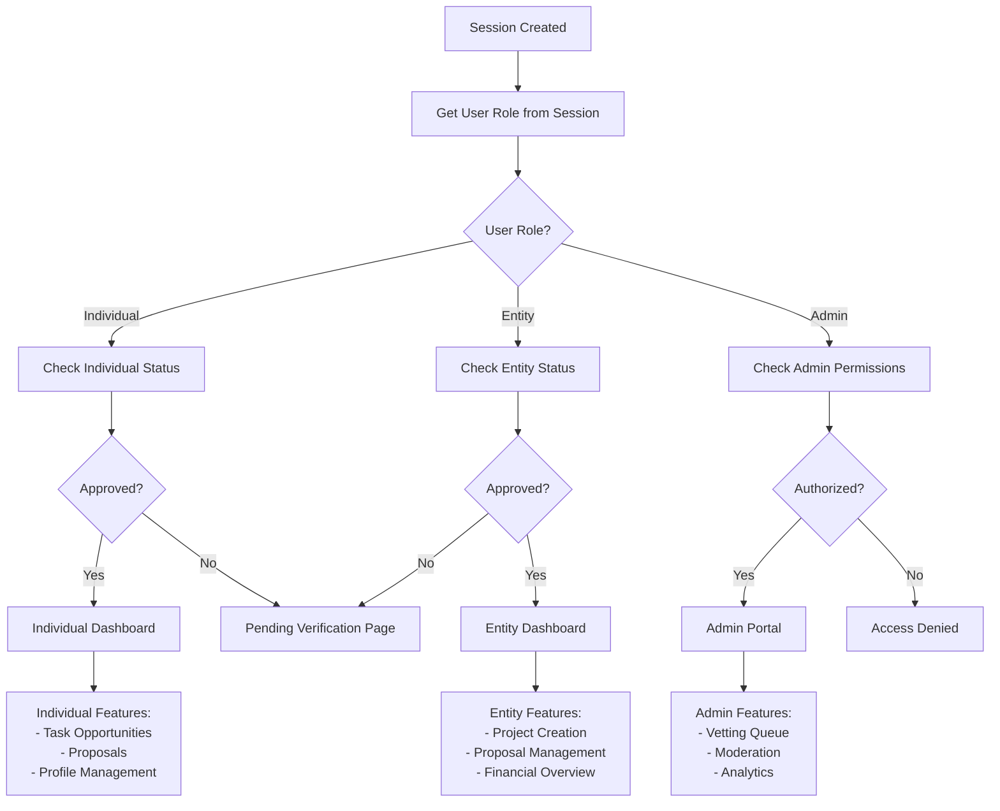
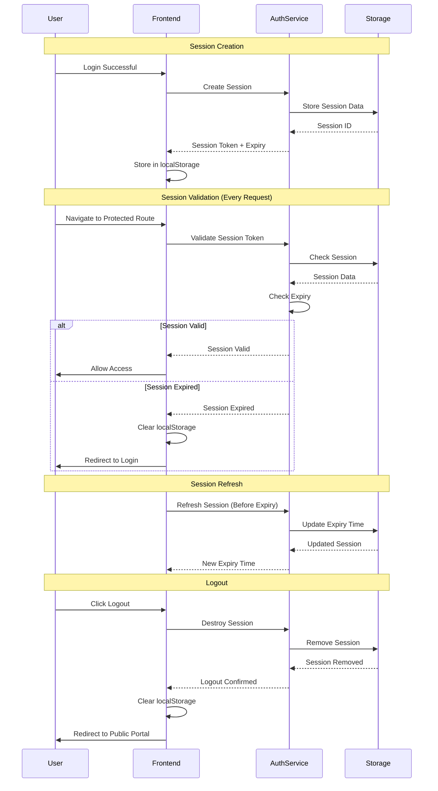

# PMTwin Sign-In & Authentication Workflow

## Overview

This document details the complete authentication and session management workflow for the PMTwin platform, including user login, role-based routing, and session handling for different user types (B2B, B2P, P2P, Admin).

## Portal & Role Context

**Portals:** All portals (Public, User, Admin, Mobile)  
**Roles:** Guest, Individual, Entity, Admin  
**User Types:** B2B (Entity), B2P (Entity to Professional), P2P (Professional to Professional)  
**Access:** Authentication is the entry point for all portals except Public Portal (guest access)

## Authentication State Machine



## Complete Sign-In Flow



## Role-Based Routing Logic



## Session Management Flow



## Step-by-Step Breakdown

### Step 1: User Initiates Login
- User visits any portal page or clicks "Login" button
- System checks for existing valid session
- If session exists and is valid, user is redirected to appropriate dashboard
- If no session or expired, login form is displayed

### Step 2: Credential Validation
- User enters email and password
- Frontend sends credentials to authentication service
- System queries user database for matching email
- Password hash is verified against stored hash

### Step 3: Account Status Check
- System checks user account status:
  - **Pending:** Account awaiting admin approval
  - **Rejected:** Account rejected with reason
  - **Approved:** Account active and ready

### Step 4: Session Creation
- If credentials valid and account approved:
  - Generate unique session token
  - Store session in database with:
    - User ID
    - Role
    - Expiry timestamp (24 hours default)
    - IP address (optional)
  - Return session token to frontend
  - Frontend stores token in localStorage

### Step 5: Role-Based Routing
Based on user role, system routes to appropriate portal:

**Individual (P2P, P2B):**
- Individual Dashboard
- Features: Task opportunities, proposals, profile management
- Access: User Portal (Individual view)

**Entity (B2B, B2P):**
- Entity Dashboard
- Features: Project creation, proposal management, financial overview
- Access: User Portal (Entity view)

**Admin:**
- Admin Portal
- Features: Vetting queue, moderation, analytics, audit trail
- Access: Admin Portal (full access)

### Step 6: Session Validation
On every protected route access:
- Frontend sends session token
- Backend validates token and checks expiry
- If valid: Allow access
- If expired: Clear session and redirect to login

### Step 7: Session Refresh
- System automatically refreshes session before expiry
- Updates expiry timestamp
- Maintains user session without interruption

### Step 8: Logout
- User clicks logout
- System destroys session in database
- Frontend clears localStorage
- User redirected to public portal

## Key Attributes

### Session Data Structure
```javascript
{
  sessionId: "session_abc123",
  userId: "user_123",
  userRole: "individual" | "entity" | "admin",
  userEmail: "user@example.com",
  createdAt: "2024-01-15T10:00:00Z",
  expiresAt: "2024-01-16T10:00:00Z",
  lastActivity: "2024-01-15T14:30:00Z",
  ipAddress: "192.168.1.1" // Optional
}
```

### User Status Values
- **pending:** Awaiting admin vetting approval
- **approved:** Account active, can access portal
- **rejected:** Account rejected, cannot access
- **suspended:** Account temporarily suspended (admin action)

## Security Features

1. **Password Hashing:** All passwords stored as hashed values (bcrypt/argon2)
2. **Session Expiry:** Automatic session expiration after 24 hours of inactivity
3. **Token Validation:** Every request validates session token
4. **Role-Based Access Control:** Routes and features restricted by user role
5. **Account Status Verification:** Only approved accounts can access portals
6. **Audit Logging:** All login attempts and session activities logged

## Error Handling

### Invalid Credentials
- Error message: "Invalid email or password"
- User can retry login
- No account lockout (future: implement rate limiting)

### Account Pending
- Message: "Your account is pending approval. Please wait for admin verification."
- User cannot access portal until approved

### Account Rejected
- Message: "Your account has been rejected. Reason: [reason]"
- User can view rejection reason
- User may reapply with new registration

### Session Expired
- Automatic redirect to login page
- Message: "Your session has expired. Please login again."
- All unsaved data preserved in localStorage (if applicable)

## Outcomes

### Successful Login
- User redirected to role-appropriate dashboard
- Session established for 24 hours
- Access to all features based on role
- Real-time notifications enabled

### Failed Login
- Error message displayed
- User remains on login page
- Can retry or navigate to signup

### Logout
- Session destroyed
- All local data cleared
- Redirected to public portal
- Audit log entry created

---

*This authentication workflow ensures secure, role-based access to the PMTwin platform for all user types.*

