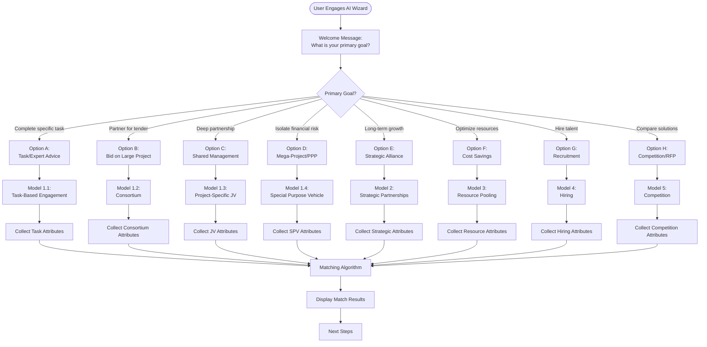
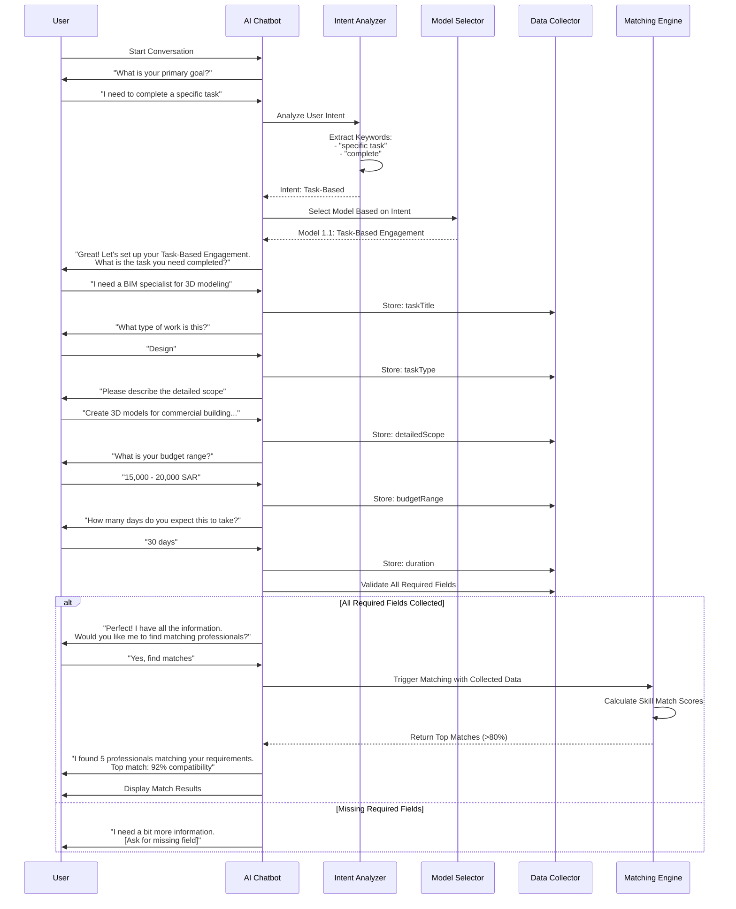
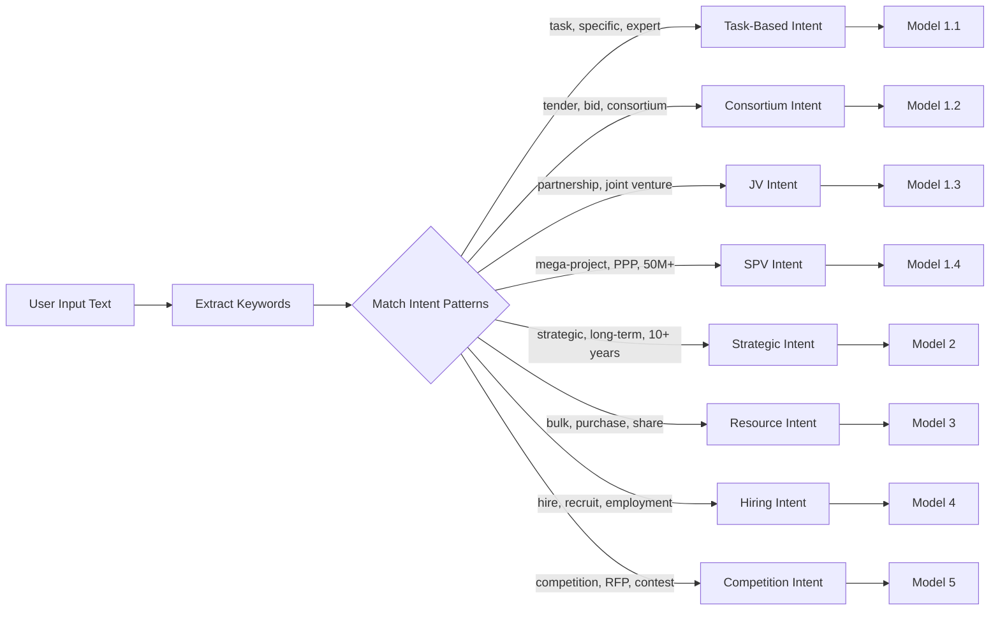
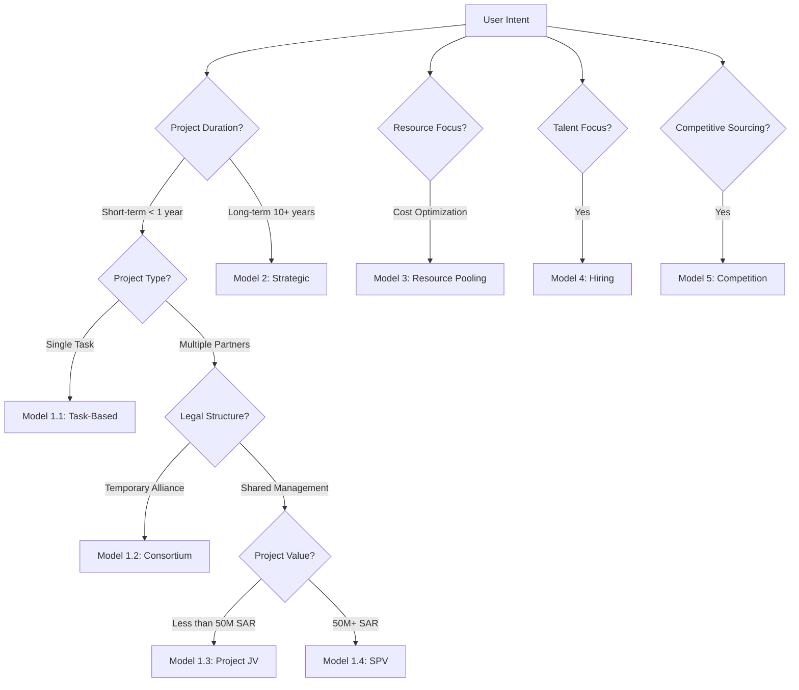
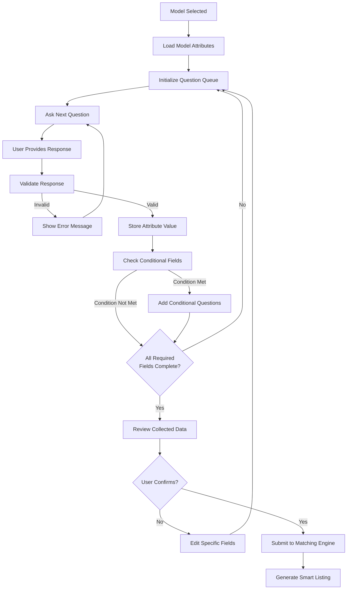

# PMTwin AI Chatbot Wizard Workflow

## Overview

The AI Chatbot Wizard is the intelligent entry point that guides users through intent identification and model selection. It uses conversational AI to understand user needs and direct them to the appropriate collaboration model (1-5) and sub-model.

## Portal & Role Context

**Portals:** Public Portal (guest access), User Portal (authenticated users)  
**Roles:** All roles can access the wizard, but model availability varies by role  
**User Types:** 
- **B2B (Entity):** Full access to all 5 models and sub-models
- **B2P/P2P (Individual):** Limited access (Task-Based, Resource Exchange, Hiring applications, Competition participation)
- **Guest:** Can use wizard for education, but cannot create opportunities

**Model Access by Role:**
- **Entity:** All models (1.1-1.4, 2.1-2.3, 3.1-3.3, 4.1-4.2, 5.1)
- **Individual:** Models 1.1, 2.3 (as mentee), 3.3, 4.1-4.2 (apply), 5.1 (participate)
- **Guest:** View-only for educational purposes

## AI Wizard Decision Flow

## Detailed Wizard Conversation Flow

## Intent Identification Logic

## Model Selection Decision Tree

## Data Collection Workflow

## Step-by-Step Breakdown

### Stage 1: Intent Identification (Entry Point)

**Chatbot Question:** "What is the primary goal of your collaboration?"

**User Options:**
- **A:** "I need to complete a specific task or get expert advice." → Sub-Model 1.1
- **B:** "I want to partner with others to bid on a large tender or project." → Sub-Model 1.2
- **C:** "I want to form a deep, shared-management partnership for a specific project." → Sub-Model 1.3
- **D:** "I need to isolate financial risk for a multi-million dollar mega-project/PPP." → Sub-Model 1.4
- **E:** "I want to form a long-term strategic alliance (10+ years)." → Model 2
- **F:** "I want to optimize costs through bulk purchasing or resource sharing." → Model 3
- **G:** "I need to hire professionals or consultants." → Model 4
- **H:** "I want to launch a competition or RFP." → Model 5

### Stage 2: Sub-Model Logic Branches

Once the sub-model is identified, the chatbot triggers specific data-collection questions:

#### Branch 1.1: Task-Based Engagement
1. **Task Details:** "What is the task you need completed?"
2. **Scope:** "Please describe the detailed scope and deliverables."
3. **Logistics:** "What is your budget range and expected completion time (days)?"
4. **Requirements:** "Does this work require on-site presence or can it be remote?"
5. **Compensation:** "How will you compensate? (Cash, Barter, or Mixed)"

#### Branch 1.2: Consortium
1. **Project Identity:** "What is the project or tender you're pursuing?"
2. **Scale:** "What is the total project value and expected duration in months?"
3. **Role:** "Will you be the lead member of this consortium?"
4. **Needs:** "How many members do you need and what roles should they fill?"
5. **Legal/Risk:** "What liability structure will be used?"

#### Branch 1.3: Project-Specific JV
1. **Structure:** "What type of JV structure? (Contractual vs. Incorporated)"
2. **Ownership:** "How will equity and profits be split among partners?"
3. **Management:** "How will the JV be managed?"
4. **Risk:** "How will risks and liabilities be allocated?"
5. **Exit:** "What is the exit strategy after project completion?"

#### Branch 1.4: Special Purpose Vehicle
1. **Financial Threshold:** "Is the total project value at least 50M SAR?"
2. **Funding:** "How much debt financing is required and what is the debt type?"
3. **Revenue:** "What is the revenue model?"
4. **Governance:** "What board composition and management team do you envision?"

### Stage 3: Matching & Closing

After gathering attributes:
1. **Metric Calculation:** System runs algorithms (Skill Match Score, Financial Capacity, etc.)
2. **Smart Contract Prep:** "Would you like me to generate a draft Smart Contract?"
3. **Educational Support:** For SPVs, attach guides and regulatory checklists

## Key Attributes Collected by Model

### Model 1.1: Task-Based
- Task Title
- Task Type (Design, Engineering, Consultation, etc.)
- Detailed Scope
- Duration (days)
- Budget Range
- Required Skills
- Location Requirement (Remote/On-Site)
- Compensation Type (Cash/Barter/Mixed)

### Model 1.2: Consortium
- Project Title
- Project Value
- Tender Deadline
- Lead Member Role
- Required Member Roles
- Scope Division Method
- Liability Structure
- Payment Distribution

### Model 1.3: Project JV
- Project Details
- JV Structure (Contractual/Incorporated)
- Equity Split
- Capital Contribution
- Management Structure
- Profit Distribution
- Risk Allocation
- Exit Strategy

### Model 1.4: SPV
- Project Value (must be 50M+ SAR)
- Debt Financing Requirements
- Revenue Model
- Governance Structure
- Regulatory Approvals Needed

## Matching Metrics

The wizard informs users about matching criteria:

| Sub-Model | Primary Matching Metric | Calculation Logic |
|-----------|------------------------|-------------------|
| Task-Based | Skill Match Score | Weighted average of skills, experience, location |
| Consortium | Scope Match Score | Alignment of required roles and capabilities |
| JV | Complementary Capabilities | What each partner brings to the partnership |
| SPV | Financial Capacity | Equity contribution ability and sector expertise |
| Strategic | Strategic Alignment | Long-term goal compatibility |
| Resource Pooling | Timeline Alignment | Delivery/usage schedule overlap |
| Hiring | Qualification Match | Skills, experience, certifications |
| Competition | Eligibility Match | Meets participant requirements |

## Outcomes

### Successful Wizard Completion
- User data collected and validated
- Appropriate model selected
- Smart listing generated
- Matching algorithm triggered
- User notified of next steps

### Incomplete Wizard
- Data saved as draft
- User can resume later
- Progress indicator shown

### Educational Support
- Model-specific guides provided
- Regulatory checklists (for SPVs)
- Best practices documentation
- FAQ links

---

*The AI Wizard provides intelligent, conversational guidance to help users find the right collaboration model for their needs.*

