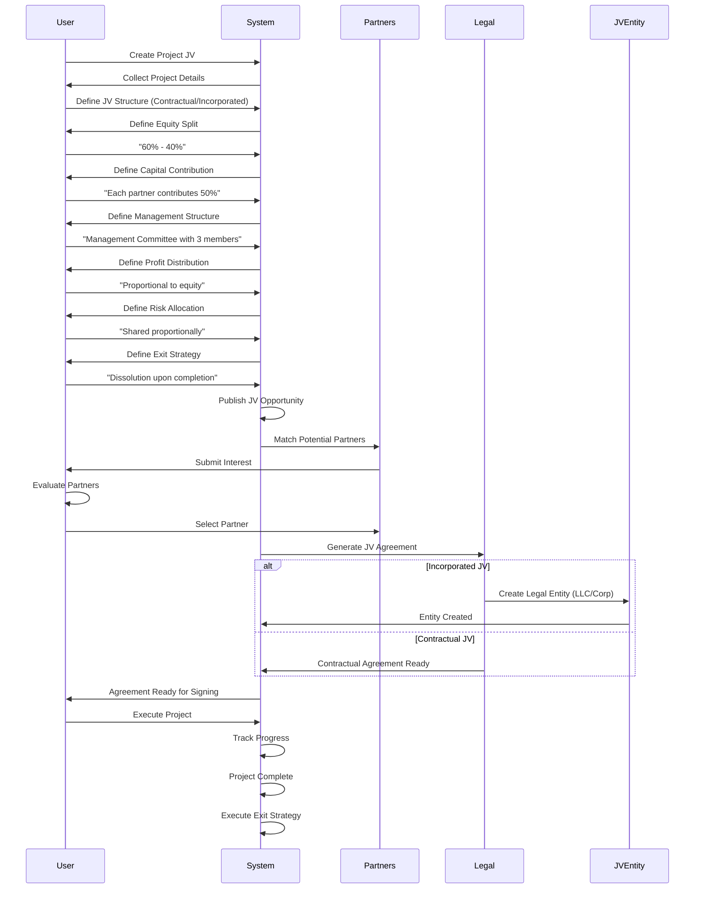

# Model 1: Project-Based Collaboration Workflow

## Overview

Model 1 encompasses partnerships formed to deliver specific projects with clear start and end points. It includes four sub-models: Task-Based Engagement, Consortium, Project-Specific Joint Venture, and Special Purpose Vehicle (SPV).

## Portal & Role Context

**Portals:** User Portal (primary), Mobile App (execution tracking)  
**Roles & Access:**
- **Entity (B2B):** Full access to all 4 sub-models (1.1, 1.2, 1.3, 1.4)
- **Individual (B2P/P2P):** Access to 1.1 (Task-Based) only, can join 1.2 (Consortium) as member
- **Admin:** View-only access for moderation

**Sub-Model Access by Role:**
- **1.1 Task-Based:** Entity (create & hire), Individual (apply & execute)
- **1.2 Consortium:** Entity (create & join), Individual (join as member)
- **1.3 Project JV:** Entity (create & partner), Individual (limited partnership)
- **1.4 SPV:** Entity only (50M+ SAR projects), Individual (cannot create)

## Model 1 High-Level Flow


## Sub-Model 1.1: Task-Based Engagement

### Workflow


### Key Attributes Collected

1. **Task Title:** Name of the task
2. **Task Type:** Design, Engineering, Consultation, Review, Analysis
3. **Detailed Scope:** Full description of deliverables
4. **Duration:** Expected completion time in days
5. **Budget Range:** Minimum and maximum budget (SAR)
6. **Required Skills:** List of required skills/certifications
7. **Experience Level:** Junior, Intermediate, Senior, Expert
8. **Location Requirement:** Remote, On-Site, Hybrid
9. **Compensation Type:** Fixed Price, Hourly Rate, Barter, Mixed
10. **Deliverable Format:** PDF, CAD files, Excel, etc.

### Matching Metrics

- **Skill Match Score:** Weighted average (0-100)
  - Required skills match: 40%
  - Experience level: 20%
  - Certifications: 20%
  - Past performance: 20%
- **Budget Compatibility:** Boolean (within range)
- **Availability Match:** Boolean (available for duration)

## Sub-Model 1.2: Consortium

### Workflow


### Key Attributes Collected

1. **Project Title:** Name of project/tender
2. **Project Value:** Total project value (SAR)
3. **Tender Deadline:** Submission deadline date
4. **Lead Member:** Will you be the lead? (Yes/No)
5. **Required Members:** Number of members needed
6. **Member Roles:** Civil, MEP, Structural, etc.
7. **Scope Division:** By Trade, Phase, or Geography
8. **Liability Structure:** Individual vs. Joint & Several
9. **Payment Distribution:** Per Scope, Proportional, Fixed Fee
10. **Prequalification Required:** Yes/No

### Matching Metrics

- **Scope Match Score:** Alignment of member capabilities with required roles
- **Financial Capacity:** Ability to handle project value
- **Past Collaboration Score:** History of successful consortia
- **Geographic Proximity:** Location relevance

## Sub-Model 1.3: Project-Specific Joint Venture

### Workflow



### Key Attributes Collected

1. **Project Details:** Title, value, duration
2. **JV Structure:** Contractual or Incorporated (LLC/Corp)
3. **Equity Split:** Percentage per partner
4. **Capital Contribution:** Amount per partner
5. **Management Structure:** Lead Partner, Committee, etc.
6. **Profit Distribution:** Method and percentages
7. **Risk Allocation:** How risks are shared
8. **Exit Strategy:** Dissolution, Buyout, etc.
9. **Dispute Resolution:** Arbitration, Mediation, etc.

### Matching Metrics

- **Complementary Capabilities:** What each partner brings
- **Financial Capacity:** Equity contribution ability
- **Risk Tolerance:** Alignment of risk preferences
- **Management Compatibility:** Management style fit

## Sub-Model 1.4: Special Purpose Vehicle (SPV)

### Workflow


### Key Attributes Collected

1. **Project Value:** Must be 50M+ SAR
2. **Project Duration:** Long-term (typically 10+ years)
3. **Equity Structure:** Percentage per sponsor
4. **Debt Financing:** Amount and type (Non-Recourse, etc.)
5. **Revenue Model:** How revenue is generated
6. **Governance Structure:** Board composition, management
7. **Risk Allocation:** How risks are isolated
8. **Regulatory Approvals:** Required approvals checklist

### Matching Metrics

- **Financial Capacity:** Equity contribution ability (must meet threshold)
- **Sector Expertise:** Relevant project experience
- **Creditworthiness:** For debt financing
- **Regulatory Compliance:** Approval history

## Complete Model 1 Data Flow


## Matching Algorithm Details

### For Task-Based (1.1)
```
Skill Match Score = 
  (Skills Match × 0.40) +
  (Experience Match × 0.20) +
  (Certifications Match × 0.20) +
  (Past Performance × 0.20)

Threshold: Score >= 80% for auto-notification
```

### For Consortium (1.2)
```
Scope Match Score = 
  (Role Alignment × 0.50) +
  (Financial Capacity × 0.30) +
  (Past Collaboration × 0.20)

Threshold: Score >= 80% for invitation
```

### For JV (1.3)
```
JV Compatibility Score = 
  (Complementary Capabilities × 0.40) +
  (Financial Capacity × 0.30) +
  (Risk Tolerance Alignment × 0.20) +
  (Management Compatibility × 0.10)

Threshold: Score >= 75% for recommendation
```

### For SPV (1.4)
```
SPV Match Score = 
  (Financial Capacity × 0.50) +
  (Sector Expertise × 0.30) +
  (Creditworthiness × 0.20)

Threshold: Score >= 80% AND Financial Capacity >= Threshold
```

## Outcomes

### Successful Task-Based Engagement
- Professional matched and selected
- Task agreement generated
- Project initiated
- Deliverables tracked
- Payment processed upon completion

### Successful Consortium
- Consortium members selected
- Consortium agreement generated
- Tender bid submitted
- Project execution (if won)
- Consortium dissolved upon completion

### Successful Project JV
- Partner selected
- JV agreement/entity created
- Project execution begins
- Shared management operational
- Exit strategy executed upon completion

### Successful SPV
- Sponsors selected
- SPV entity created
- Bankability studies completed
- Regulatory approvals obtained
- Mega-project execution begins
- Long-term operation and revenue generation

---

*Model 1 provides flexible collaboration structures for projects of all scales, from simple tasks to mega-projects requiring risk isolation.*

