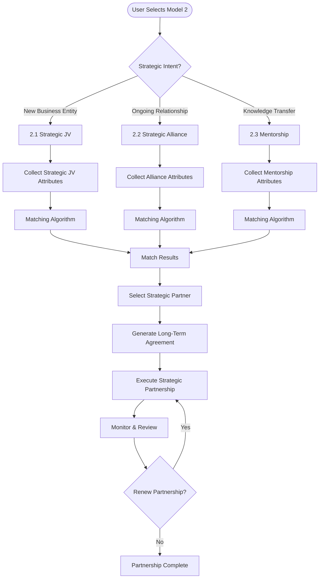
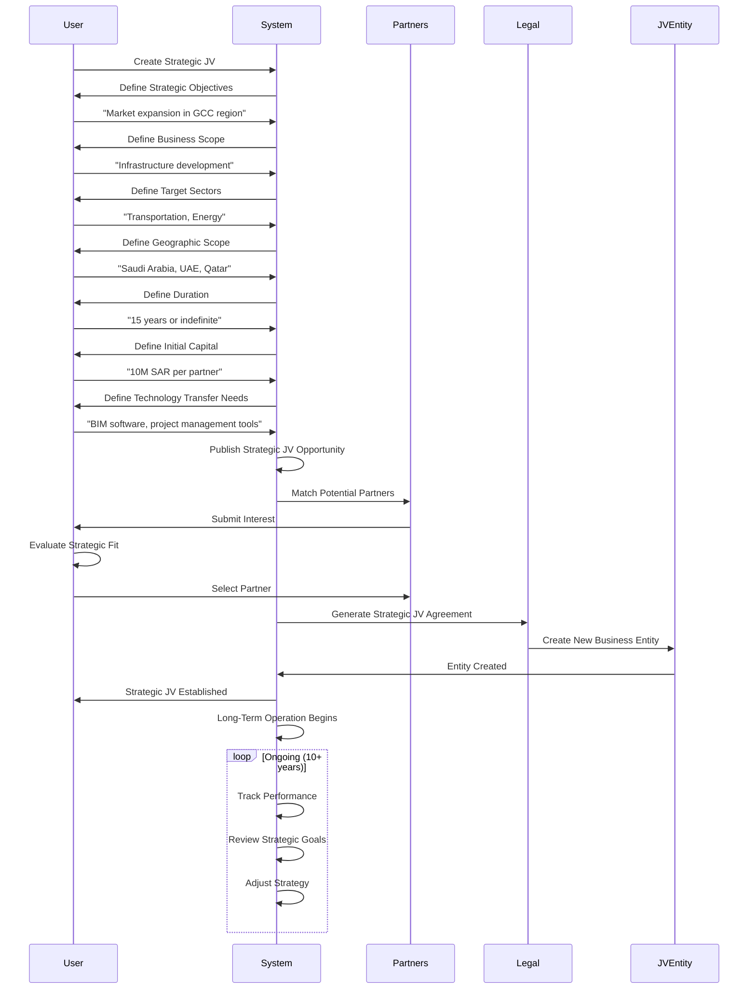
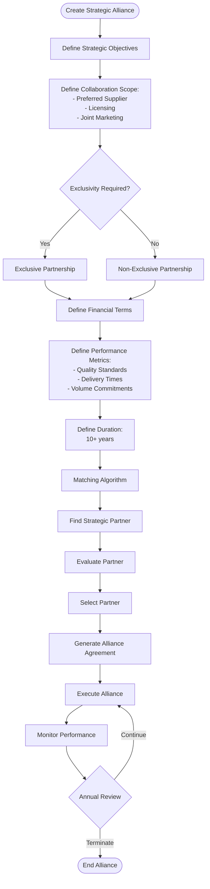
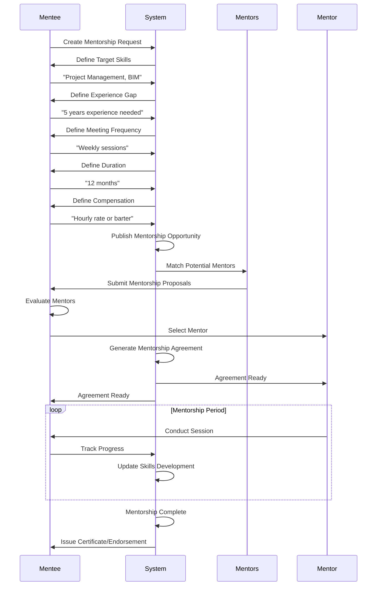
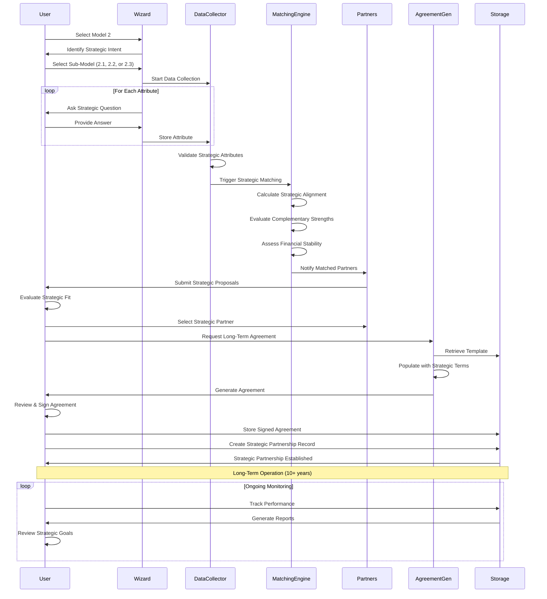
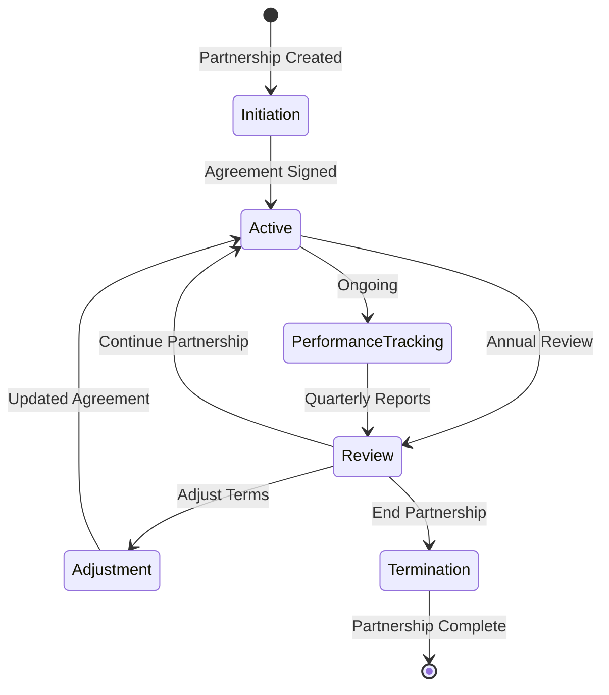

# Model 2: Strategic Partnerships Workflow

## Overview

Model 2 focuses on long-term alliances (10+ years) formed for ongoing collaboration, mutual growth, and capability enhancement beyond a single project. It includes three sub-models: Strategic Joint Venture, Strategic Alliance, and Mentorship.

## Portal & Role Context

**Portals:** User Portal (primary)  
**Roles & Access:**
- **Entity (B2B):** Full access to all 3 sub-models (2.1, 2.2, 2.3 as mentor)
- **Individual (B2P/P2P):** Access to 2.2 (Strategic Alliance - limited), 2.3 (Mentorship as mentee)
- **Admin:** View-only access

**Sub-Model Access by Role:**
- **2.1 Strategic JV:** Entity only (B2B partnerships)
- **2.2 Strategic Alliance:** Entity (full), Individual (limited creation)
- **2.3 Mentorship:** Entity (as mentor), Individual (as mentee)

## Model 2 High-Level Flow



## Sub-Model 2.1: Strategic Joint Venture

### Workflow



### Key Attributes Collected

1. **Strategic Objectives:** Primary goals of the partnership
2. **Business Scope:** Areas of collaboration
3. **Target Sectors:** Industries/markets to focus on
4. **Geographic Scope:** Regions/countries
5. **Duration:** 10-20 years or indefinite
6. **Initial Capital:** Investment per partner
7. **Ongoing Funding:** Additional capital requirements
8. **Technology Transfer:** Knowledge/assets to share
9. **Market Access:** What each partner brings
10. **Exit Conditions:** When/how partnership can end

### Matching Metrics

- **Strategic Alignment:** Compatibility of long-term goals (weight: 40%)
- **Complementary Strengths:** What each partner brings (weight: 30%)
- **Financial Stability:** Ability to sustain long-term commitment (weight: 20%)
- **Cultural Compatibility:** Organizational culture fit (weight: 10%)

## Sub-Model 2.2: Strategic Alliance

### Workflow



### Key Attributes Collected

1. **Collaboration Scope:** Type of alliance (supplier, licensing, marketing)
2. **Exclusivity:** Exclusive or non-exclusive relationship
3. **Financial Terms:** Payment structure, pricing
4. **Performance Metrics:** KPIs and standards
5. **Duration:** Long-term commitment period
6. **Territory:** Geographic scope
7. **Termination Conditions:** How alliance can end

### Matching Metrics

- **Strategic Fit:** Alignment with business objectives
- **Capability Match:** Complementary services/products
- **Market Position:** Industry standing and reputation
- **Financial Health:** Stability for long-term commitment

## Sub-Model 2.3: Mentorship

### Workflow



### Key Attributes Collected

1. **Target Skills:** Skills to develop
2. **Experience Level:** Current vs. desired level
3. **Experience Gap:** Years of experience needed
4. **Meeting Frequency:** Weekly, monthly, etc.
5. **Duration:** Mentorship period (months/years)
6. **Compensation:** Paid or barter arrangement
7. **Success Metrics:** How progress is measured
8. **Preferred Mentor Profile:** Desired mentor characteristics

### Matching Metrics

- **Skill Match:** Mentor's expertise in target skills
- **Experience Level:** Mentor's seniority and experience
- **Availability:** Mentor's time commitment
- **Teaching Ability:** Past mentorship success

## Complete Model 2 Data Flow



## Strategic Matching Algorithm

### Strategic Alignment Score
```
Strategic Alignment = 
  (Goal Compatibility × 0.40) +
  (Market Synergy × 0.30) +
  (Technology Fit × 0.20) +
  (Geographic Complement × 0.10)

Threshold: Score >= 75% for strategic partnership
```

### Complementary Strengths Analysis
- **Capital vs. Technology:** One partner provides funding, other provides expertise
- **Market Access vs. Local Knowledge:** International partner + local partner
- **Manufacturing vs. Distribution:** Production capability + sales network
- **R&D vs. Commercialization:** Innovation + market execution

### Financial Stability Assessment
- Annual revenue trends (3+ years)
- Debt-to-equity ratio
- Cash flow stability
- Credit rating (if available)
- Long-term commitment capacity

## Long-Term Partnership Lifecycle



## Key Success Factors

### For Strategic JV (2.1)
1. **Clear Strategic Vision:** Shared long-term goals
2. **Complementary Capabilities:** Each partner brings unique value
3. **Financial Commitment:** Adequate capital for long-term operation
4. **Governance Structure:** Effective decision-making framework
5. **Technology Transfer:** Successful knowledge sharing

### For Strategic Alliance (2.2)
1. **Mutual Benefit:** Value for both parties
2. **Performance Standards:** Clear quality and delivery metrics
3. **Flexibility:** Ability to adapt to market changes
4. **Communication:** Regular review and feedback
5. **Trust:** Strong relationship foundation

### For Mentorship (2.3)
1. **Clear Learning Objectives:** Defined skills to develop
2. **Structured Program:** Regular sessions and milestones
3. **Mentor Expertise:** Relevant experience and teaching ability
4. **Commitment:** Both parties dedicated to success
5. **Progress Tracking:** Measurable skill development

## Outcomes

### Successful Strategic JV
- New business entity created
- Long-term operation established
- Market expansion achieved
- Technology transfer completed
- Sustainable growth realized

### Successful Strategic Alliance
- Ongoing partnership established
- Preferred supplier/licensing relationship
- Joint marketing initiatives
- Performance metrics met
- Long-term value created

### Successful Mentorship
- Mentor matched and engaged
- Skills development program active
- Regular progress tracking
- Knowledge transfer completed
- Career advancement achieved

---

*Model 2 enables long-term strategic partnerships that drive mutual growth and capability enhancement beyond individual projects.*

