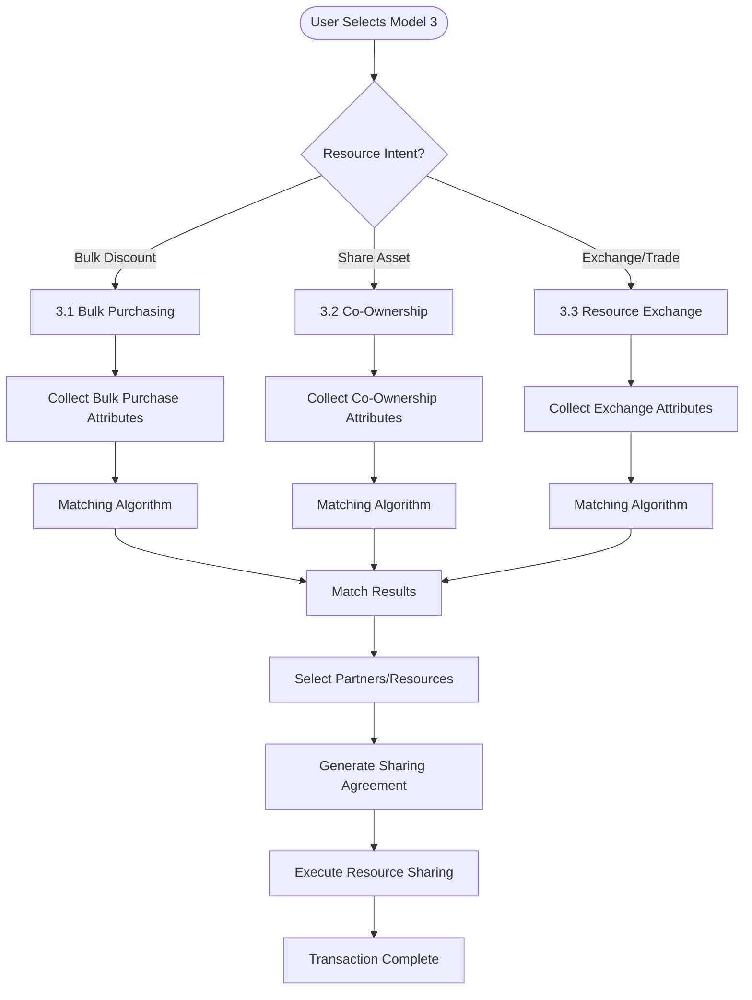
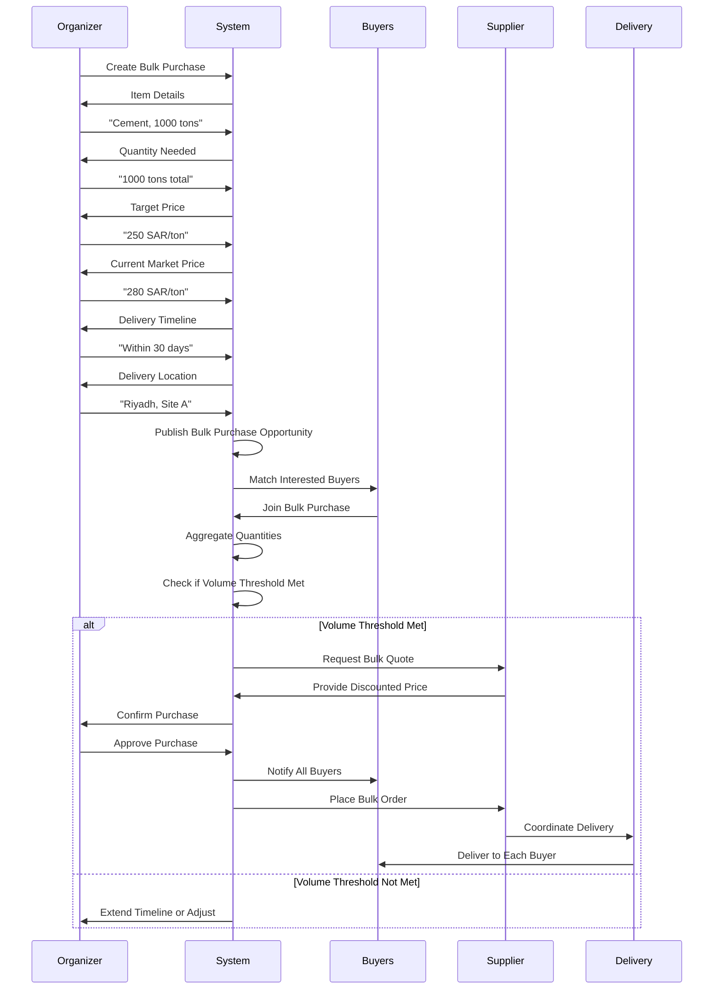
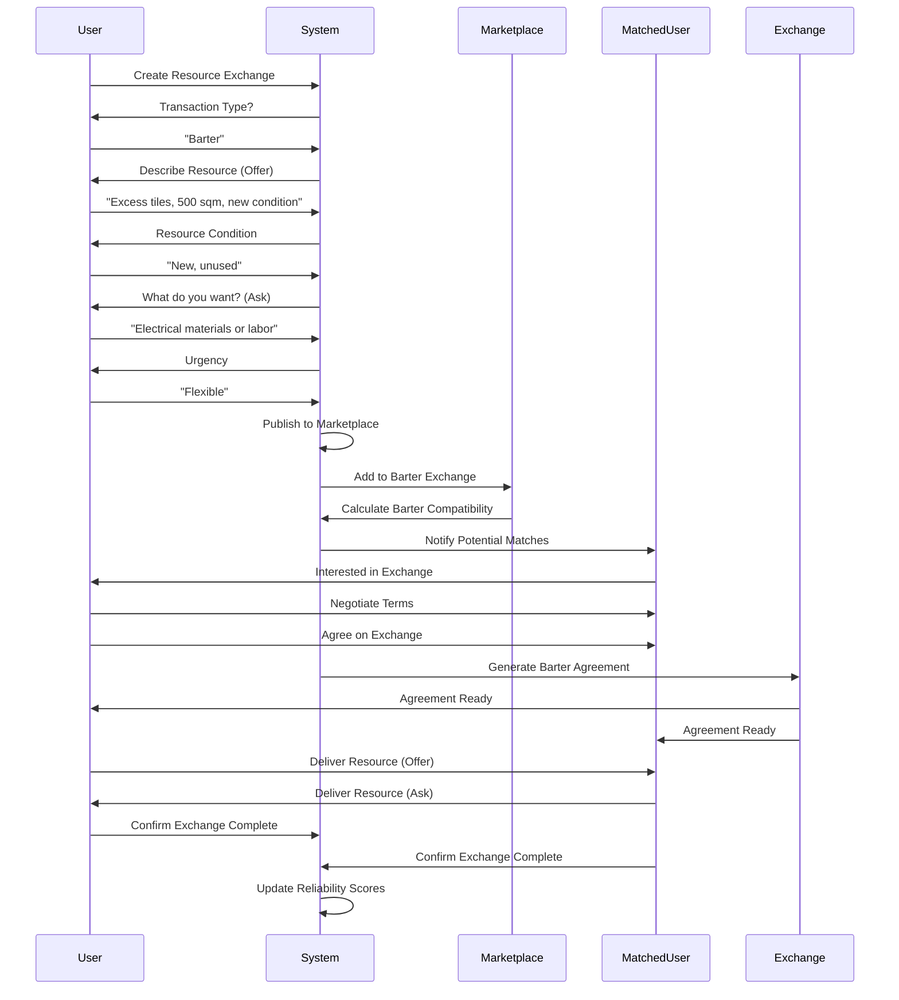
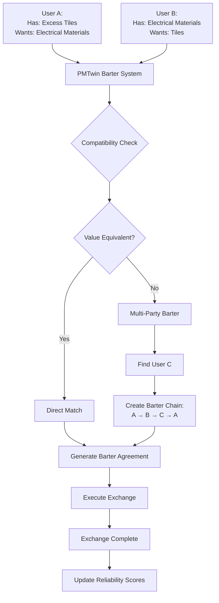
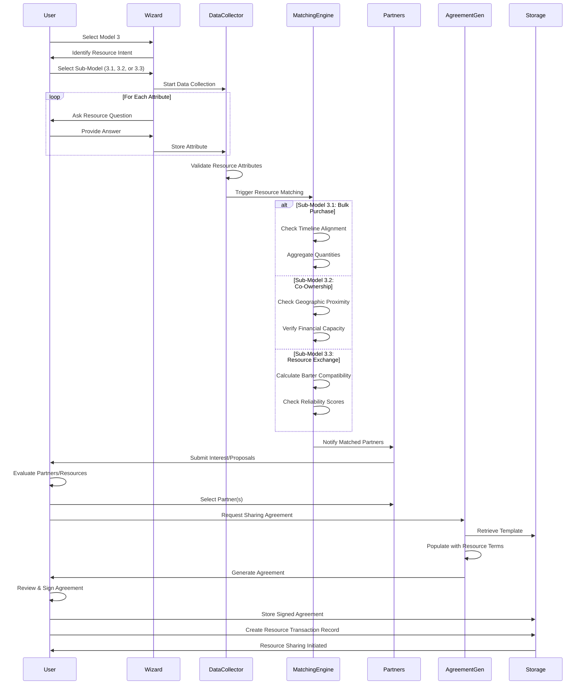

# Model 3: Resource Pooling & Sharing Workflow

## Overview

Model 3 focuses on cost optimization through collective buying, co-ownership of assets, and resource exchange (including barter). It includes three sub-models: Bulk Purchasing, Co-Ownership, and Resource Exchange/Barter.

## Portal & Role Context

**Portals:** User Portal (primary)  
**Roles & Access:**
- **Entity (B2B):** Full access to all 3 sub-models (3.1, 3.2, 3.3)
- **Individual (B2P/P2P):** Access to 3.1 (join bulk purchases), 3.2 (limited co-ownership), 3.3 (full barter exchange)
- **Admin:** View-only access

**Sub-Model Access by Role:**
- **3.1 Bulk Purchasing:** Entity (create & join), Individual (join only)
- **3.2 Co-Ownership:** Entity (create & join), Individual (join limited assets)
- **3.3 Resource Exchange:** Entity (full), Individual (full barter access)

## Model 3 High-Level Flow



## Sub-Model 3.1: Bulk Purchasing

### Workflow



### Key Attributes Collected

1. **Product/Service:** What to buy in bulk
2. **Total Quantity:** Aggregate quantity needed
3. **Unit of Measure:** Tons, units, etc.
4. **Target Price:** Desired price per unit
5. **Current Market Price:** Baseline for comparison
6. **Delivery Timeline:** When goods needed
7. **Delivery Location:** Where to deliver
8. **Organizer Role:** Will you organize? (Yes/No)
9. **Minimum Participants:** Required buyers for discount
10. **Payment Terms:** Upfront, milestone, completion

### Matching Metrics

- **Timeline Alignment:** Delivery dates overlap (Boolean)
- **Geographic Proximity:** Delivery location compatibility
- **Quantity Contribution:** Each buyer's quantity share
- **Payment Compatibility:** Payment terms alignment

## Sub-Model 3.2: Co-Ownership Pooling

### Workflow

```mermaid
flowchart TD
    Start([Create Co-Ownership]) --> Asset[Asset Details:<br/>- Type (Crane, Equipment, Software)<br/>- Purchase Price<br/>- Description]
    
    Asset --> Equity[Equity Structure:<br/>- Number of Owners<br/>- Equity per Owner<br/>- Ownership Percentage]
    
    Equity --> Operational[Operational Rules:<br/>- Usage Schedule<br/>- Booking System<br/>- Rotation Policy]
    
    Operational --> Maintenance[Maintenance Plan:<br/>- Shared Responsibility<br/>- Designated Owner<br/>- Third Party]
    
    Maintenance --> Insurance[Insurance & Storage:<br/>- Coverage Details<br/>- Storage Location<br/>- Access Control]
    
    Insurance --> Exit[Exit Plan:<br/>- Sell Share<br/>- Liquidate Asset<br/>- Transfer Ownership]
    
    Exit --> Publish[Publish Co-Ownership Opportunity]
    Publish --> Matching[Matching Algorithm]
    
    Matching --> FindOwners[Find Co-Owners]
    FindOwners --> Evaluate[Evaluate Applicants]
    
    Evaluate --> SelectOwners[Select Co-Owners]
    SelectOwners --> Purchase[Purchase Asset]
    
    Purchase --> Agreement[Generate Co-Ownership Agreement]
    Agreement --> Operate[Operate Shared Asset]
    
    Operate --> Schedule[Manage Usage Schedule]
    Schedule --> Maintain[Maintain Asset]
    Maintain --> Operate
    
    Operate --> ExitTrigger{Owner Wants to Exit?}
    ExitTrigger -->|Yes| ExecuteExit[Execute Exit Plan]
    ExitTrigger -->|No| Operate
    ExecuteExit --> Complete([Co-Ownership Complete])
```

### Key Attributes Collected

1. **Asset Description:** Type and specifications
2. **Purchase Price:** Total cost (SAR)
3. **Number of Owners:** How many co-owners needed
4. **Equity per Owner:** Investment per owner
5. **Ownership Percentage:** Share per owner
6. **Usage Schedule:** Booking system, rotation
7. **Maintenance Responsibility:** Who maintains
8. **Storage Location:** Where asset is stored
9. **Insurance:** Coverage details
10. **Exit Strategy:** How owners can exit

### Matching Metrics

- **Geographic Proximity:** Distance to asset location (km)
- **Financial Capacity:** Ability to contribute equity
- **Usage Compatibility:** Schedule alignment
- **Maintenance Commitment:** Willingness to share maintenance

## Sub-Model 3.3: Resource Exchange & Barter

### Workflow



### Key Attributes Collected

1. **Transaction Type:** Sell, Buy, Rent, Barter, Donate
2. **Resource Description:** What is being offered
3. **Resource Condition:** New, Used, Good, Fair
4. **Quantity/Amount:** How much available
5. **Location:** Where resource is located
6. **Barter Offer:** What you have (for barter)
7. **Barter Preferences:** What you want (for barter)
8. **Value Estimate:** Estimated value (SAR)
9. **Urgency:** Immediate vs. Flexible
10. **Photos/Documents:** Visual documentation

### Matching Metrics

- **Barter Compatibility Score:** Match between offer and preferences
  - Resource type match: 40%
  - Value equivalence: 30%
  - Condition compatibility: 20%
  - Location proximity: 10%
- **Reliability Score:** Past successful exchanges (0-5)
- **Value Alignment:** Offer value vs. ask value

## Barter System Logic



## Complete Model 3 Data Flow



## Matching Algorithm Details

### For Bulk Purchasing (3.1)
```
Timeline Alignment = 
  Delivery dates overlap AND
  Location compatibility AND
  Quantity threshold met

Threshold: Minimum participants reached for volume discount
```

### For Co-Ownership (3.2)
```
Co-Ownership Match Score = 
  (Geographic Proximity × 0.40) +
  (Financial Capacity × 0.30) +
  (Usage Compatibility × 0.20) +
  (Maintenance Commitment × 0.10)

Threshold: Score >= 75% for co-ownership recommendation
```

### For Resource Exchange (3.3)
```
Barter Compatibility Score = 
  (Resource Type Match × 0.40) +
  (Value Equivalence × 0.30) +
  (Condition Match × 0.20) +
  (Location Proximity × 0.10)

Reliability Score: Average of past exchange ratings (0-5)
Final Score: (Barter Compatibility × 0.80) + (Reliability × 0.20)

Threshold: Score >= 70% for barter match
```

## Barter Exchange Types

### Skill-for-Skill
- **Example:** Design services for project management training
- **Value:** Time-based or project-based equivalence
- **Tracking:** Hours or deliverables exchanged

### Service-for-Certification
- **Example:** Labor services for equipment rental
- **Value:** Service value matches rental cost
- **Tracking:** Service completion vs. rental period

### Surplus Swap
- **Example:** Excess tiles for electrical materials
- **Value:** Material cost equivalence
- **Tracking:** Quantity and condition verification

## Outcomes

### Successful Bulk Purchase
- Minimum participants reached
- Volume discount negotiated
- Bulk order placed
- Coordinated delivery to all buyers
- Cost savings realized

### Successful Co-Ownership
- Co-owners selected and agreed
- Asset purchased jointly
- Usage schedule established
- Maintenance plan operational
- Shared asset operational

### Successful Resource Exchange
- Barter partner matched
- Exchange agreement signed
- Resources exchanged
- Both parties satisfied
- Reliability scores updated

---

*Model 3 enables cost optimization through collective buying, asset sharing, and innovative barter exchanges, reducing waste and maximizing resource utilization.*

