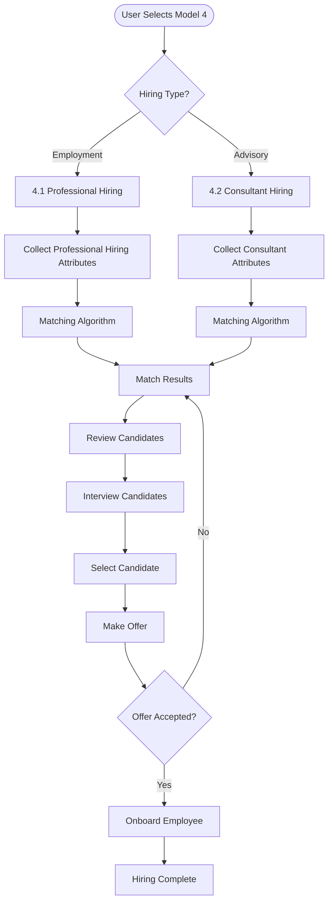
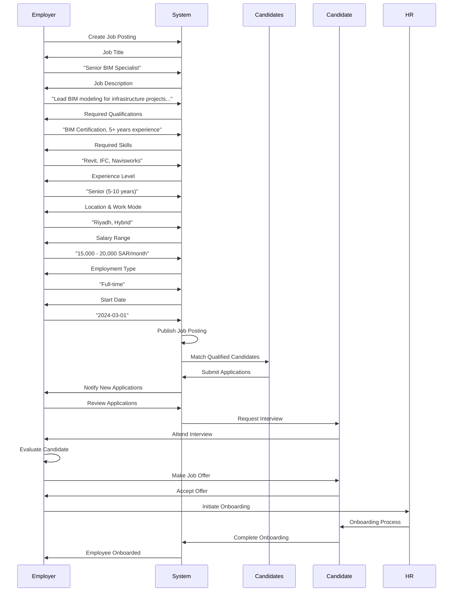
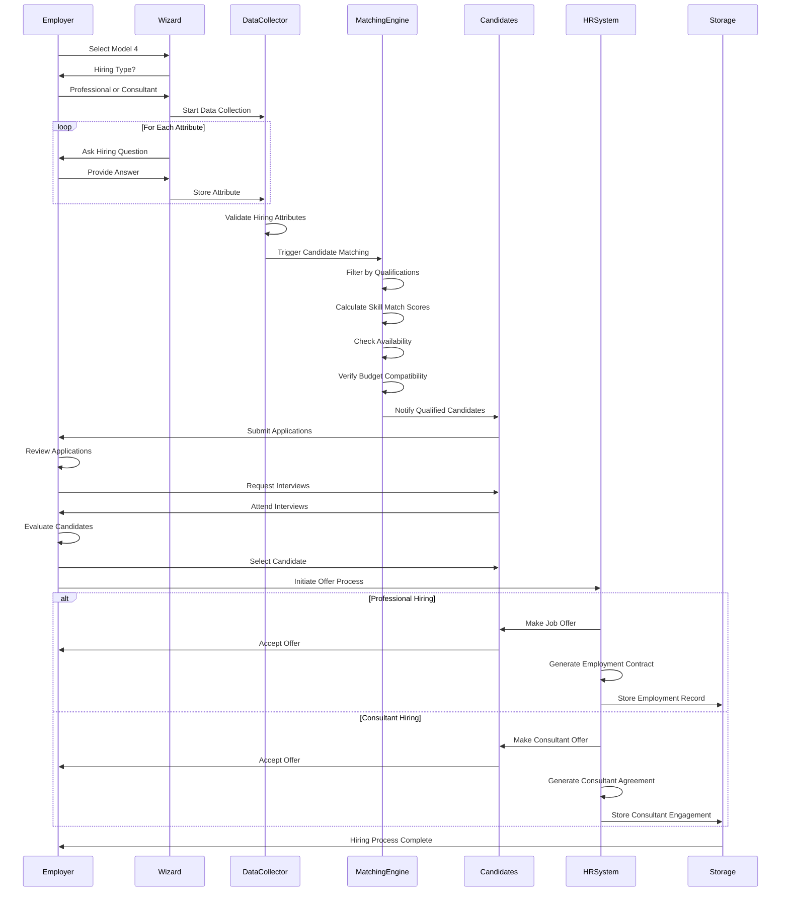
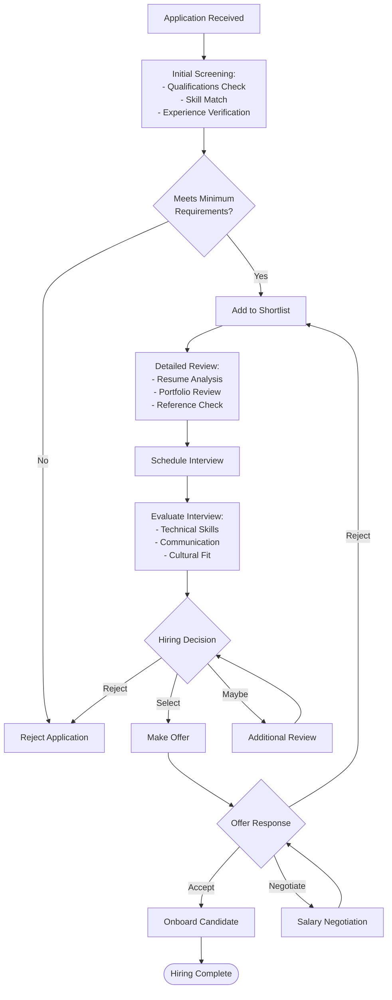

# Model 4: Hiring a Resource Workflow

## Overview

Model 4 focuses on recruiting professionals or consultants for employment or defined service engagements. It includes two sub-models: Professional Hiring (employment) and Consultant Hiring (expert advisory services).

## Portal & Role Context

**Portals:** User Portal (primary)  
**Roles & Access:**
- **Entity (B2B):** Full access to both sub-models (4.1, 4.2) - can create job postings
- **Individual (B2P/P2P):** Access to apply for jobs/consulting (4.1, 4.2)
- **Admin:** View-only access

**Sub-Model Access by Role:**
- **4.1 Professional Hiring:** Entity (create jobs), Individual (apply for jobs)
- **4.2 Consultant Hiring:** Entity (create engagements), Individual (apply as consultant)

## Model 4 High-Level Flow



## Sub-Model 4.1: Professional Hiring

### Workflow



### Key Attributes Collected

1. **Job Title:** Position name
2. **Job Description:** Detailed role description
3. **Required Qualifications:** Education, certifications
4. **Required Skills:** Technical and soft skills
5. **Experience Level:** Years of experience required
6. **Location:** Work location
7. **Work Mode:** Remote, On-Site, Hybrid
8. **Employment Type:** Full-time, Part-time, Contract
9. **Salary Range:** Minimum and maximum (SAR)
10. **Benefits:** Health insurance, etc.
11. **Start Date:** When position starts
12. **Application Deadline:** Last date to apply

### Matching Metrics

- **Qualification Match:** Education and certifications (Boolean)
- **Skill Match Score:** Required skills vs. candidate skills (0-100)
- **Experience Match:** Years of experience alignment (Boolean)
- **Availability Match:** Start date compatibility (Boolean)
- **Salary Compatibility:** Candidate expectations vs. range (Boolean)
- **Location Match:** Geographic preference alignment

## Sub-Model 4.2: Consultant Hiring

### Workflow

```mermaid
flowchart TD
    Start([Create Consultant Engagement]) --> Scope[Define Consultation Scope:<br/>- Type (Legal, Technical, etc.)<br/>- Specific Deliverables<br/>- Consultation Format]
    
    Scope --> Requirements[Define Requirements:<br/>- Required Certifications<br/>- Expert Level<br/>- Specialized Knowledge]
    
    Requirements --> Logistics[Define Logistics:<br/>- Duration<br/>- Meeting Frequency<br/>- Delivery Format]
    
    Logistics --> Budget[Define Budget:<br/>- Total Budget<br/>- Payment Terms<br/>- Milestone Payments]
    
    Budget --> Publish[Publish Consultant Opportunity]
    Publish --> Matching[Matching Algorithm]
    
    Matching --> FindConsultants[Find Qualified Consultants]
    FindConsultants --> Review[Review Consultant Profiles]
    
    Review --> Select[Select Consultant]
    Select --> Agreement[Generate Consultant Agreement]
    
    Agreement --> Execute[Execute Consultation]
    Execute --> Deliverables[Receive Deliverables]
    
    Deliverables --> ReviewDeliverables{Deliverables<br/>Accepted?}
    ReviewDeliverables -->|Yes| Payment[Process Payment]
    ReviewDeliverables -->|No| Revise[Request Revisions]
    Revise --> Execute
    
    Payment --> Complete([Consultation Complete])
```

### Key Attributes Collected

1. **Consultation Type:** Legal, Technical, Sustainability, etc.
2. **Consultation Title:** Name of engagement
3. **Detailed Scope:** What consultant will do
4. **Deliverables:** Expected outputs (reports, analysis, etc.)
5. **Required Certifications:** LEED AP, PMP, etc.
6. **Expert Level:** Senior, Expert, Specialist
7. **Duration:** How long consultation lasts
8. **Meeting Frequency:** Weekly, monthly, as needed
9. **Delivery Format:** Reports, presentations, etc.
10. **Budget:** Total budget (SAR)
11. **Payment Terms:** Upfront, milestone, completion
12. **Timeline:** Start and end dates

### Matching Metrics

- **Certification Match:** Required certifications held (Boolean)
- **Expertise Match:** Relevant experience in consultation type
- **Availability Match:** Consultant available for duration
- **Budget Compatibility:** Consultant rates within budget
- **Past Performance:** Previous consultation ratings

## Complete Model 4 Data Flow



## Candidate Matching Algorithm

### For Professional Hiring (4.1)
```
Professional Match Score = 
  (Qualification Match × 0.30) +
  (Skill Match × 0.40) +
  (Experience Match × 0.20) +
  (Availability Match × 0.10)

Qualification Match: Boolean (all required qualifications met)
Skill Match: Percentage of required skills possessed
Experience Match: Boolean (meets minimum experience)
Availability Match: Boolean (available for start date)

Threshold: Score >= 80% for top candidate recommendation
```

### For Consultant Hiring (4.2)
```
Consultant Match Score = 
  (Certification Match × 0.30) +
  (Expertise Match × 0.35) +
  (Past Performance × 0.20) +
  (Availability Match × 0.15)

Certification Match: Boolean (all required certifications held)
Expertise Match: Relevant experience in consultation type
Past Performance: Average rating from previous consultations
Availability Match: Boolean (available for engagement duration)

Threshold: Score >= 75% for consultant recommendation
```

## Candidate Evaluation Process



## Key Requirements by Role Type

### For Professional Hiring
- **Saudi Council of Engineers (SCE) Registration:** Required for engineering roles
- **Professional License:** Valid professional license
- **Work Authorization:** Right to work in Saudi Arabia
- **Background Check:** May be required for sensitive positions
- **Medical Clearance:** For on-site construction roles

### For Consultant Hiring
- **Expert Certifications:** LEED AP, PMP, etc. as specified
- **Portfolio:** Past project examples
- **References:** Professional references
- **Availability:** Confirmed availability for engagement period
- **NDA Compliance:** For confidential projects

## Outcomes

### Successful Professional Hiring
- Qualified candidate selected
- Employment contract generated
- Onboarding process initiated
- Employee integrated into team
- Performance tracking begins

### Successful Consultant Hiring
- Expert consultant selected
- Consultant agreement generated
- Consultation engagement begins
- Deliverables received and reviewed
- Payment processed upon completion

---

*Model 4 streamlines the hiring process for both employment and consulting engagements, ensuring qualified candidates are matched with appropriate opportunities.*

