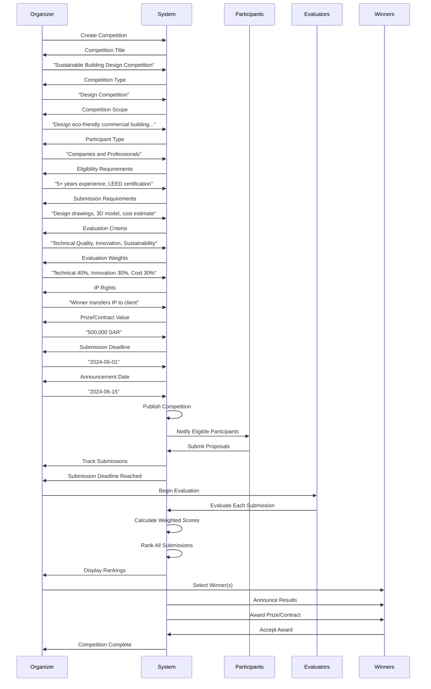
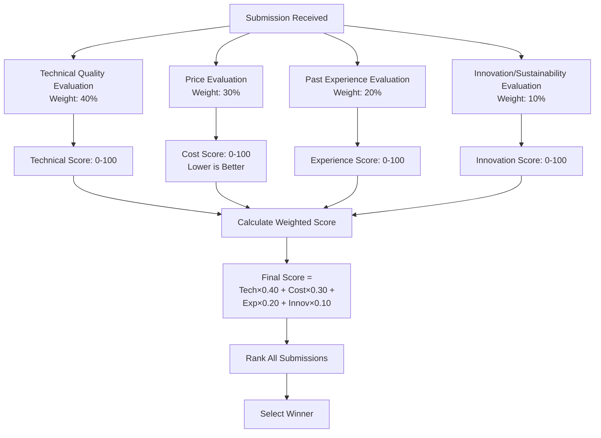
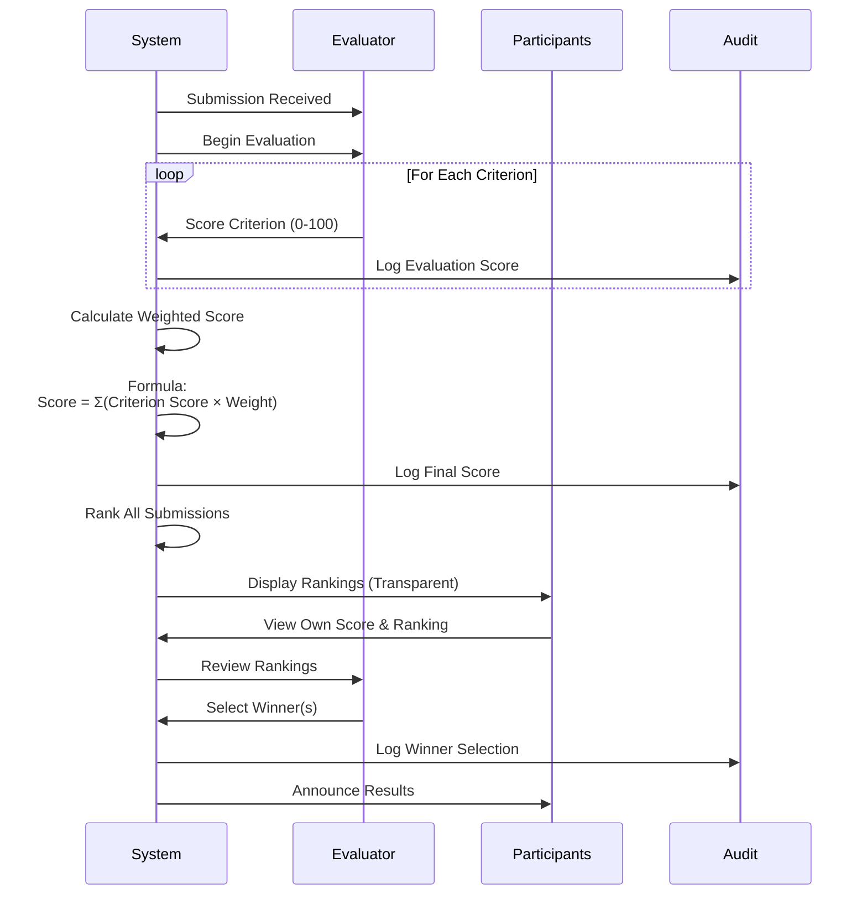
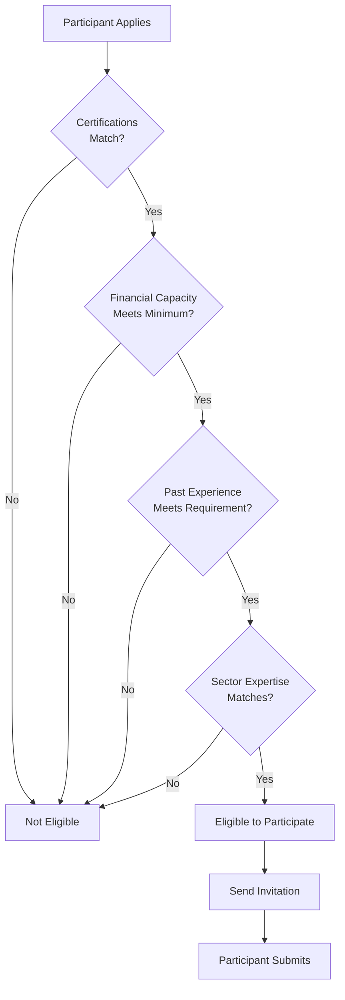
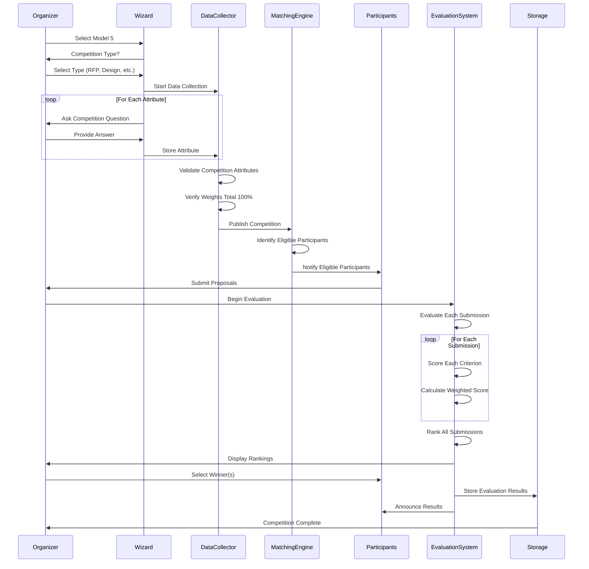

# Model 5: Call for Competition Workflow

## Overview

Model 5 focuses on competitive sourcing of solutions, designs, or talent through transparent evaluation processes. It includes RFP (Request for Proposal), design competitions, innovation challenges, and material supply competitions.

## Portal & Role Context

**Portals:** User Portal (primary)  
**Roles & Access:**
- **Entity (B2B):** Full access - can create competitions and participate
- **Individual (B2P/P2P):** Can participate in competitions, cannot create
- **Admin:** View-only access for moderation

**Sub-Model Access by Role:**
- **5.1 Competition/RFP:** Entity (create & participate), Individual (participate only)

## Model 5 High-Level Flow

```mermaid
flowchart TD
    Start([User Selects Model 5]) --> Type{Competition Type?}
    
    Type -->|Design| DesignComp[Design Competition]
    Type -->|Project Contract| RFP[RFP/RFQ]
    Type -->|Innovation| Innovation[Innovation Challenge]
    Type -->|Materials| MaterialRFQ[RFQ for Materials]
    
    DesignComp --> Setup[Setup Competition]
    RFP --> Setup
    Innovation --> Setup
    MaterialRFQ --> Setup
    
    Setup --> Criteria[Define Evaluation Criteria]
    Criteria --> Weights[Assign Evaluation Weights]
    Weights --> Eligibility[Set Participant Eligibility]
    Eligibility --> Publish[Publish Competition]
    
    Publish --> Submissions[Receive Submissions]
    Submissions --> Evaluate[Evaluate Submissions]
    Evaluate --> Score[Calculate Weighted Scores]
    Score --> Rank[Rank Participants]
    Rank --> Select[Select Winner(s)]
    Select --> Announce[Announce Results]
    Announce --> Award[Award Prize/Contract]
    Award --> Complete([Competition Complete])
```

## Competition Setup Workflow



## Evaluation Criteria & Weighting

### Example Evaluation Framework



## Key Attributes Collected

1. **Competition Title:** Name of competition
2. **Competition Type:** Design, RFP, Innovation Challenge, RFQ
3. **Competition Scope:** Detailed description of what's being competed for
4. **Participant Type:** Companies, Professionals, or Both
5. **Eligibility Requirements:**
   - Minimum qualifications
   - Required certifications
   - Financial capacity
   - Past experience
6. **Submission Requirements:** What participants must submit
7. **Evaluation Criteria:** List of criteria (Technical, Price, Experience, Innovation)
8. **Evaluation Weights:** Percentage for each criterion (must total 100%)
9. **IP Rights:** Who owns submitted solutions
10. **Prize/Contract Value:** Total value (SAR)
11. **Number of Winners:** How many winners selected
12. **Submission Deadline:** Last date to submit
13. **Announcement Date:** When winners announced
14. **Format:** Open to All or Invited Only

## Transparent Evaluation Process



## Matching & Participation Logic

### Eligibility Matching



### Evaluation Metrics

| Metric | Purpose | Logic |
|--------|---------|-------|
| **Eligibility Match** | Filter participants | Boolean: Meets all required qualifications |
| **Sector Expertise** | Targeted invitations | Boolean: Has completed similar projects |
| **Capacity Match** | Ensure delivery | Boolean: Has manpower/equipment for contract value |
| **Technical Quality** | Evaluate solution | Score 0-100 based on technical merit |
| **Price Competitiveness** | Cost evaluation | Score 0-100 (lower price = higher score) |
| **Past Experience** | Track record | Score 0-100 based on relevant experience |
| **Innovation** | Creativity/sustainability | Score 0-100 based on innovation level |

## Complete Model 5 Data Flow



## Evaluation Weight Examples

### Example 1: Technical Focus
- Technical Quality: 50%
- Price: 25%
- Past Experience: 15%
- Innovation: 10%
- **Total: 100%**

### Example 2: Cost Focus
- Price: 40%
- Technical Quality: 30%
- Past Experience: 20%
- Innovation: 10%
- **Total: 100%**

### Example 3: Innovation Focus
- Innovation/Sustainability: 40%
- Technical Quality: 30%
- Price: 20%
- Past Experience: 10%
- **Total: 100%**

## IP Rights Scenarios

### Scenario 1: Submitter Retains IP
- Participants keep ownership of their designs
- Client gets license to use winning design
- Non-winners can use their designs elsewhere

### Scenario 2: Client Owns IP
- Winner transfers all IP rights to client
- Client has full ownership and can modify
- Common for commissioned work

### Scenario 3: Winner Transfers IP
- Only winner transfers IP to client
- Non-winners retain their IP
- Client can use only winning solution

## Outcomes

### Successful Competition
- Competition published and visible
- Eligible participants notified
- Multiple submissions received
- Transparent evaluation completed
- Winner(s) selected and announced
- Prize/contract awarded
- Evaluation results logged for audit

### Competition Metrics Tracked
- Number of participants
- Number of submissions
- Average evaluation scores
- Time to complete evaluation
- Winner acceptance rate
- Contract execution rate

---

*Model 5 enables transparent, competitive sourcing through well-defined evaluation criteria and weighted scoring, ensuring fair selection of the best solutions.*

