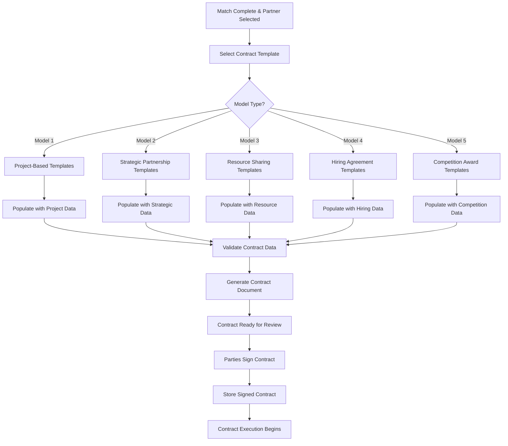
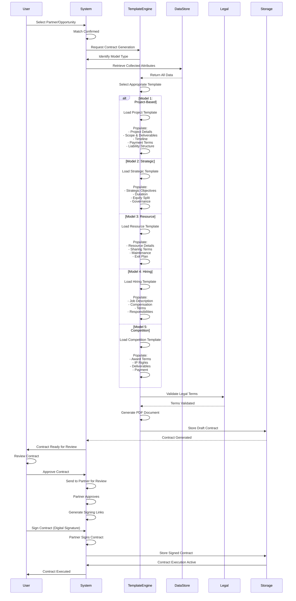
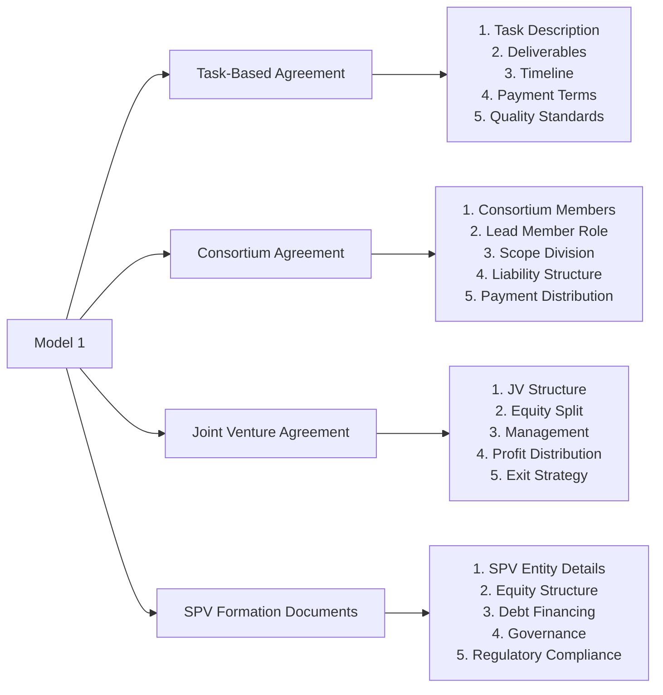
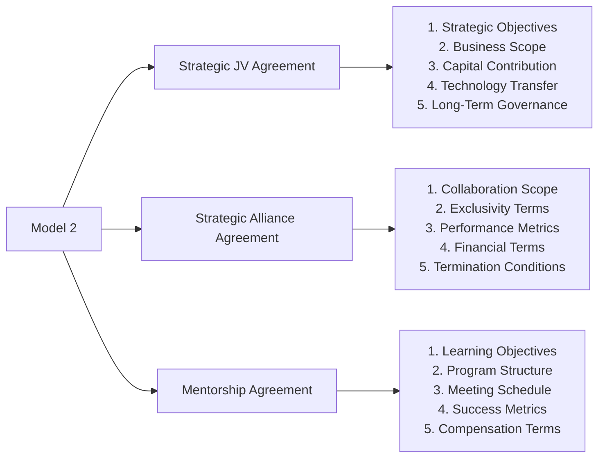
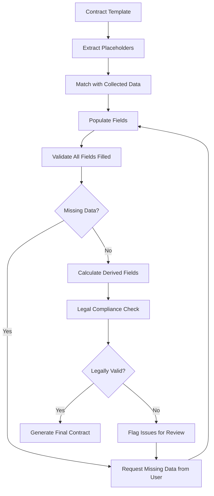
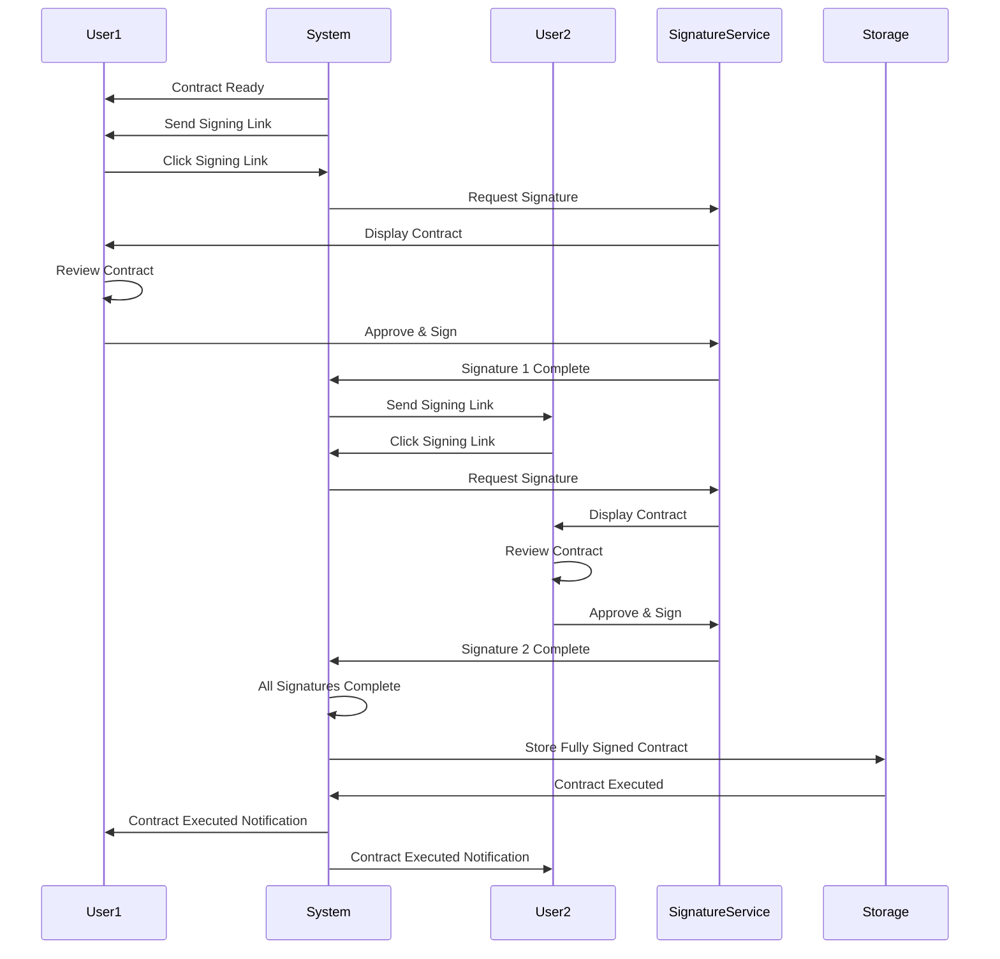
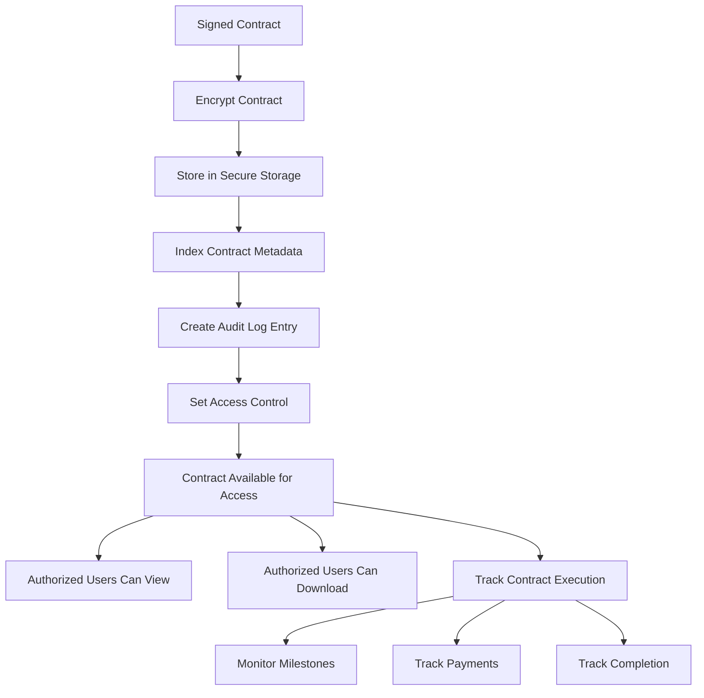
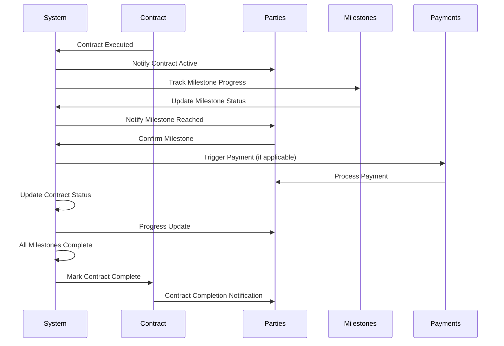

# Smart Contract Generation Workflow

## Overview

After successful matching and partner selection, the PMTwin platform automatically generates legal agreements (smart contracts) based on the collected attributes and matched parameters. This document details the contract generation pipeline.

## Portal & Role Context

**Portals:** User Portal (primary), Mobile App (view signed contracts)  
**Roles & Access:**
- **Entity (B2B):** Can generate and sign contracts for all collaboration models
- **Individual (B2P/P2P):** Can sign contracts for applicable models (Task-Based, Resource Exchange, etc.)
- **Admin:** View-only access to all contracts for audit purposes

**Contract Types by Model:**
- Model 1: Task Agreements, Consortium Agreements, JV Agreements, SPV Documents
- Model 2: Strategic JV Agreements, Alliance Agreements, Mentorship Agreements
- Model 3: Bulk Purchase Agreements, Co-Ownership Agreements, Barter Agreements
- Model 4: Employment Contracts, Consultant Agreements
- Model 5: Competition Award Contracts

## Contract Generation Flow

## Detailed Contract Generation Process

## Contract Templates by Model

### Model 1: Project-Based Contracts

### Model 2: Strategic Partnership Contracts

## Contract Data Population

## Contract Sections by Type

### Task-Based Agreement Sections
1. **Parties:** User and Professional details
2. **Task Description:** Detailed scope from wizard
3. **Deliverables:** Expected outputs and formats
4. **Timeline:** Start date, duration, milestones
5. **Compensation:** Payment terms (fixed, hourly, barter)
6. **Quality Standards:** Acceptance criteria
7. **Intellectual Property:** IP ownership
8. **Termination:** Conditions for termination
9. **Dispute Resolution:** Arbitration/mediation
10. **Signatures:** Digital signatures

### Consortium Agreement Sections
1. **Consortium Members:** All member details
2. **Lead Member:** Designated lead and responsibilities
3. **Project Details:** Project description and value
4. **Scope Division:** How work is divided
5. **Liability Structure:** Individual vs. Joint & Several
6. **Payment Distribution:** How revenue is shared
7. **Decision Making:** Voting and approval process
8. **Dispute Resolution:** Internal and external
9. **Termination:** Dissolution conditions
10. **Signatures:** All member signatures

## Digital Signature Flow

## Contract Storage & Management

## Contract Execution Tracking

## Key Contract Attributes

### Automatically Populated Fields
- Party names and contact information
- Project/collaboration details
- Financial terms (from wizard data)
- Timeline and milestones
- Scope and deliverables
- Liability and risk allocation
- Payment terms and schedules

### User-Configurable Fields
- Additional terms and conditions
- Custom clauses
- Special requirements
- Modification requests

### System-Generated Fields
- Contract ID (unique identifier)
- Generation timestamp
- Version number
- Digital signature metadata
- Execution status

## Outcomes

### Successful Contract Generation
- Contract template selected
- All data populated correctly
- Legal validation passed
- Contract document generated
- Ready for review and signing

### Successful Contract Execution
- All parties signed contract
- Contract stored securely
- Execution tracking active
- Milestones monitored
- Payments processed (if applicable)
- Contract completion tracked

### Contract Management
- Version control maintained
- Amendments tracked
- Audit trail complete
- Access control enforced
- Compliance verified

---

*Smart Contract Generation automates the creation of legally sound agreements based on matched collaboration parameters, streamlining the transition from matching to execution.*

