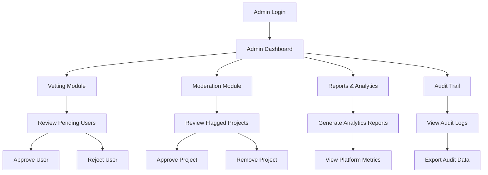
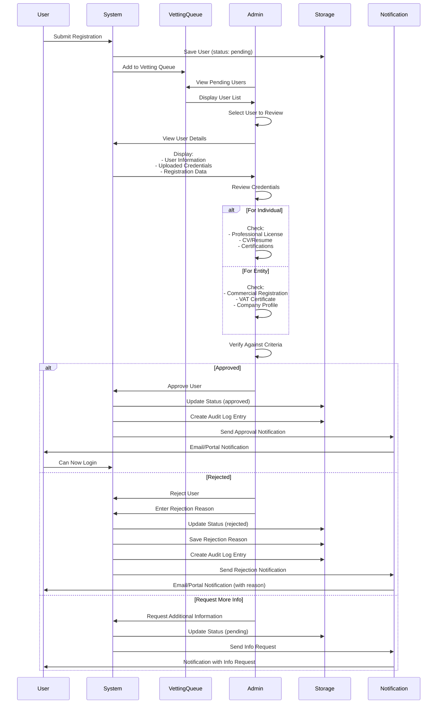
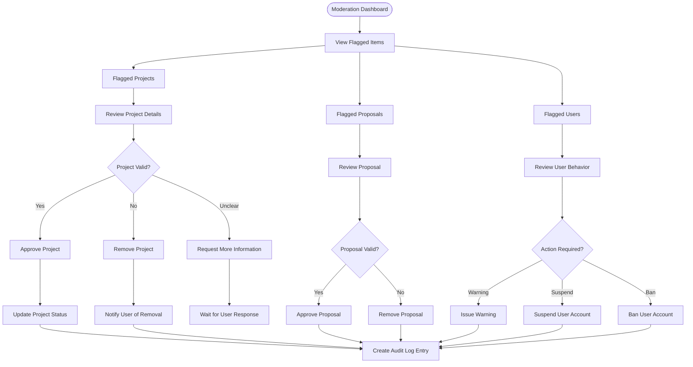
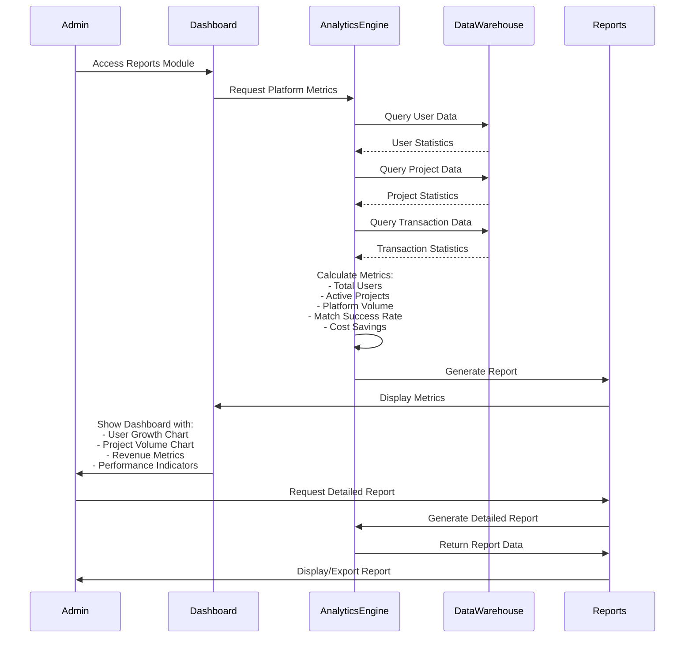
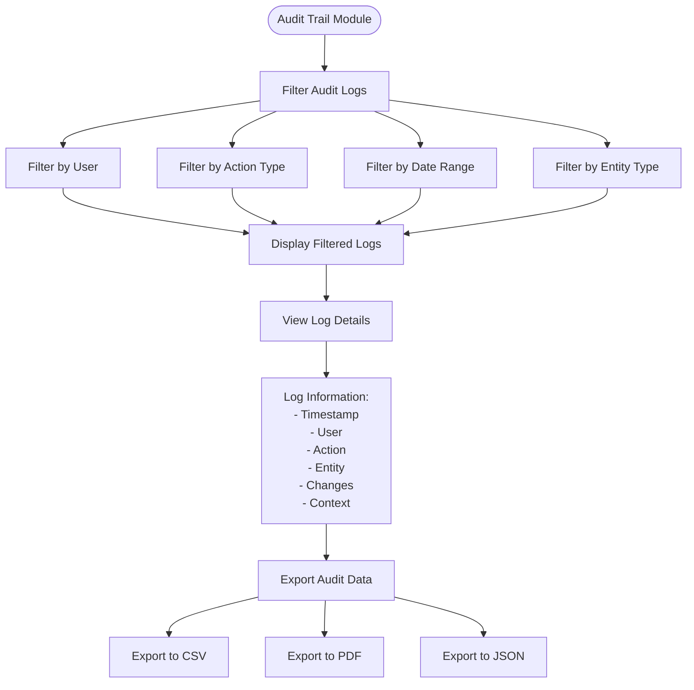
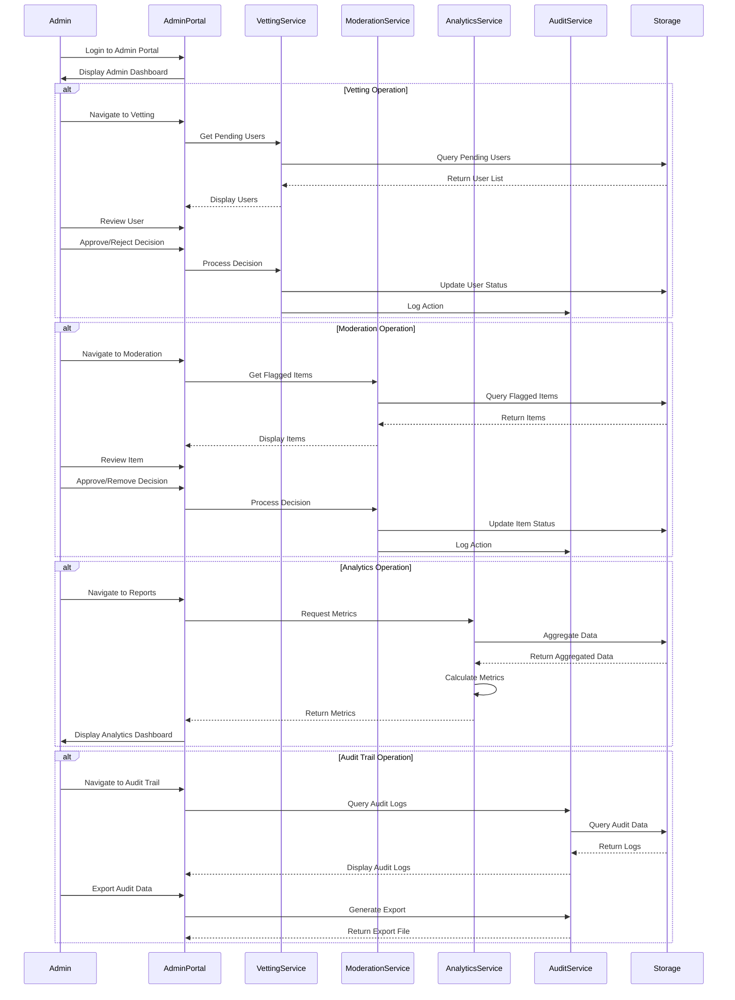

# Admin Portal Workflow

## Overview

The Admin Portal provides governance, vetting, moderation, and analytics capabilities for PMTwin platform operators. This document details all admin workflows including user vetting, marketplace moderation, reporting, and audit trail management.

## Portal & Role Context

**Portals:** Admin Portal (exclusive)  
**Roles:** Admin only (restricted access)  
**User Types:** N/A (Admin is platform operator, not a user type)

**Admin Capabilities:**
- Full access to all platform data
- User vetting and approval/rejection
- Marketplace moderation (projects, proposals)
- Analytics and reporting
- Audit trail management
- System settings configuration

**Restrictions:**
- Cannot create projects or submit proposals
- Cannot participate in collaborations
- View-only access to user features (for moderation)

## Admin Portal High-Level Flow



## User Vetting Workflow



## Marketplace Moderation Workflow



## Reporting & Analytics Workflow



## Audit Trail Management



## Admin Operations Flow



## Vetting Criteria

### For Individual Users
- **Professional License:** Valid and current
- **CV/Resume:** Complete and accurate
- **Certifications:** Verified credentials
- **Information Match:** Registration data matches documents
- **No Red Flags:** No suspicious activity

### For Entity Users
- **Commercial Registration (CR):** Valid and current
- **VAT Certificate:** Valid tax registration
- **Company Profile:** Complete business information
- **Financial Capacity:** Meets minimum requirements
- **No Red Flags:** No suspicious activity

## Moderation Actions

### Project Moderation
- **Approve:** Project meets platform standards
- **Remove:** Project violates terms or is inappropriate
- **Request Revision:** Project needs clarification
- **Flag for Review:** Requires additional review

### User Moderation
- **Warning:** Issue warning for minor violations
- **Suspend:** Temporarily suspend account
- **Ban:** Permanently ban account
- **Restore:** Restore previously suspended account

## Analytics Metrics

### User Metrics
- Total registered users
- Pending approvals
- Approved users
- Rejected users
- Active users (last 30 days)
- User growth trend

### Project Metrics
- Total projects created
- Active projects
- Completed projects
- Projects by model type
- Average project value
- Platform volume (total SAR)

### Matching Metrics
- Total matches generated
- Match success rate
- Average match score
- Matches by model type
- Conversion rate (match to contract)

### Financial Metrics
- Total transaction value
- Cost savings from bulk purchasing
- Barter transaction value
- Average savings per transaction

## Audit Log Entry Structure

```javascript
{
  id: "audit_123",
  timestamp: "2024-01-15T10:30:00Z",
  adminId: "admin_001",
  adminName: "Admin User",
  action: "vetting_approval",
  actionCategory: "user",
  entityType: "user",
  entityId: "user_456",
  description: "Approved user registration for Ahmed Al-Saud",
  changes: {
    before: { status: "pending" },
    after: { status: "approved" }
  },
  context: {
    userId: "user_456",
    userEmail: "ahmed@example.com",
    userRole: "individual"
  }
}
```

## Outcomes

### Successful Vetting
- User credentials verified
- Account approved
- User notified
- Access granted to portal
- Audit log created

### Successful Moderation
- Content reviewed
- Appropriate action taken
- User notified (if applicable)
- Platform quality maintained
- Audit log created

### Successful Reporting
- Metrics calculated
- Reports generated
- Insights provided
- Data exported (if requested)
- Trends identified

### Successful Audit
- Logs retrieved
- Actions traced
- Compliance verified
- Data exported
- History preserved

---

*The Admin Portal provides comprehensive governance tools to maintain platform quality, ensure compliance, and track platform performance.*

