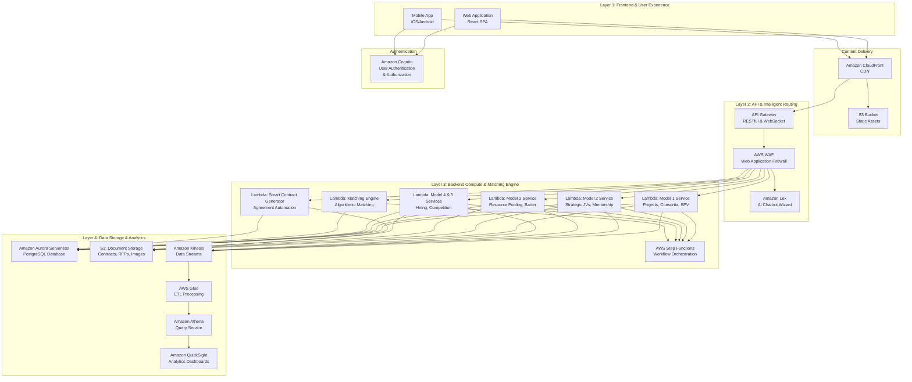
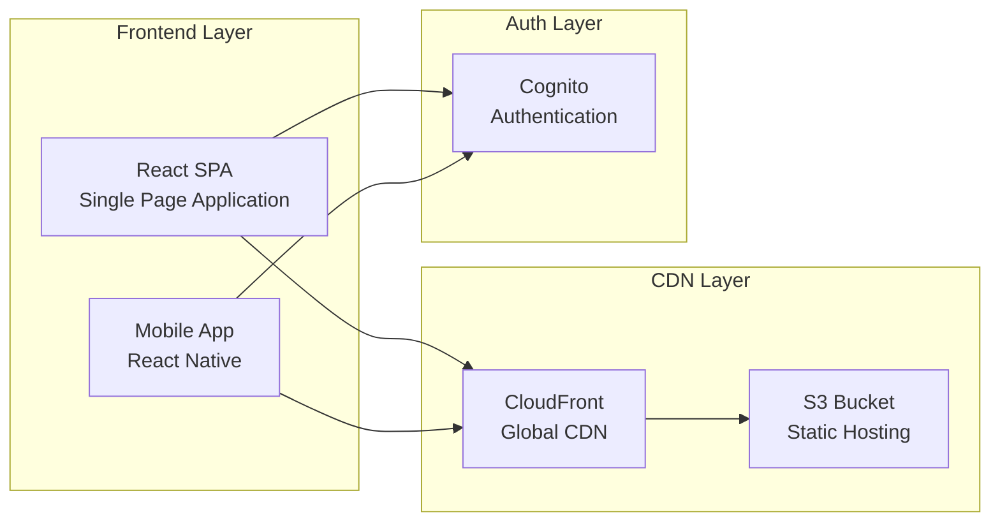
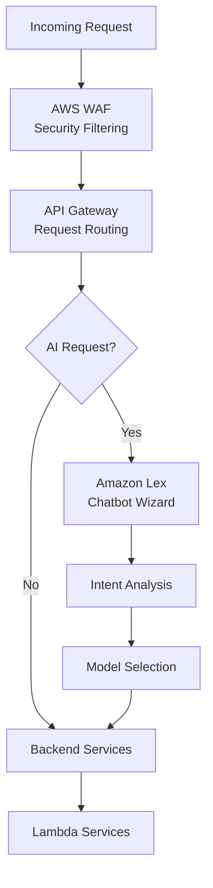
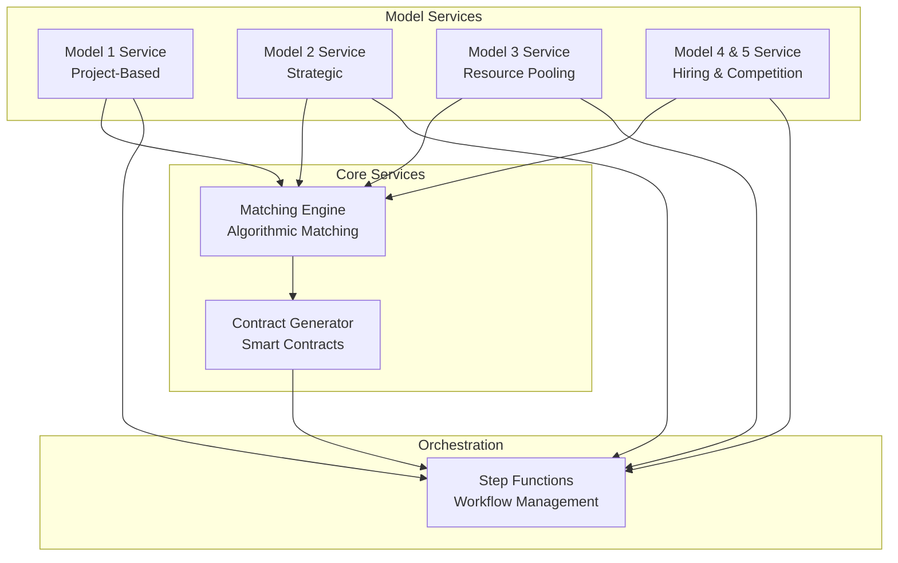
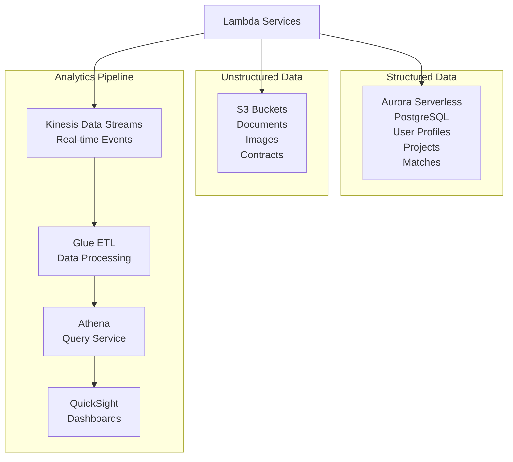
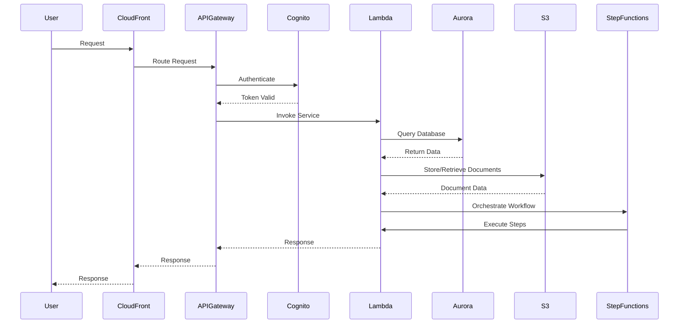
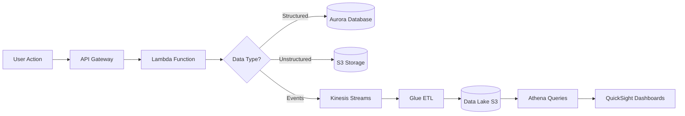

# PMTwin AWS Technology Architecture

## Overview

This document details the complete AWS serverless architecture for the PMTwin platform, designed to support the complex data demands of 5 collaboration models, AI-guided user experience, and real-time algorithmic matching.

## AWS Architecture Diagram

## Layer-by-Layer Breakdown

### Layer 1: Frontend & User Experience

**Components:**
- **Web Application (SPA):** React-based single-page application
- **Mobile App:** iOS/Android applications
- **CloudFront:** Global content delivery network
- **S3:** Static asset hosting
- **Cognito:** User authentication and authorization

### Layer 2: API & Intelligent Routing

**Components:**
- **API Gateway:** Central API management
- **WAF:** Web application firewall protection
- **Lex:** AI chatbot wizard for intent identification

### Layer 3: Backend Compute & Matching Engine

**Components:**
- **Lambda Functions:** Serverless microservices for each model
- **Matching Engine:** High-performance matching algorithm
- **Smart Contract Generator:** Automated agreement creation
- **Step Functions:** Complex workflow orchestration

### Layer 4: Data Storage & Analytics

**Components:**
- **Aurora Serverless:** Relational database (PostgreSQL)
- **S3:** Object storage for documents and media
- **Kinesis:** Real-time data streaming
- **Glue:** ETL processing
- **Athena:** Serverless query service
- **QuickSight:** Business intelligence dashboards

## Service Interactions

## Data Flow Architecture

## Key Architectural Benefits

### Scalability
- **Serverless Design:** Lambda and Aurora Serverless scale automatically
- **No Idle Costs:** Pay only for actual usage
- **Traffic Spikes:** Handles large competitions without infrastructure changes

### Agility
- **Microservices:** Independent updates to specific models
- **Rapid Deployment:** CI/CD pipeline for quick releases
- **A/B Testing:** Easy to test new features

### Intelligence
- **Amazon Lex Integration:** Advanced conversational AI
- **Matching Algorithms:** Purpose-built compute for matching
- **Analytics:** Real-time insights from data streams

### Security
- **WAF Protection:** Web application firewall
- **Cognito:** Secure authentication
- **IAM:** Fine-grained access control
- **Encryption:** Data encryption at rest and in transit

## Cost Optimization

- **Aurora Serverless:** Scales to zero when not in use
- **Lambda:** Pay per invocation
- **S3:** Tiered storage for cost efficiency
- **CloudFront:** Reduced data transfer costs
- **Reserved Capacity:** For predictable workloads

---

*This AWS architecture provides a scalable, serverless foundation for the PMTwin platform, enabling efficient operation and growth.*

