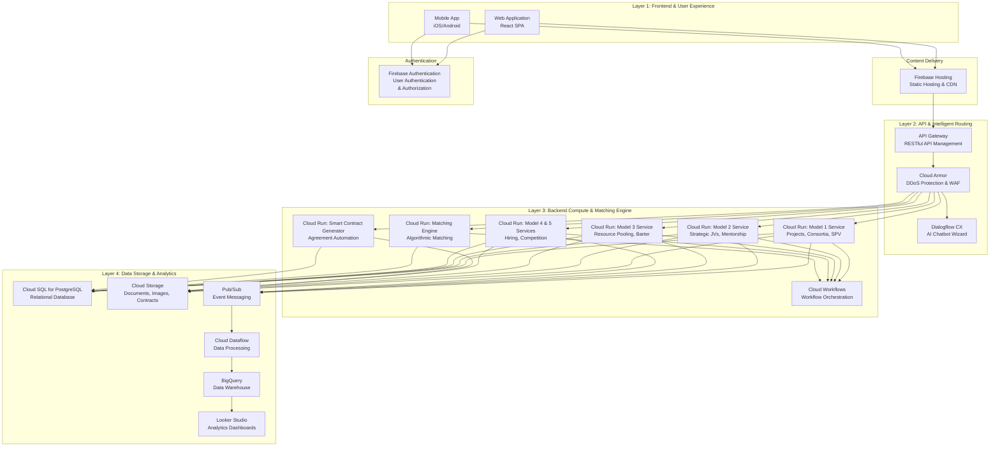
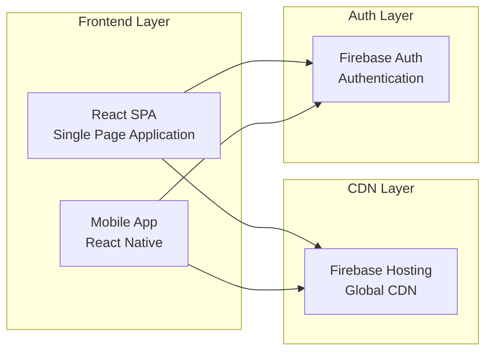
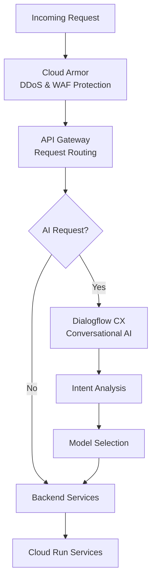
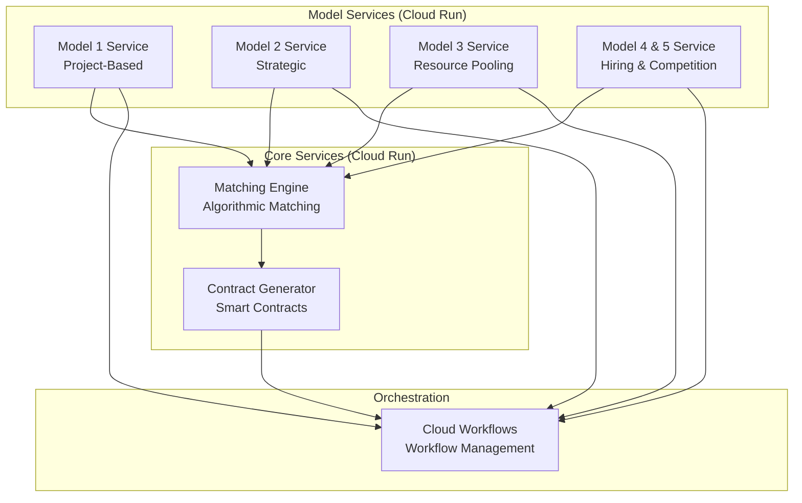
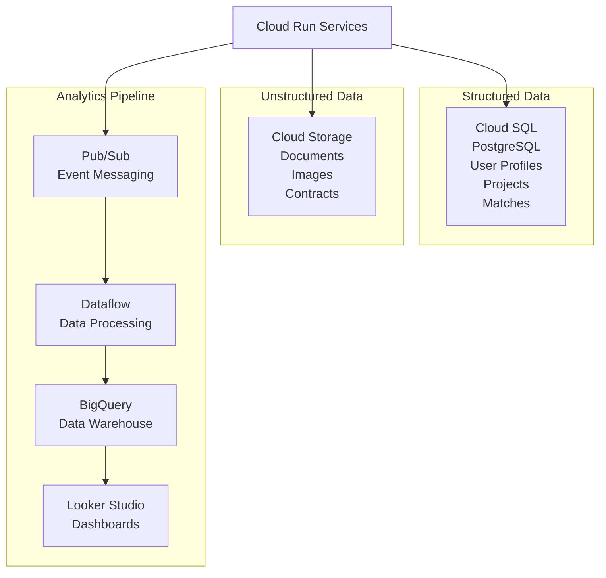
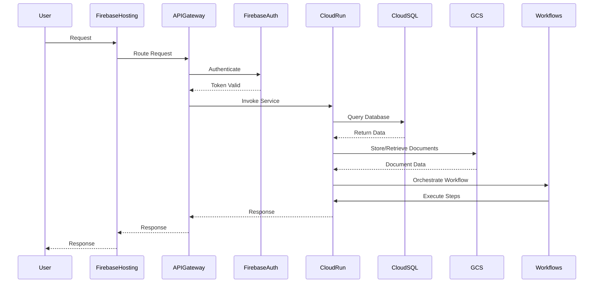
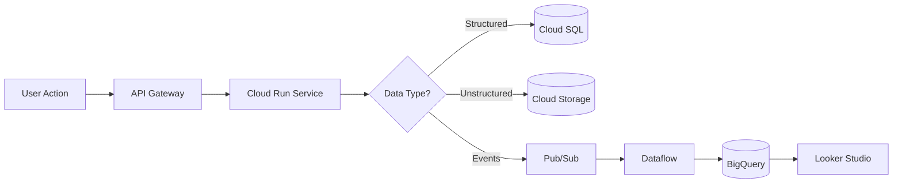

# PMTwin GCP Technology Architecture

## Overview

This document details the complete Google Cloud Platform (GCP) serverless architecture for the PMTwin platform, designed to support the complex data demands of 5 collaboration models, AI-guided user experience, and real-time algorithmic matching.

## GCP Architecture Diagram

## Layer-by-Layer Breakdown

### Layer 1: Frontend & User Experience

**Components:**
- **Web Application (SPA):** React-based single-page application
- **Mobile App:** iOS/Android applications
- **Firebase Hosting:** Fast, secure, globally distributed static hosting
- **Firebase Authentication:** User sign-in and identity management

### Layer 2: API & Intelligent Routing

**Components:**
- **API Gateway:** Fully managed API gateway
- **Cloud Armor:** DDoS protection and WAF
- **Dialogflow CX:** Advanced conversational AI for wizard

### Layer 3: Backend Compute & Matching Engine

**Components:**
- **Cloud Run:** Serverless containers for microservices
- **Matching Engine:** High-performance matching algorithm
- **Smart Contract Generator:** Automated agreement creation
- **Cloud Workflows:** Complex workflow orchestration

### Layer 4: Data Storage & Analytics

**Components:**
- **Cloud SQL:** Fully managed PostgreSQL database
- **Cloud Storage (GCS):** Object storage for documents and media
- **Pub/Sub:** Event messaging and streaming
- **Dataflow:** Serverless data processing
- **BigQuery:** Serverless data warehouse
- **Looker Studio:** Business intelligence dashboards

## Service Interactions

## Data Flow Architecture

## Key Architectural Benefits

### Scalability
- **Serverless Containers:** Cloud Run auto-scales based on traffic
- **Firebase:** Handles scale automatically
- **No Server Management:** Fully managed services

### Advanced AI
- **Dialogflow CX:** Market-leading conversational AI
- **Natural Language Processing:** Advanced intent recognition
- **Multi-language Support:** Future expansion capability

### Integrated Data & Analytics
- **Seamless Flow:** Cloud SQL to BigQuery integration
- **Real-time Analytics:** Pub/Sub and Dataflow pipeline
- **Business Intelligence:** Looker Studio dashboards
- **Data Warehouse:** BigQuery for historical analysis

### Security
- **Cloud Armor:** DDoS protection and WAF
- **Firebase Auth:** Secure authentication
- **IAM:** Fine-grained access control
- **Encryption:** Data encryption at rest and in transit

## Cost Optimization

- **Cloud Run:** Pay per request, scales to zero
- **Cloud SQL:** Pay for actual usage
- **Cloud Storage:** Tiered storage classes
- **BigQuery:** Pay per query, not storage
- **Committed Use Discounts:** For predictable workloads

## GCP vs AWS Comparison

| Feature | AWS | GCP |
|---------|-----|-----|
| **Frontend Hosting** | CloudFront + S3 | Firebase Hosting |
| **Authentication** | Cognito | Firebase Auth |
| **API Gateway** | API Gateway | API Gateway |
| **WAF** | AWS WAF | Cloud Armor |
| **AI Chatbot** | Lex | Dialogflow CX |
| **Compute** | Lambda | Cloud Run |
| **Database** | Aurora Serverless | Cloud SQL |
| **Object Storage** | S3 | Cloud Storage |
| **Workflow** | Step Functions | Cloud Workflows |
| **Streaming** | Kinesis | Pub/Sub |
| **ETL** | Glue | Dataflow |
| **Data Warehouse** | Athena | BigQuery |
| **Analytics** | QuickSight | Looker Studio |

---

*This GCP architecture provides a scalable, serverless foundation for the PMTwin platform with advanced AI capabilities and integrated analytics.*

