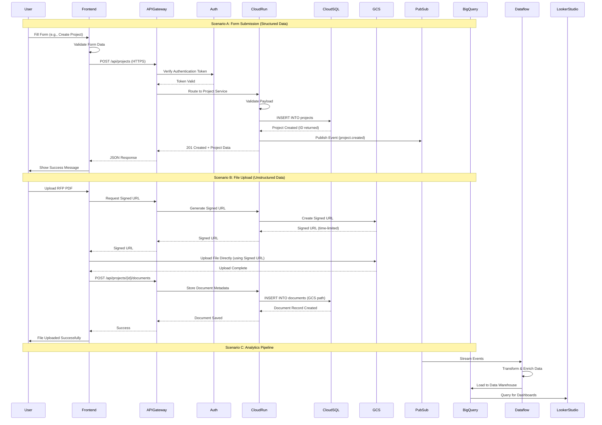
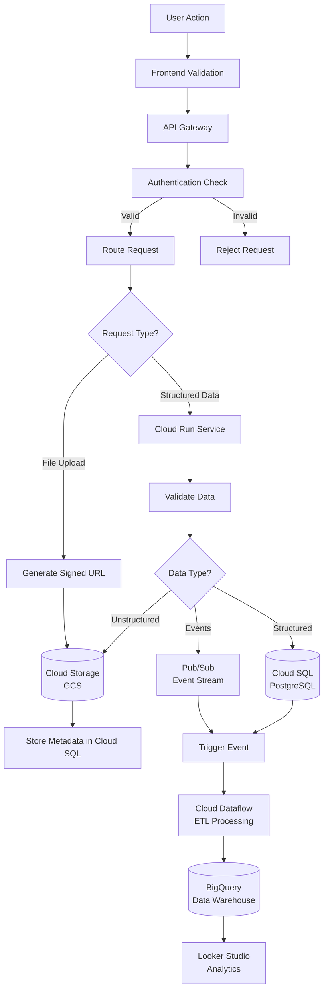
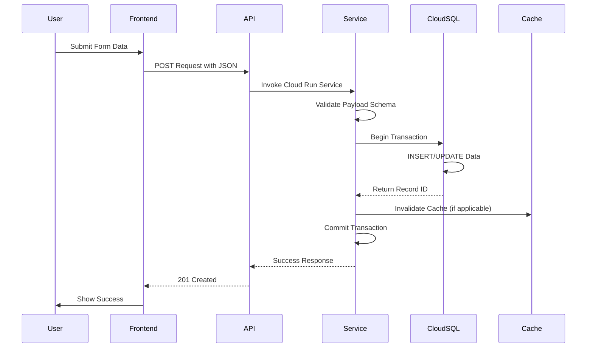
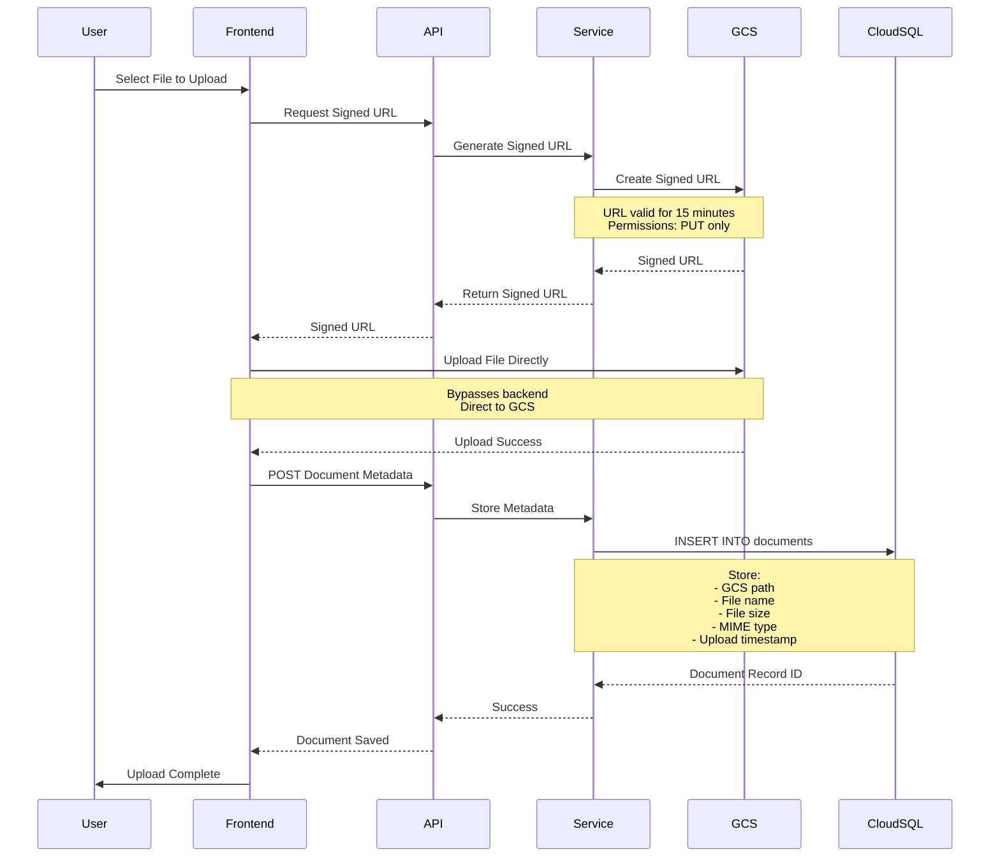
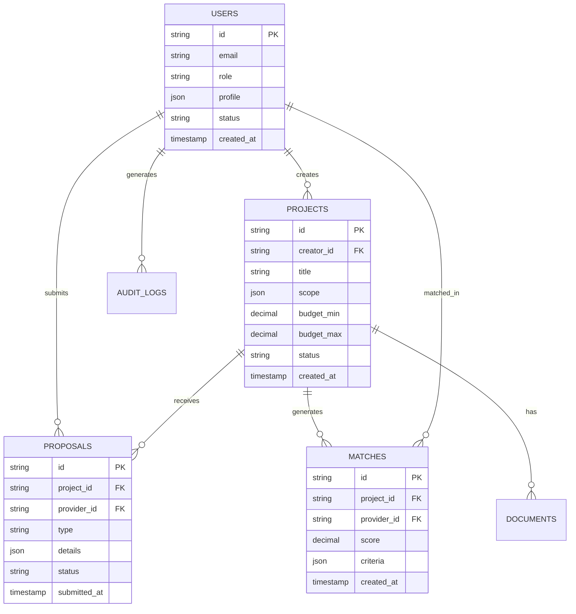
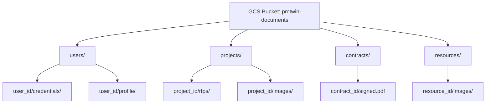
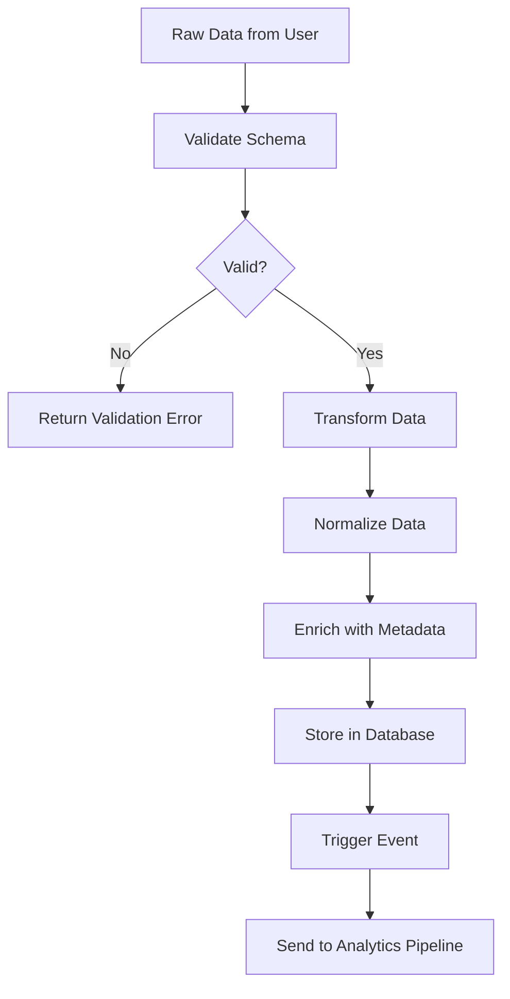
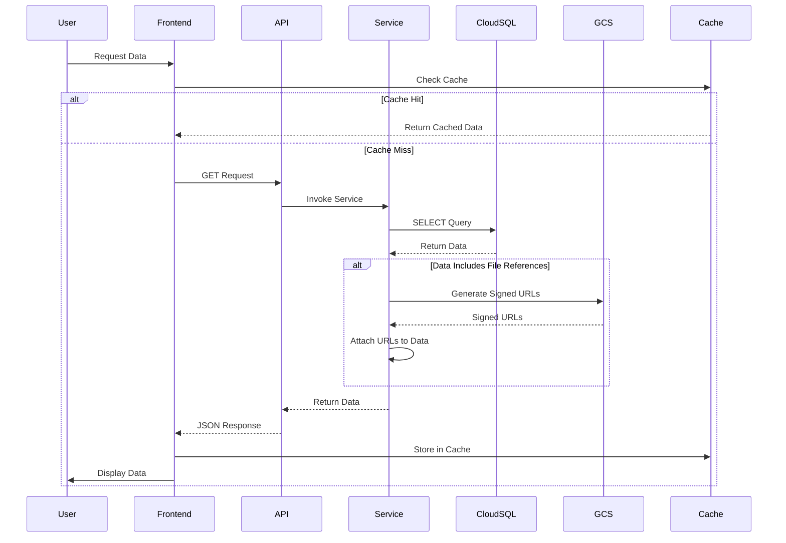
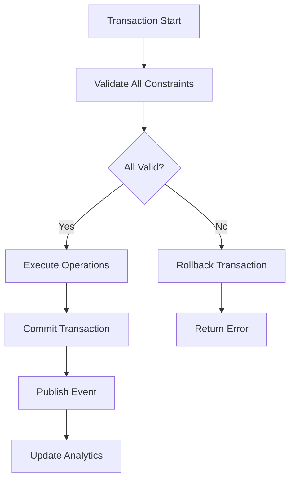

# PMTwin Data Flow & Persistence Workflow

## Overview

This document details the complete data flow from user interaction to data storage, illustrating how user actions on the frontend result in data being processed and ultimately stored in the database and object storage layers.

## End-to-End Data Flow

## Data Flow Architecture

## Structured Data Flow (Database)

## Unstructured Data Flow (Object Storage)

## Analytics Data Pipeline

```mermaid
flowchart LR
    UserAction[User Action] --> Event[Event Generated]
    Event --> PubSub[Pub/Sub Topic]
    
    PubSub --> Dataflow[Cloud Dataflow]
    Dataflow --> Transform[Transform & Enrich]
    Transform --> BigQuery[BigQuery Table]
    
    BigQuery --> Query[SQL Queries]
    Query --> LookerStudio[Looker Studio]
    LookerStudio --> Dashboard[Analytics Dashboard]
```

## Data Storage Strategy

### Structured Data (Cloud SQL)

### Unstructured Data (Cloud Storage)

## Data Validation & Transformation

## Data Retrieval Flow

## Key Data Flow Patterns

### Pattern 1: Create Operation
1. User submits form
2. Frontend validates
3. API Gateway routes request
4. Service validates payload
5. Cloud SQL stores data
6. Event published to Pub/Sub
7. Response returned to user

### Pattern 2: File Upload
1. User selects file
2. Frontend requests signed URL
3. Service generates signed URL from GCS
4. Frontend uploads directly to GCS
5. Frontend sends metadata to backend
6. Service stores metadata in Cloud SQL
7. Response returned to user

### Pattern 3: Read Operation
1. User requests data
2. Frontend checks cache
3. If cache miss, request to API
4. Service queries Cloud SQL
5. If files needed, generate signed URLs
6. Return data to frontend
7. Cache response

### Pattern 4: Analytics Pipeline
1. User action triggers event
2. Event published to Pub/Sub
3. Dataflow processes event
4. Data transformed and enriched
5. Loaded into BigQuery
6. Available for analytics queries
7. Displayed in Looker Studio

## Data Consistency & Integrity

## Outcomes

### Successful Data Flow
- Data validated and stored correctly
- Files uploaded to object storage
- Metadata linked in database
- Events published for analytics
- User receives confirmation

### Error Handling
- Validation errors returned immediately
- Transaction rollback on failure
- Error messages logged
- User notified of issues
- Retry mechanisms for transient failures

---

*This data flow architecture ensures reliable, scalable data processing from user interaction through storage and analytics.*

