# PMTwin Features by User, Portal, and Role

## Overview

This document provides a comprehensive feature matrix showing which features are available to which users, roles, and portals across the PMTwin platform. It includes portal-specific workflows and role-based access diagrams.

## Quick Reference: All Features by Portal and Role

### Complete Feature Matrix (All 30+ Features)

| # | Feature Name | Public Portal | User Portal (Entity) | User Portal (Individual) | Admin Portal | Mobile App |
|---|--------------|---------------|---------------------|-------------------------|--------------|------------|
| 1 | Home/Landing Page | ✅ | ❌ | ❌ | ❌ | ❌ |
| 2 | Project Discovery | ✅ (Limited) | ✅ (Full) | ✅ (Full) | ✅ (View All) | ✅ (Assigned) |
| 3 | PMTwin Wizard | ✅ | ✅ | ✅ | ✅ (View Only) | ❌ |
| 4 | Knowledge Hub | ✅ | ✅ | ✅ | ✅ | ❌ |
| 5 | Login | ✅ | ✅ | ✅ | ✅ | ✅ |
| 6 | Signup/Registration | ✅ | ❌ | ❌ | ❌ | ❌ |
| 7 | Dashboard | ❌ | ✅ (Entity) | ✅ (Individual) | ✅ (Admin) | ✅ (Mobile) |
| 8 | Project Creation | ❌ | ✅ | ❌ | ❌ | ❌ |
| 9 | Project List/View | ❌ | ✅ | ✅ | ✅ (All) | ✅ (Assigned) |
| 10 | Project Edit/Delete | ❌ | ✅ (Own) | ❌ | ✅ (All) | ❌ |
| 11 | Proposal Creation | ❌ | ✅ | ✅ | ❌ | ❌ |
| 12 | Proposal List/View | ❌ | ✅ (Received) | ✅ (Own) | ✅ (All) | ❌ |
| 13 | Proposal Review/Approve | ❌ | ✅ (Own Projects) | ❌ | ✅ (All) | ❌ |
| 14 | Opportunities View | ❌ | ✅ | ✅ | ✅ (All) | ❌ |
| 15 | Matches View | ❌ | ✅ | ✅ | ✅ (All) | ❌ |
| 16 | Collaboration Models | ✅ (Wizard) | ✅ (Full) | ✅ (Limited) | ✅ (View Only) | ❌ |
| 17 | Collaboration Opportunities | ❌ | ✅ (Create) | ✅ (Apply) | ✅ (View All) | ❌ |
| 18 | Pipeline Management | ❌ | ✅ | ❌ | ✅ (View All) | ❌ |
| 19 | Profile Management | ✅ (Reg Only) | ✅ (Full) | ✅ (Full) | ✅ (View All) | ✅ (Limited) |
| 20 | Onboarding | ❌ | ✅ | ✅ | ❌ | ❌ |
| 21 | Notifications | ❌ | ✅ | ✅ | ✅ | ✅ |
| 22 | User Vetting | ❌ | ❌ | ❌ | ✅ | ❌ |
| 23 | Project Moderation | ❌ | ❌ | ❌ | ✅ | ❌ |
| 24 | Audit Trail | ❌ | ✅ (Own) | ✅ (Own) | ✅ (Full) | ✅ (Own) |
| 25 | Reports & Analytics | ❌ | ✅ (Own Data) | ✅ (Own Data) | ✅ (Full Platform) | ❌ |
| 26 | Site Logging | ❌ | ❌ | ❌ | ❌ | ✅ |
| 27 | Biometric Approval | ❌ | ❌ | ❌ | ❌ | ✅ |
| 28 | Media Upload | ❌ | ✅ (Docs) | ✅ (Docs) | ❌ | ✅ (Photos/Videos) |
| 29 | Offline Mode | ❌ | ❌ | ❌ | ❌ | ✅ |
| 30 | Smart Contracts | ❌ | ✅ (Generate & Sign) | ✅ (Sign) | ✅ (View Only) | ✅ (View Signed) |

## Complete Feature Matrix

### All Features by Portal

| Feature | Public Portal | User Portal | Admin Portal | Mobile App |
|---------|---------------|-------------|--------------|------------|
| **Home/Landing Page** | ✅ | ❌ | ❌ | ❌ |
| **Project Discovery** | ✅ (Limited) | ✅ (Full) | ✅ (View All) | ✅ (Assigned Only) |
| **PMTwin Wizard** | ✅ | ✅ | ✅ (View Only) | ❌ |
| **Knowledge Hub** | ✅ | ✅ | ✅ | ❌ |
| **Login** | ✅ | ✅ | ✅ | ✅ |
| **Signup/Registration** | ✅ | ❌ | ❌ | ❌ |
| **Dashboard** | ❌ | ✅ (Role-Adaptive) | ✅ (Admin Dashboard) | ✅ (Mobile Dashboard) |
| **Project Creation** | ❌ | ✅ (Entity only) | ❌ | ❌ |
| **Project List/View** | ❌ | ✅ | ✅ (View All) | ✅ (Assigned) |
| **Project Edit/Delete** | ❌ | ✅ (Own Projects) | ✅ (All Projects) | ❌ |
| **Proposal Creation** | ❌ | ✅ | ❌ | ❌ |
| **Proposal List/View** | ❌ | ✅ | ✅ (View All) | ❌ |
| **Proposal Review/Approve** | ❌ | ✅ (Own Projects) | ✅ (All) | ❌ |
| **Opportunities View** | ❌ | ✅ | ✅ (View All) | ❌ |
| **Matches View** | ❌ | ✅ | ✅ (View All) | ❌ |
| **Collaboration Models** | ✅ (Wizard Only) | ✅ (Full Access) | ✅ (View Only) | ❌ |
| **Collaboration Opportunities** | ❌ | ✅ | ✅ (View All) | ❌ |
| **Pipeline Management** | ❌ | ✅ (Entity) | ✅ (View All) | ❌ |
| **Profile Management** | ✅ (Registration) | ✅ (Full) | ✅ (View All) | ✅ (Limited) |
| **Onboarding** | ❌ | ✅ | ❌ | ❌ |
| **Notifications** | ❌ | ✅ | ✅ | ✅ |
| **User Vetting** | ❌ | ❌ | ✅ | ❌ |
| **Project Moderation** | ❌ | ❌ | ✅ | ❌ |
| **Audit Trail** | ❌ | ✅ (Own Actions) | ✅ (Full Access) | ✅ (Own Actions) |
| **Reports & Analytics** | ❌ | ✅ (Own Data) | ✅ (Full Platform) | ❌ |
| **Site Logging** | ❌ | ❌ | ❌ | ✅ |
| **Biometric Approval** | ❌ | ❌ | ❌ | ✅ |
| **Media Upload** | ❌ | ✅ (Documents) | ❌ | ✅ (Photos/Videos) |
| **Offline Mode** | ❌ | ❌ | ❌ | ✅ |
| **Smart Contracts** | ❌ | ✅ | ✅ (View Only) | ✅ (View Signed) |

### Complete Features by User Role

| Feature | Entity (B2B) | Individual (B2P/P2P) | Consultant | Admin | Guest |
|---------|--------------|----------------------|------------|-------|-------|
| **Home/Landing** | ❌ | ❌ | ❌ | ❌ | ✅ |
| **Project Discovery** | ✅ (Full) | ✅ (Full) | ✅ (Full) | ✅ (View All) | ✅ (Limited) |
| **PMTwin Wizard** | ✅ | ✅ | ✅ | ✅ (View Only) | ✅ |
| **Knowledge Hub** | ✅ | ✅ | ✅ | ✅ | ✅ |
| **Login** | ✅ | ✅ | ✅ | ✅ | ✅ |
| **Signup** | ✅ | ✅ | ✅ | ❌ | ✅ |
| **Dashboard** | ✅ (Entity Dashboard) | ✅ (Individual Dashboard) | ✅ (Individual Dashboard) | ✅ (Admin Dashboard) | ❌ |
| **Create Projects** | ✅ | ❌ | ❌ | ❌ | ❌ |
| **View Projects** | ✅ (Own + Public) | ✅ (Public) | ✅ (Public) | ✅ (All) | ✅ (Limited) |
| **Edit/Delete Projects** | ✅ (Own Only) | ❌ | ❌ | ✅ (All) | ❌ |
| **Create Proposals** | ✅ | ✅ | ✅ | ❌ | ❌ |
| **View Proposals** | ✅ (Received) | ✅ (Own) | ✅ (Own) | ✅ (All) | ❌ |
| **Review/Approve Proposals** | ✅ (Own Projects) | ❌ | ❌ | ✅ (All) | ❌ |
| **View Opportunities** | ✅ | ✅ | ✅ | ✅ (All) | ❌ |
| **View Matches** | ✅ | ✅ | ✅ | ✅ (All) | ❌ |
| **Create Collaboration Opportunities** | ✅ | ❌ | ✅ | ❌ | ❌ |
| **Apply to Collaborations** | ✅ | ✅ | ✅ | ❌ | ❌ |
| **Manage Pipeline** | ✅ | ❌ | ❌ | ✅ (View All) | ❌ |
| **Profile Management** | ✅ (Full) | ✅ (Full) | ✅ (Full) | ✅ (View All) | ✅ (Registration Only) |
| **Onboarding** | ✅ | ✅ | ✅ | ❌ | ❌ |
| **Notifications** | ✅ | ✅ | ✅ | ✅ | ❌ |
| **User Vetting** | ❌ | ❌ | ❌ | ✅ | ❌ |
| **Project Moderation** | ❌ | ❌ | ❌ | ✅ | ❌ |
| **Audit Trail** | ✅ (Own Actions) | ✅ (Own Actions) | ✅ (Own Actions) | ✅ (Full Access) | ❌ |
| **Reports & Analytics** | ✅ (Own Data) | ✅ (Own Data) | ✅ (Own Data) | ✅ (Full Platform) | ❌ |
| **Site Logging** | ✅ (Mobile) | ✅ (Mobile) | ✅ (Mobile) | ❌ | ❌ |
| **Biometric Approval** | ✅ (Mobile) | ✅ (Mobile) | ✅ (Mobile) | ❌ | ❌ |
| **Media Upload** | ✅ | ✅ | ✅ | ❌ | ❌ |
| **Offline Mode** | ✅ (Mobile) | ✅ (Mobile) | ✅ (Mobile) | ❌ | ❌ |
| **Smart Contracts** | ✅ (Generate & Sign) | ✅ (Sign) | ✅ (Sign) | ✅ (View Only) | ❌ |

## Portal-Specific Workflows

### Public Portal Workflow

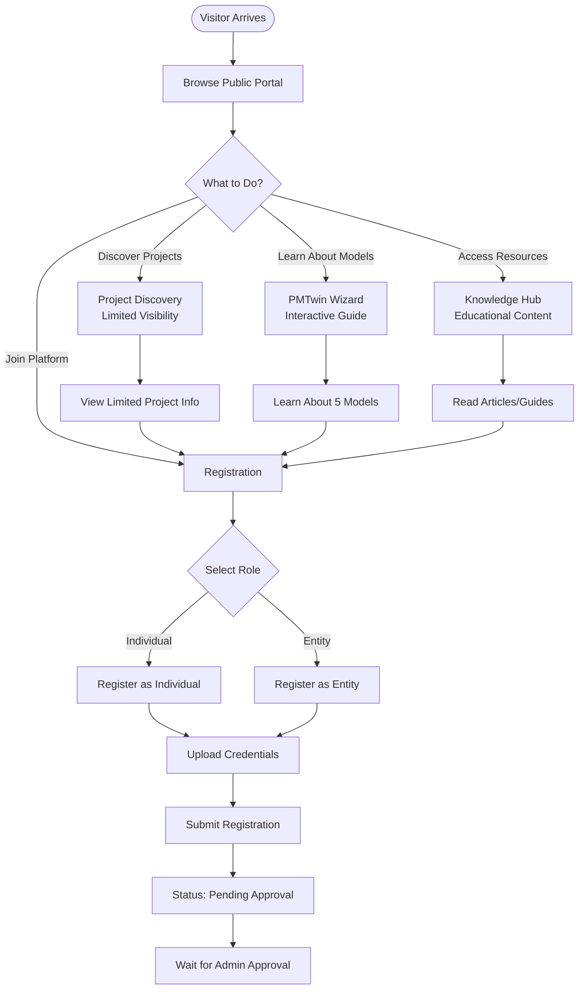

**Available Features:**
- Project Discovery (limited visibility)
- PMTwin Wizard (interactive model selection guide)
- Knowledge Hub (educational resources)
- Registration (Individual or Entity)
- View public project listings (basic info only)

**Restrictions:**
- Cannot view full project details
- Cannot submit proposals
- Cannot access user features
- Cannot create projects

### User Portal - Entity Dashboard Workflow

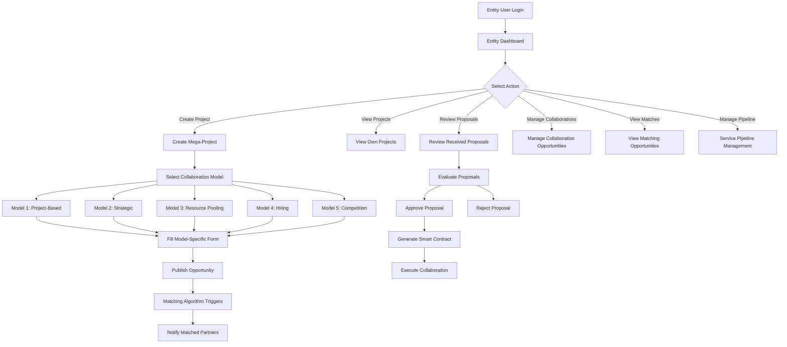

**Available Features:**
- Create and manage mega-projects
- Review and approve/reject proposals
- Create collaboration opportunities (all 5 models)
- View matching opportunities
- Manage service pipeline
- Financial overview dashboard
- Profile management
- View notifications

**Model Access:**
- ✅ Model 1: All sub-models (Task, Consortium, JV, SPV)
- ✅ Model 2: Strategic JV, Alliance, Mentorship
- ✅ Model 3: Bulk Purchase, Co-Ownership, Barter
- ✅ Model 4: Professional Hiring, Consultant Hiring
- ✅ Model 5: Competition/RFP

### User Portal - Individual Dashboard Workflow

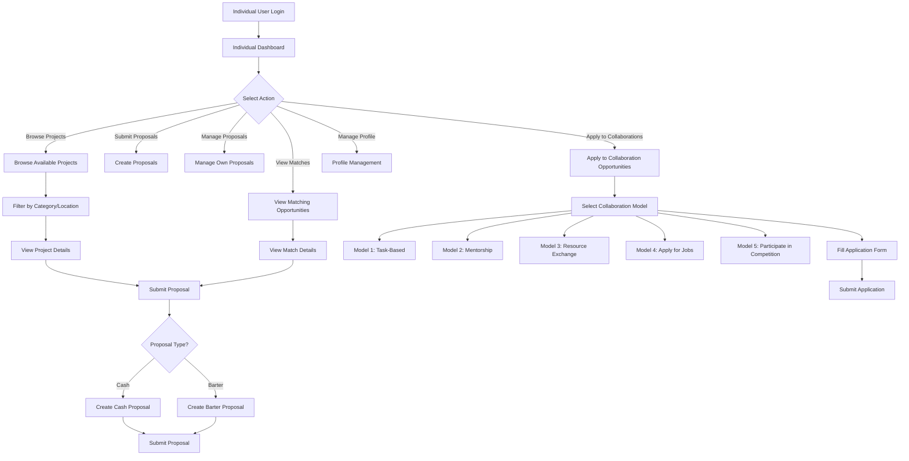

**Available Features:**
- Browse available projects
- View matching opportunities (>80% match)
- Submit proposals (Cash and Barter)
- Manage own proposals
- Apply to collaboration opportunities
- Profile management with endorsements
- View notifications
- Portfolio management

**Model Access:**
- ✅ Model 1: Task-Based Engagement only
- ✅ Model 2: Mentorship (as mentee)
- ✅ Model 3: Resource Exchange/Barter
- ✅ Model 4: Apply for jobs/consulting
- ✅ Model 5: Participate in competitions

**Restrictions:**
- Cannot create mega-projects
- Cannot create competitions
- Cannot form consortia (can join)
- Cannot create SPVs

### Admin Portal Workflow

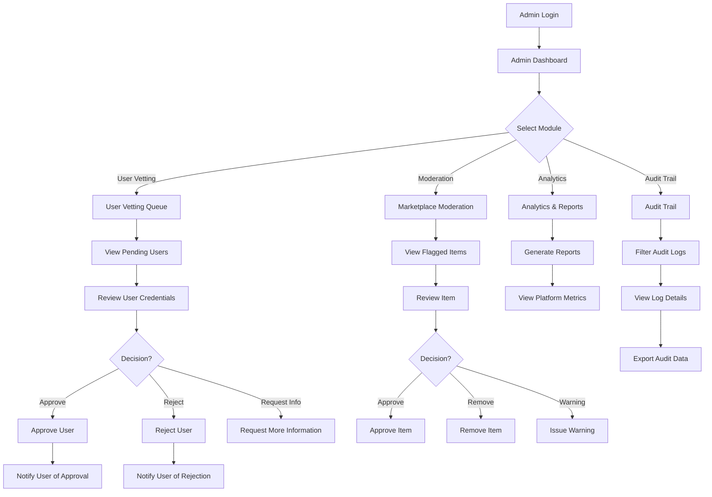

**Available Features:**
- User credential vetting and approval
- Marketplace moderation (projects, proposals)
- View all projects and proposals
- Generate analytics reports
- Access full audit trail
- System settings management
- Role and permission management
- User suspension/banning

**Restrictions:**
- Cannot create projects
- Cannot submit proposals
- Cannot participate in collaborations
- View-only access to user features

### Mobile App Workflow

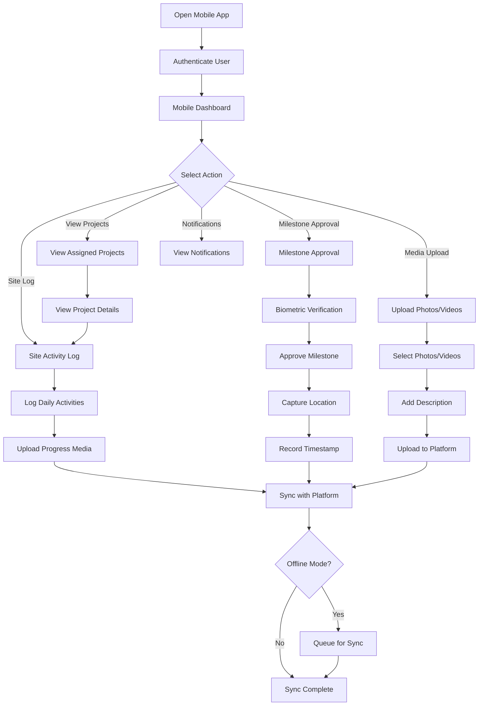

**Available Features:**
- View assigned projects
- Site activity logging
- Biometric milestone approval
- Media upload (photos/videos)
- Push notifications
- Offline mode with sync
- Location capture
- Progress tracking

**Restrictions:**
- Cannot create projects
- Cannot submit proposals
- Cannot access admin features
- Limited to assigned projects only

## Role-Based Access Diagram

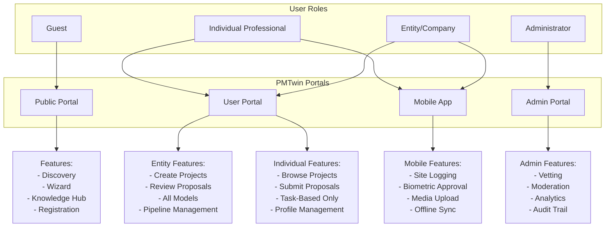

## Collaboration Models in All Portals

### Model 1: Project-Based Collaboration

#### Portal Availability

| Portal | Model 1.1 Task-Based | Model 1.2 Consortium | Model 1.3 Project JV | Model 1.4 SPV |
|--------|---------------------|---------------------|---------------------|---------------|
| **Public Portal** | ✅ (Wizard Education) | ✅ (Wizard Education) | ✅ (Wizard Education) | ✅ (Wizard Education) |
| **User Portal** | ✅ (Full Access) | ✅ (Full Access) | ✅ (Full Access) | ✅ (Full Access) |
| **Admin Portal** | ✅ (View Only) | ✅ (View Only) | ✅ (View Only) | ✅ (View Only) |
| **Mobile App** | ✅ (Execution Tracking) | ✅ (Execution Tracking) | ✅ (Execution Tracking) | ✅ (Execution Tracking) |

#### Role-Based Access

| Sub-Model | Entity (B2B) | Individual (B2P/P2P) | Consultant | Admin | Guest |
|-----------|--------------|----------------------|------------|-------|-------|
| **1.1 Task-Based** | ✅ Create & Hire | ✅ Apply & Execute | ✅ Apply & Execute | View Only | Wizard Only |
| **1.2 Consortium** | ✅ Create & Join | ✅ Join as Member | ✅ Join as Member | View Only | Wizard Only |
| **1.3 Project JV** | ✅ Create & Partner | ✅ Partner (Limited) | ✅ Partner (Limited) | View Only | Wizard Only |
| **1.4 SPV** | ✅ Create (50M+ SAR) | ❌ | ❌ | View Only | Wizard Only |

#### Portal-Specific Workflows

**Public Portal:**
- Wizard shows Model 1 options
- Educational content about each sub-model
- Cannot create, only learn

**User Portal:**
- Full creation and management interface
- Entity: Can create all 4 sub-models
- Individual: Can apply to 1.1, join 1.2, partner in 1.3
- Matching algorithm integration
- Proposal management

**Admin Portal:**
- View all Model 1 opportunities
- Moderation capabilities
- Analytics on Model 1 usage

**Mobile App:**
- View assigned Model 1 projects
- Track execution progress
- Milestone approvals
- Site logging for active projects

### Model 2: Strategic Partnerships

#### Portal Availability

| Portal | Model 2.1 Strategic JV | Model 2.2 Strategic Alliance | Model 2.3 Mentorship |
|--------|----------------------|----------------------------|---------------------|
| **Public Portal** | ✅ (Wizard Education) | ✅ (Wizard Education) | ✅ (Wizard Education) |
| **User Portal** | ✅ (Full Access) | ✅ (Full Access) | ✅ (Full Access) |
| **Admin Portal** | ✅ (View Only) | ✅ (View Only) | ✅ (View Only) |
| **Mobile App** | ❌ | ❌ | ❌ |

#### Role-Based Access

| Sub-Model | Entity (B2B) | Individual (B2P/P2P) | Consultant | Admin | Guest |
|-----------|--------------|----------------------|------------|-------|-------|
| **2.1 Strategic JV** | ✅ Create | ❌ | ❌ | View Only | Wizard Only |
| **2.2 Strategic Alliance** | ✅ Create | ✅ Create (Limited) | ✅ Create (Limited) | View Only | Wizard Only |
| **2.3 Mentorship** | ✅ Create (as Mentor) | ✅ Apply (as Mentee) | ✅ Apply (as Mentee) | View Only | Wizard Only |

#### Portal-Specific Workflows

**Public Portal:**
- Wizard explains strategic partnerships
- Knowledge Hub articles on long-term alliances
- Cannot create, only learn

**User Portal:**
- Full creation interface for Entities
- Application interface for Individuals
- Long-term partnership management
- Performance tracking

**Admin Portal:**
- View all strategic partnerships
- Monitor long-term relationships
- Analytics on partnership success

**Mobile App:**
- Not applicable (long-term strategic, not site-specific)

### Model 3: Resource Pooling & Sharing

#### Portal Availability

| Portal | Model 3.1 Bulk Purchase | Model 3.2 Co-Ownership | Model 3.3 Resource Exchange |
|--------|------------------------|----------------------|--------------------------|
| **Public Portal** | ✅ (Wizard Education) | ✅ (Wizard Education) | ✅ (Wizard Education) |
| **User Portal** | ✅ (Full Access) | ✅ (Full Access) | ✅ (Full Access) |
| **Admin Portal** | ✅ (View Only) | ✅ (View Only) | ✅ (View Only) |
| **Mobile App** | ❌ | ❌ | ❌ |

#### Role-Based Access

| Sub-Model | Entity (B2B) | Individual (B2P/P2P) | Consultant | Admin | Guest |
|-----------|--------------|----------------------|------------|-------|-------|
| **3.1 Bulk Purchasing** | ✅ Create & Join | ✅ Join | ✅ Join | View Only | Wizard Only |
| **3.2 Co-Ownership** | ✅ Create & Join | ✅ Join (Limited) | ✅ Join (Limited) | View Only | Wizard Only |
| **3.3 Resource Exchange** | ✅ Create & Trade | ✅ Create & Trade | ✅ Create & Trade | View Only | Wizard Only |

#### Portal-Specific Workflows

**Public Portal:**
- Wizard explains resource pooling
- Knowledge Hub: Barter guide
- Cannot participate, only learn

**User Portal:**
- Full marketplace interface
- Create bulk purchases
- Join co-ownership opportunities
- Barter exchange platform
- Transaction management

**Admin Portal:**
- View all resource transactions
- Monitor barter exchanges
- Analytics on cost savings

**Mobile App:**
- Not applicable (resource transactions are portal-based)

### Model 4: Hiring a Resource

#### Portal Availability

| Portal | Model 4.1 Professional Hiring | Model 4.2 Consultant Hiring |
|--------|------------------------------|---------------------------|
| **Public Portal** | ✅ (Wizard Education) | ✅ (Wizard Education) |
| **User Portal** | ✅ (Full Access) | ✅ (Full Access) |
| **Admin Portal** | ✅ (View Only) | ✅ (View Only) |
| **Mobile App** | ❌ | ❌ |

#### Role-Based Access

| Sub-Model | Entity (B2B) | Individual (B2P/P2P) | Consultant | Admin | Guest |
|-----------|--------------|----------------------|------------|-------|-------|
| **4.1 Professional Hiring** | ✅ Create Jobs | ✅ Apply | ✅ Apply | View Only | Wizard Only |
| **4.2 Consultant Hiring** | ✅ Create Engagements | ✅ Apply | ✅ Apply | View Only | Wizard Only |

#### Portal-Specific Workflows

**Public Portal:**
- Wizard explains hiring models
- Cannot create or apply, only learn

**User Portal:**
- Entity: Create job postings
- Individual/Consultant: Apply for positions
- Candidate matching
- Application management

**Admin Portal:**
- View all job postings
- Monitor hiring activity
- Analytics on hiring trends

**Mobile App:**
- Not applicable (hiring is portal-based)

### Model 5: Call for Competition

#### Portal Availability

| Portal | Model 5.1 Competition/RFP |
|--------|-------------------------|
| **Public Portal** | ✅ (Wizard Education) |
| **User Portal** | ✅ (Full Access) |
| **Admin Portal** | ✅ (View Only) |
| **Mobile App** | ❌ |

#### Role-Based Access

| Sub-Model | Entity (B2B) | Individual (B2P/P2P) | Consultant | Admin | Guest |
|-----------|--------------|----------------------|------------|-------|-------|
| **5.1 Competition/RFP** | ✅ Create & Participate | ✅ Participate | ✅ Participate | View Only | Wizard Only |

#### Portal-Specific Workflows

**Public Portal:**
- Wizard explains competition model
- Cannot create or participate, only learn

**User Portal:**
- Entity: Create competitions/RFPs
- All users: Submit proposals
- Transparent evaluation
- Winner selection

**Admin Portal:**
- View all competitions
- Monitor evaluation process
- Ensure transparency
- Analytics on competition outcomes

**Mobile App:**
- Not applicable (competitions are portal-based)

## Portal Feature Comparison

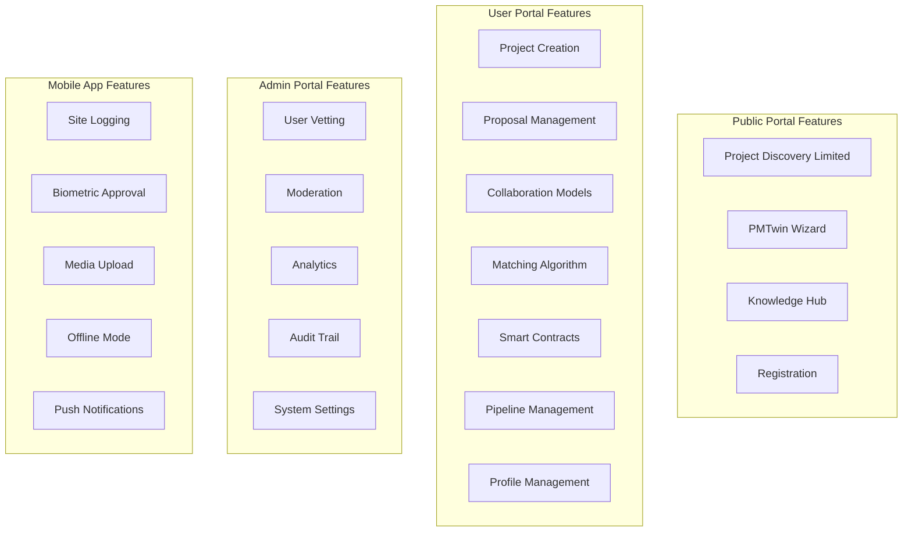

## Feature Restrictions Summary

### Entity (B2B) Restrictions
- Cannot access admin features
- Cannot view other entities' private projects
- Cannot approve/reject other entities' proposals
- Cannot create SPVs below 50M SAR threshold

### Individual (B2P/P2P) Restrictions
- Cannot create mega-projects
- Cannot create competitions
- Cannot form consortia (can join as member)
- Cannot create SPVs
- Cannot access admin features
- Cannot view other users' proposals

### Admin Restrictions
- Cannot create projects
- Cannot submit proposals
- Cannot participate in collaborations
- View-only access to user features

### Guest Restrictions
- Cannot view full project details
- Cannot submit proposals
- Cannot access user features
- Cannot access admin features
- Limited project discovery only

## Portal Routing Logic

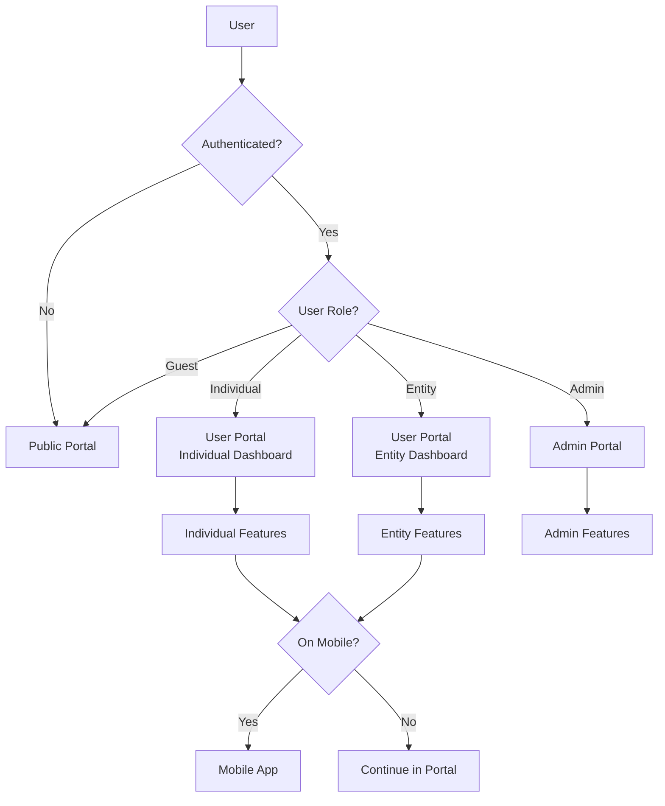

## Outcomes

### For Entities (B2B)
- Full access to all collaboration models
- Project creation and management
- Proposal review and approval
- Financial overview and pipeline management
- Access to all resource pooling features

### For Individuals (B2P/P2P)
- Task-based opportunities
- Proposal submission (Cash & Barter)
- Resource exchange participation
- Job/consulting applications
- Competition participation
- Profile and portfolio management

### For Admins
- Complete platform oversight
- User vetting and approval
- Marketplace moderation
- Analytics and reporting
- Audit trail access
- System configuration

### For Guests
- Limited project discovery
- Educational resources
- PMTwin Wizard access
- Registration capability

## Collaboration Models Portal Implementation

### Model 1: Project-Based in All Portals

```mermaid
flowchart TB
    subgraph PublicPortal["Public Portal - Model 1"]
        PW1[Wizard: Learn About Model 1]
        PK1[Knowledge Hub: Project-Based Guide]
        PED1[Educational Content Only]
    end
    
    subgraph UserPortal["User Portal - Model 1"]
        UE1[Entity: Create All 4 Sub-Models]
        UI1[Individual: Apply to 1.1, Join 1.2]
        UM1[Matching Algorithm]
        UP1[Proposal Management]
    end
    
    subgraph AdminPortal["Admin Portal - Model 1"]
        AV1[View All Model 1 Opportunities]
        AM1[Moderate Projects]
        AA1[Analytics on Model 1]
    end
    
    subgraph MobileApp["Mobile App - Model 1"]
        MV1[View Assigned Projects]
        MS1[Site Logging]
        MM1[Milestone Approvals]
        MP1[Progress Tracking]
    end
    
    PW1 --> PED1
    PK1 --> PED1
    
    UE1 --> UM1
    UI1 --> UM1
    UM1 --> UP1
    
    AV1 --> AM1
    AV1 --> AA1
    
    MV1 --> MS1
    MS1 --> MM1
    MM1 --> MP1
```

### Model 2: Strategic Partnerships in All Portals

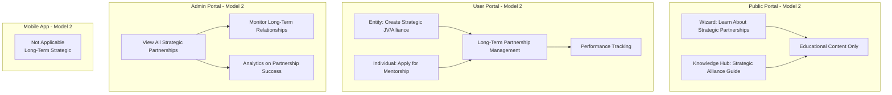

### Model 3: Resource Pooling in All Portals

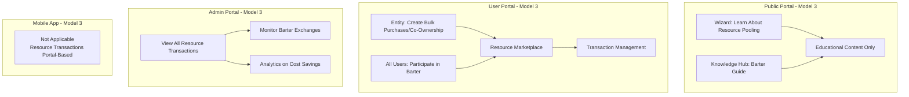

### Model 4: Hiring in All Portals

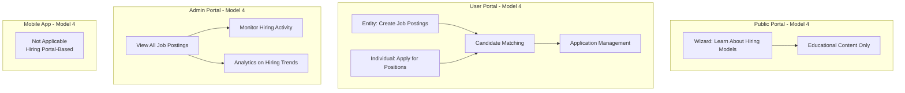

### Model 5: Competition in All Portals

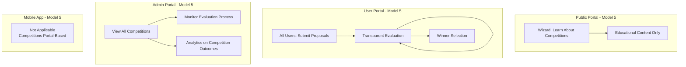

## Complete Feature List by Category

### Public Portal Features (Guest Access)

1. **Home/Landing Page** - Entry point with hero section and CTAs
2. **Project Discovery** - Limited visibility project browsing
3. **PMTwin Wizard** - Interactive collaboration model guide
4. **Knowledge Hub** - Educational articles and guides
5. **Login** - User authentication
6. **Signup/Registration** - Account creation (Individual/Entity)
7. **View Public Projects** - Basic project information only

### User Portal Features (Entity Dashboard)

1. **Entity Dashboard** - Financial health overview, incentivized deals
2. **Project Creation** - Create mega-projects (all 5 models)
3. **Project Management** - Edit, delete, publish own projects
4. **Project View** - View own and public projects
5. **Proposal Review** - Review and approve/reject received proposals
6. **Collaboration Opportunities** - Create and manage (all 5 models)
7. **Matches View** - View matching opportunities
8. **Pipeline Management** - Service pipeline Kanban board
9. **Profile Management** - Full company profile management
10. **Notifications** - Real-time notifications
11. **Onboarding** - Complete onboarding flow
12. **Smart Contracts** - Generate and sign contracts

### User Portal Features (Individual Dashboard)

1. **Individual Dashboard** - Task opportunities feed, endorsements
2. **Project Browsing** - Browse and filter available projects
3. **Proposal Creation** - Create cash and barter proposals
4. **Proposal Management** - Manage own proposals
5. **Collaboration Applications** - Apply to collaboration opportunities
6. **Matches View** - View matching opportunities (>80%)
7. **Profile Management** - Full profile with portfolio and endorsements
8. **Notifications** - Real-time notifications
9. **Onboarding** - Complete onboarding flow
10. **Smart Contracts** - Sign contracts for accepted proposals

### User Portal Features (Consultant)

1. **All Individual Features** - Plus:
2. **Create Collaboration Opportunities** - Can create limited opportunities
3. **Extended Profile** - Consultant-specific profile sections

### Admin Portal Features

1. **Admin Dashboard** - System overview and KPIs
2. **User Vetting** - Review and approve/reject registrations
3. **User Management** - Manage all users
4. **Project Moderation** - Moderate all projects
5. **Audit Trail** - View complete audit logs
6. **Reports** - Generate platform reports
7. **Analytics** - Full platform analytics
8. **System Settings** - Configure platform settings
9. **Role Management** - Manage roles and permissions
10. **View All Projects** - Access to all projects
11. **View All Proposals** - Access to all proposals
12. **View All Matches** - Access to all matches

### Mobile App Features

1. **Mobile Dashboard** - Assigned projects overview
2. **Site Logging** - Daily activity logs
3. **Biometric Approval** - Milestone approvals with biometric
4. **Media Upload** - Photos and videos
5. **Push Notifications** - Real-time alerts
6. **Offline Mode** - Work offline with sync
7. **Location Capture** - GPS location tracking
8. **Progress Tracking** - Track project progress
9. **View Assigned Projects** - Access to assigned projects only
10. **View Signed Contracts** - Access to signed contracts

## Feature Access Summary by Role

### Entity (B2B) - Complete Feature Access

**Public Portal:**
- Home, Discovery (limited), Wizard, Knowledge Hub, Login, Signup

**User Portal:**
- Dashboard, Project Creation (all models), Project Management, Proposal Review, Collaboration Opportunities (all 5 models), Matches, Pipeline, Profile, Notifications, Onboarding, Smart Contracts

**Mobile App:**
- Dashboard, Site Logging, Biometric Approval, Media Upload, Notifications, Offline Mode, Location Capture, Progress Tracking

**Total Features:** 30+ features across all portals

### Individual (B2P/P2P) - Limited Feature Access

**Public Portal:**
- Home, Discovery (limited), Wizard, Knowledge Hub, Login, Signup

**User Portal:**
- Dashboard, Project Browsing, Proposal Creation, Proposal Management, Collaboration Applications (limited models), Matches, Profile, Notifications, Onboarding, Smart Contracts (sign only)

**Mobile App:**
- Dashboard, Site Logging, Biometric Approval, Media Upload, Notifications, Offline Mode, Location Capture, Progress Tracking

**Total Features:** 20+ features (limited to applicable models)

### Consultant - Extended Individual Access

**Public Portal:**
- Same as Individual

**User Portal:**
- All Individual features + Create Collaboration Opportunities (limited)

**Mobile App:**
- Same as Individual

**Total Features:** 22+ features

### Admin - Governance Features

**Public Portal:**
- Knowledge Hub, Login

**Admin Portal:**
- Dashboard, User Vetting, User Management, Project Moderation, Audit Trail, Reports, Analytics, System Settings, Role Management, View All Data

**Total Features:** 15+ admin-specific features

### Guest - Discovery Only

**Public Portal:**
- Home, Discovery (limited), Wizard, Knowledge Hub, Signup

**Total Features:** 5 features (all discovery/educational)

---

*This document provides a comprehensive guide to feature availability across all portals, roles, and user types in the PMTwin platform, showing how each collaboration model appears and functions in each portal.*

